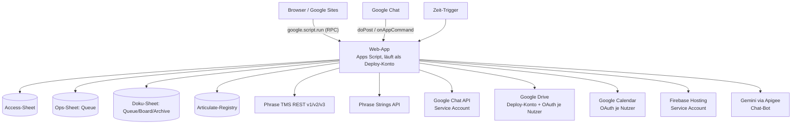
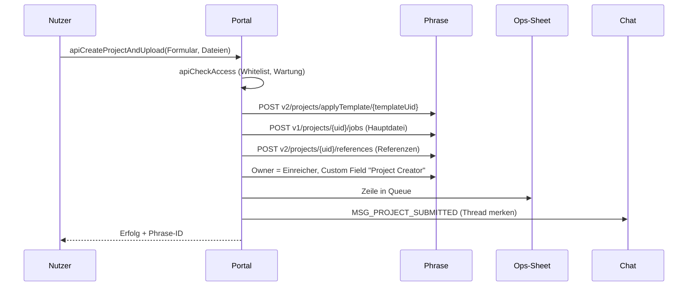

# Kärcher Translation Services (Repo `kaerchertranslationservices`)

> Kurz: Internes Portal (Google-Apps-Script-Web-App, eingebettet in die Google Site `https://sites.google.com/karcher.com/phrase`), über das Kärcher-Mitarbeitende Übersetzungsprojekte in **Phrase TMS** anlegen, verfolgen, teilen und herunterladen – ohne eigenen Phrase-Zugang. Wird intern auch „Translation Hub“ genannt.

Ausführliche Fachdokumente im Repo: `docs/ARCHITEKTUR-UND-DATEN.md`, `docs/API.md`, `docs/UI-UX.md`, `docs/AUFFAELLIGKEITEN.md` (in `KOMPLETT.md` als Anhang enthalten).

---

## 1. Steckbrief

| Eigenschaft | Wert |
|---|---|
| Typ | Web-App, `executeAs: USER_DEPLOYING`, `access: DOMAIN` (alle in karcher.com) |
| Laufzeit | Apps Script V8, Zeitzone Europe/Berlin |
| Einstieg | `doGet` in `WebApp.gs`: `Index.html`; `?page=kb` (auch `knowledgebase`, `knowledge-base`, `wissen`) = Knowledge Base; `?tab=history` = direkt „Meine Projekte“ |
| Chat | `doPost` (Google-Chat-Events, Slash-Commands), Chat-App-Funktionen `onAddedToSpace`, `onMessage`, `onRemovedFromSpace`, `onAppCommand` |
| Bibliotheken | OAuth2 (`1B7FSrk5Zi6L1rSxxTDgDEUsPzlukDsi4KGuTMorsTQHhGBzBkMun4iDF`, v43) |
| Erweiterte Dienste | Drive v2, Admin Directory |
| Sprachen der Oberfläche | de, en, fr, es, pt, zh (`I18nDicts.gs`), übersetzbar über Phrase Strings |
| Design | „Kaercher Glass“ (Kärcher-Gelb `#FFED00`, Glas-Optik, Dark Mode) |
| Tests | `npm test`, `npm run test:ui` (Playwright), Admin → Tests in der App |
| Deploy | GitHub Actions `ci.yml` → `clasp push` auf `main` |

## 2. Architektur



Wichtige Laufzeit-Eigenschaften:
- **Läuft als Deploy-Konto.** Drive, Sheets und Kalender werden mit den Rechten dieses Kontos angesprochen. Für „In mein Drive speichern“ und „Kalender-Sync“ gibt es deshalb eigene OAuth-Flows je Nutzer.
- **Identität** = `Session.getActiveUser().getEmail()`. In Chat-Events und Triggern leer → E-Mail aus dem Event (`callerOverride`).
- **Größengrenzen:** Startdokument ≈ 600 KB, nachgeladene Inhalte ≈ 144 KB. Große Bereiche (Startseite, Einstellungen, Anleitung, Admin, Dark Mode, Campus) werden nachgeladen.
- **Ausführungszeit** max. 6 min; Upload bricht nach 5 min mit `timedOut` ab.

## 3. Bereiche der Oberfläche

```
Kopf: Sprache · Glocke · Einstellungen · Hilfe (Knowledge Base)
Reiter: Start │ Neues Projekt │ Meine Projekte │ Dashboard* │ Anleitung │ Hilfe & Support │ Admin* │ Health*
Neues Projekt → General │ Marketing │ WOMA │ Competence Center │ KeC │ Dokumentation │ Campus
* nur mit Recht
```

| Bereich | Was man dort tut |
|---|---|
| **Start** | Suche/Befehle (Strg+K), Schnellstart, Kennzahlen, „Meine Arbeit“, nächste Frist, 7-Tage-Ansicht, Aktivitäten, Tipps |
| **Neues Projekt** | Vorlage wählen (nur passende), Sprachen, Name, Frist (Feiertags-/Wochenendprüfung, Express ≤ 72 h), Notiz, Hauptdateien (PC, Drive, Drive-Link), Referenzdateien, Presets |
| **General / Marketing / WOMA / CC** | Projektformulare mit eigener Whitelist |
| **KeC** | Dateien zu einem bestehenden Phrase-Projekt hinzufügen |
| **Dokumentation** | Import eines Drive-Ordners mit Sprach-Unterordnern, IA-Nummer; eigenes Sheet (Queue/Board/Archive) |
| **Campus** | Rise-Kurse: Projekt anlegen, Preview-Generator (Phrase-Job + SCORM-Ordner → Firebase-Vorschau), Batch |
| **Meine Projekte** | Tabelle/Kalender, Filter (meine, geteilt, Team), Details, Frist, Umbenennen, Notizen, Teilen, Abbrechen, Download (Datei, ZIP, in Drive speichern), Archiv (> 30 Tage) |
| **Dashboard** | Kennzahlen und Diagramme über Projekte (Admin, Admin-Light „dashboard“) |
| **Anleitung / Hilfe & Support** | Anleitung, FAQ, Taskbox-Formulare, E-Learnings |
| **Knowledge Base** (`?page=kb`) | komplette Phrase-Dokumentation (TMS, Strings, Orchestrator, Portal, Studio, Global; 414 Artikel), durchsuchbar |
| **Admin** | Console (System, Properties, Wartung, Ankündigungen, Datenbank-Links), Nutzer/Whitelists, Template Manager, User Template Debugger, Pivot-Admin, Translate UI (Phrase Strings), Tests, Protokoll |
| **Health** | `apiHealthCheck` – Zustand der Anbindungen |

## 4. Datenbanken (Google Sheets)

| Sheet | ID | Konfiguration |
|---|---|---|
| **Access-Sheet** („Sync DB“) | `1mU8zWhR-E8_fmBcLtMh1qIwST9FibKT5UfH7oaivs0Q` | `ACCESS_SHEET_ID` (Fallback in `Config.gs`) |
| **Ops-Sheet** („Uploads DB“) | `1xi0ZtFxxurNu25URrhpHmfSLy8nld_SXm0KmkXxRCpQ` | `OPS_SHEET_ID` (Fallback in `Config.gs`) |
| **Dokumentations-Sheet** | `1_EFW_ItawRvutiVrcNIamKTSYPFsA5XFGR1s6PctYxs` | fest in `DocQueue.gs`/`DocBoard.gs`/`DocImport.gs` |
| **Articulate-Registry** | `1V6oyZVw7-CPy8Bs5_sGl9Cg886b2T6r7FLGgp1gfBRY` | fest in `Articulateregistry.gs` |

### Access-Sheet – Tabs

| Tab | Zweck |
|---|---|
| `Whitelist` | Zugang General Projects (Spalte Email) |
| `Whitelist_Marketing`, `_KeC`, `_Documentation`, `_Woma`, `_CC`, `_Articulate` | Spezialbereiche (exklusiv) |
| `Whitelist_AdminLight` | Teil-Admins: Email, Subtabs (`users,templates,pivot,tests,dashboard`) |
| `FetchTemplate-Prod` | Phrase-Vorlagen (per Sync): Display Name, Template UID, Source, Targets, Active, Client, Domain, Subdomain, Business Unit |
| `FetchTMS_USERS-Prod` | Nutzer-Zuordnung (per Sync): Email, Client, Domain, Subdomain, Business Unit |
| `Maintenance` | Wartungsfenster: ID, StartTime, EndTime, Message, Active |
| `Notifications` | Email · ON/OFF · Chat-User-ID (`users/…`) – auch vom Mention Digest gelesen |
| `UserPrefs` | Email · Prefs JSON · Updated At |
| `CalendarSync` | Email, Enabled, Calendar ID, Include Done, Lang, Last Sync, Last Result |
| `User_Presets` | gespeicherte Formular-Vorlagen |
| `Announcements` | Banner/Chat-Ankündigungen |
| `NotificationLog` | Einträge der Glocke |
| `AuditLog` | Admin-/Projektaktionen, Phrase-Owner, jede Chat-Nachricht |
| `Message_Templates` | Chat-Texte DE/EN (`MSG_PROJECT_SUBMITTED`, `MSG_COMPLETED`, `MSG_SHARED`, `MSG_CANCELLED` …) |
| `Watchers` | wer bei neuen Projekten einer Vorlage informiert wird |
| `PivotTemplateLinks`, `PivotLanguageMap` | Pivot-Workflow |

### Ops-Sheet – Tab `Queue` (eine Zeile je Phrase-Projekt; nie löschen, Status `CANCELLED`)

A Timestamp · B User Email (Eigentümer) · C Project UID · D File ID · E File Name · F Mime Type · G Target Lang(s) · H Status · I Job UIDs · J Async ID · K Notification Email · L Project Name · M Due Date · N CC Email · O Analysis UID · P Total Words · Q Net Words · R Shared With · S Template Name · T Chat-Thread · U Chat-Threads der Geteilten · V Downloaded At · (per Kopfzeile) JobMapping, Pivot Role, Pivot Link.

Status: `NEW`, `QUEUED_UPLOAD`, `UPLOADED`, `ASSIGNED`, `ACCEPTED`, `COMPLETED`, `NOTIFIED`, `DELIVERED`, `CANCELLED`, `REJECTED`, Pivot `WAITING_CHILD`.

## 5. Rollen

| Rolle | Quelle | Wirkung |
|---|---|---|
| Admin | Script Property `ADMIN_EMAILS` | alles, sieht alle Projekte, Simulation anderer Nutzer |
| Admin-Light | `Whitelist_AdminLight` | nur freigegebene Admin-Bereiche |
| General | `Whitelist` | Reiter General Projects |
| Exklusive Bereiche | `Whitelist_Marketing` usw. | nur der jeweilige Bereich |
| ohne Eintrag | – | sieht keine Bereiche, Upload abgelehnt |

Vorlagen-Sichtbarkeit ist **fail-closed**: Client, Domain, Subdomain und Business Unit der Vorlage müssen zu den Werten des Nutzers passen. Projekte sieht man, wenn man Eigentümer ist, sie geteilt bekam oder (WOMA) im selben Team ist.

## 6. Script Properties

`ADMIN_EMAILS`, `ACCESS_SHEET_ID`, `OPS_SHEET_ID`, `PHRASE_API_TOKEN` (Aliase `PHRASE_TOKEN`, `GLOBAL_PHRASE_TOKEN`), `PHRASE_API_BASE_URL` (Standard `https://cloud.memsource.com/web`), `PHRASE_STRINGS_TOKEN`, `PHRASE_STRINGS_PROJECT`, `PHRASE_STRINGS_REGION`, `PHRASE_STRINGS_NIGHTLY`, `CHAT_CLIENT_EMAIL`, `CHAT_PRIVATE_KEY`, `SERVICE_ACCOUNT_JSON` (Firebase), `DRIVE_SAVE_OAUTH_CLIENT_ID`, `DRIVE_SAVE_OAUTH_CLIENT_SECRET`, `GEMINI_API_KEY`, `MAX_FILE_SIZE_MB` (100), `PHRASE_SET_REAL_OWNER` (`false` = API-Nutzer bleibt Owner), `MAINT_START`, `MAINT_END`, `MAINT_MSG`, `KEC_CLIENT_ID`, `KEC_DOMAIN_ID`, `KEC_BUSINESS_UNIT_ID`, `AUTO_SYNC_ENABLED`, `CAMPUS_BATCH_ENABLED`, `CAMPUS_BATCH_TEMPLATE_NAMES`, `TERMBASE_UID`; dynamisch `CHAT_USER_MAP__<email>`, `CHAT_NOTIFIED__<uid>`, `oauth2.*`, `Cal_*`.

Admin → Console → System zeigt Properties; Werte mit `token`, `key`, `secret`, `password`, `private` im Namen werden nie angezeigt.

## 7. Trigger

| Funktion | Takt | Zweck |
|---|---|---|
| `autoSyncProjectStatuses_` | 15 min | Status aus Phrase, Chat/Glocke, Pivot-Kinder |
| `calendarSyncAllTrigger` | stündlich | Fristen in Nutzerkalender |
| `psNightlySync_` | täglich ~02:00 | UI-Texte aus Phrase Strings |
| `cleanupChatDedupProperties_` | täglich ~03:00 | Aufräumen |

## 8. Wichtige Abläufe

### Projekt anlegen



### Status und Benachrichtigung
Alle 15 min liest `autoSyncProjectStatuses_` die Phrase-Status der offenen Queue-Zeilen, schreibt sie zurück, schickt bei Abschluss eine Chat-Antwort in den Projekt-Thread (auch an Geteilte) und legt Glocken-Einträge an.

### Pivot-Workflow
Pivot-Vorlagen (`PivotTemplateLinks`) erzeugen nach Abschluss des Elternprojekts ein Kindprojekt mit den Sprachen aus `PivotLanguageMap`; Status `WAITING_CHILD` bis dahin.

### Download
Höchster Workflow-Schritt je Sprache, Einzeldatei oder ZIP (`DownloadZip.gs`), oder „In Google Drive speichern“ per Nutzer-OAuth (`drive.file`), optional in Google-Format umgewandelt.

## 9. Google Chat

- Bot mit Service Account (`CHAT_CLIENT_EMAIL`, `CHAT_PRIVATE_KEY`), Nachrichten im 1:1-Space, Antworten im selben Thread.
- Slash-Commands (`ChatCommands.gs`): `/changeprojectname`, `/changeduedate`, `/changerevisor`, `/projectstatus`, `/assignlinguist`, `/closeproject`, `/termsearch` (`TERMBASE_UID`), `/quotestatus`, `/notifyvendor`, `/jobstats`.
- Freitext-Nachrichten beantwortet ein Gemini-Bot (`Chatbot.gs`, `gemini-2.0-flash`, max. 5 Tool-Runden, nur lesende Tools).

## 10. Externe Dienste

| Dienst | Zugang |
|---|---|
| Phrase TMS | `PHRASE_API_TOKEN` (Bearer), 429-Retry |
| Phrase Strings | `PHRASE_STRINGS_TOKEN`: klassischer Token oder Plattform-Token → JWT über `https://eu.phrase.com/idm/oauth/token` |
| Google Chat | Service Account, Scope `chat.bot` |
| Drive „Save to Drive“ / Kalender | OAuth-Client `DRIVE_SAVE_OAUTH_CLIENT_ID/SECRET`, Redirect `https://script.google.com/macros/d/{SCRIPT_ID}/usercallback` |
| Firebase Hosting | `SERVICE_ACCOUNT_JSON`, Site `kaercher-course-preview` |
| Gemini | `GEMINI_API_KEY` über Apigee-Proxy |
| Workspace | Admin Directory, People API, Cloud Identity Groups, Contacts (lesen) |

## 11. Dateien (Auswahl)

| Bereich | Dateien |
|---|---|
| Einstieg/Konfiguration | `WebApp.gs`, `Code.gs`, `Config.gs`, `Apialiases.gs` |
| Rollen | `AdminAccess.gs`, `AdminLight.gs`, `AdminMarketing.gs`, `AdminWoma.gs`, `AdminCc.gs` |
| Projekte | `Upload.gs`, `ProjectsApi.gs`, `KeCProjects.gs`, `DocImport.gs`, `AutoSync.gs`, `Sync.gs`, `Watchers.gs` |
| Download | `DownloadZip.gs`, `DownloadTargetFile.gs`, `DriveSaveConfig.gs`, `DriveHelpers.gs`, `DocExport.gs` |
| Dokumentation | `DocQueue.gs`, `DocBoard.gs`, `DocArchive.gs`, `DocDriveConfig.gs`, `DocDriveTree.gs` |
| Pivot | `PivotProjects.gs`, `PivotAdmin.gs`, `PivotTemplateLinks.gs`, `PivotLanguageMap.gs` |
| Campus | `Articulateapi.gs`, `Articulateregistry.gs`, `Articualtepreview.gs`, `RisePatcher.gs`, `ScormPatcher.gs`, `Xliffparser.gs`, `CampusBatch.gs`, `FirebaseAuth.gs`, `FirebaseHostingDeploy.gs` |
| Chat | `Upload.gs` (Senden, doPost), `ChatToken.gs`, `ChatCommands.gs`, `Chatbot.gs`, `Messagetemplates.gs` |
| Persönlich | `UserPrefs.gs`, `Presets.gs`, `CalendarSync.gs`, `Announcements.gs`, `GermanHolidays.gs` |
| UI-Übersetzung | `I18nDicts.gs`, `AdminI18n.gs`, `PhraseStrings.gs`, `PhraseStringsSync.gs` |
| Knowledge Base | `KnowledgebaseApi.gs`, `Knowledgebase.html`, `KbData*.html` (aus `kb-src/*.md` mit `npm run build:kb`) |
| Betrieb | `Auditlog.gs`, `Adminadvanced.gs`, `SelfTests.gs`, `Triggers.gs`, `SheetSetup.gs`, `HeaderRepair.gs`, `Debug.gs` |
| Oberfläche | `Index.html`, `Styles.html`, `Js*.html`, `HomeUi.html`, `PrefsUi.html`, `AdminConsole.html`, `AdminScript.html`, `DarkTheme.html`, `GuideContent.html` |

## 12. Bekannte Auffälligkeiten (Auszug aus `docs/AUFFAELLIGKEITEN.md`)

- 🔴 Downloads prüfen nur die Whitelist, nicht den Projektbesitz.
- 🔴 Drive-Auswahl läuft als Deploy-Konto (Nutzer sehen dessen Ordner).
- 🟠 Articulate-Registry-Funktionen ohne Rechteprüfung; `doPost` prüft die Herkunft nicht; `apiGetJobNotes` ohne Prüfung.
- 🟠 Doppelte Funktionsnamen (`apiSetMaintenance`, `apiDownloadTargetFile`, `onMessage`) – welche gewinnt, hängt von der Dateireihenfolge ab.
- 🟠 Zwei Quellen für den Wartungsmodus (Sheet `Maintenance` vs. Properties `MAINT_*`).

## 13. Bezüge zu anderen Repos

- **articulate-rise-patcher:** Ursprung des Campus-Vorschau-Moduls (Dateien übernommen und weiterentwickelt).
- **phrase-notification-hub:** nutzt denselben Chat-Bot und das Tab `Notifications`; `Hub snippet mentiondigest.gs` zeigt, wie „Meine Projekte“ einen Link in den Mention Digest bekommt.
- **Design-Vorlage** für Prompt Hub und AutoFix Hub (gleiche Optik und Bedienung).

---

Gesamtdokumentation aller acht Repositories (Systemlandkarte, alle Datenbanken, FAQ, Gemini-Gem/NotebookLM-Paket): [`MMario996/kaerchertranslationservices` → `wissensbasis/`](https://github.com/MMario996/kaerchertranslationservices/tree/main/wissensbasis).
