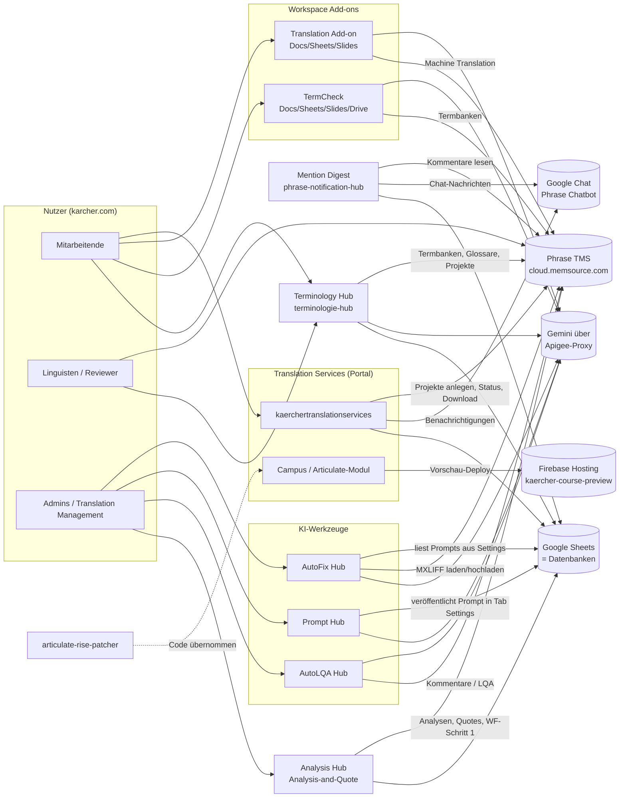
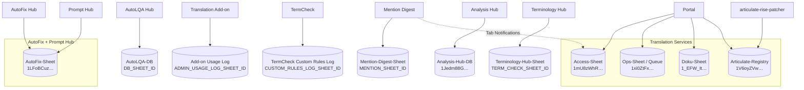
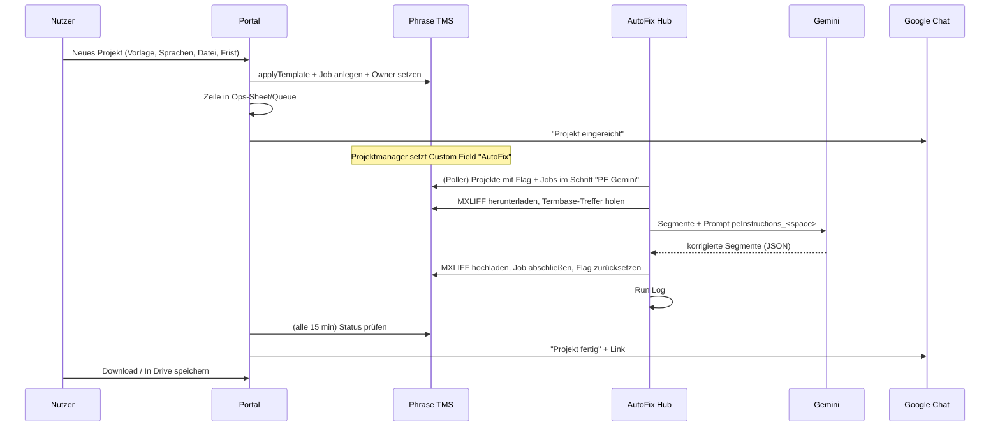

# Kärcher Translation Tools – Gesamtübersicht (10 Anwendungen)

Diese Dokumentation beschreibt alle zehn GitHub-Repositories von `MMario996` rund um Übersetzung, Phrase TMS und Gemini bei Kärcher.
Sie ist so geschrieben, dass ein Mensch oder ein KI-Assistent (Gemini Gem, NotebookLM) Fragen beantworten kann wie
„Welche Datenbank steckt hinter dem AutoFix Hub?“, „Wo stelle ich das Gemini-Modell ein?“ oder „Was passiert, wenn ein Projekt das AutoFix-Flag bekommt?“.

Stand: aus dem Code abgeleitet (2. Oktober 2026, Branch `claude/practical-bohr-d9wt57` nach dem Struktur-Umbau: Code liegt in jedem Repo unter `src/`). Bei Widersprüchen gilt der Code.

**Weitere Dateien dieses Pakets:** [`ENDPOINTS-GESAMT.md`](ENDPOINTS-GESAMT.md) (alle Phrase- und sonstigen Endpunkte, Matrix Endpunkt × Anwendung), [`systemlandkarte.svg`](systemlandkarte.svg) / [`systemlandkarte.html`](systemlandkarte.html) (Grafik), [`STRUKTUR-STANDARD.md`](STRUKTUR-STANDARD.md) (einheitlicher Repo-Aufbau), [`anwendungen/`](anwendungen/) (Dokumentation je Anwendung).

---

## 1. Die zehn Repositories auf einen Blick

| # | Repository | Produktname | Art | Zweck in einem Satz |
|---|---|---|---|---|
| 1 | `kaerchertranslationservices` | **Kärcher Translation Services** (Portal, „Translation Hub“) | Web-App (Apps Script), eingebettet in Google Sites | Mitarbeitende legen Übersetzungsprojekte in Phrase TMS an, verfolgen, teilen und laden sie herunter – ohne eigenen Phrase-Zugang. |
| 2 | `autofix-hub` | **AutoFix Hub** | Web-App + Zeit-Trigger | Post-editiert automatisch Phrase-Jobs im Workflow-Schritt „PE Gemini“ mit Gemini und schreibt die Korrekturen zurück. |
| 3 | `Prompt-hub` | **Prompt Hub** | Web-App | Pflege, Prüfung, Live-Test und Versionierung der Post-Editing-Prompts, die AutoFix verwendet. |
| 4 | `autolqa-hub` | **AutoLQA Hub** | Web-App | KI-gestützte Qualitätsprüfung (LQA nach DQF-MQM) von Phrase-Projekten, mit Rückschreiben als Kommentar oder LQA-Assessment. |
| 5 | `phrase-notification-hub` | **Mention Digest** (Phrase Notification Hub) | Web-App + Zeit-Trigger | Benachrichtigt per Google Chat, wenn jemand in Phrase-Kommentaren @erwähnt wird – sofort oder als Digest. |
| 6 | `k-rcher-translation-add-on` | **Kärcher Translation Add-on** | Google-Workspace-Add-on (Docs, Sheets, Slides) | Übersetzt Inhalte direkt im Dokument über Phrase MT, mit Gemini-Fallback und Gemini-Post-Editing. |
| 7 | `term-author-checker` | **Kärcher TermCheck** | Google-Workspace-Add-on (Docs, Sheets, Slides, Drive) + Web-App | Terminologiesuche in Phrase-Termbanken und „Author Check“ (Grammatik, Terminologie, Stil) inkl. PDF-Prüfung. |
| 8 | `articulate-rise-patcher` | **Articulate Rise Patcher** | Apps-Script-Bibliothek / Prototyp | Baut aus übersetzter Rise-XLIFF eine live klickbare Kursvorschau auf Firebase Hosting. Ist inzwischen auch Teil des Portals (Reiter „Campus“). |
| 9 | `Analysis-and-Quote` | **Analysis Hub** (Analysis & Quotes) | Web-App + Zeit-Trigger | Erstellt für Phrase-Projekte mit Custom Field „Analysis Type“ automatisch Analyse und Quote beim Dienstleister, verschickt die Quote-Mail und schließt nach Freigabe Workflow-Schritt 1 ab. |
| 10 | `terminologie-hub` | **Terminology Hub** | Web-App + Zeit-Trigger | Begriffsvorschläge, Freigabe, Übersetzung als Phrase-Projekt und Import in Termbanken/Glossar; Termbank-Pflege, KI-Vorschläge, Begriffsnetz. |

Alle Projekte sind **Google Apps Script (V8)**, laufen in der Workspace-Domain `karcher.com`, nutzen **Google Sheets als Datenbank** und sprechen mit **Phrase TMS** (`https://cloud.memsource.com/web`, früher Memsource).
Die KI-Funktionen laufen über den **Kärcher-Gemini-Proxy (Apigee)** `https://34-111-99-134.nip.io/gemini/v1beta/models/<modell>:generateContent` mit Header `x-api-key: <GEMINI_API_KEY>`.

---

## 2. Systemlandkarte

Die grafische Fassung liegt als [`systemlandkarte.png`](systemlandkarte.png) / [`.svg`](systemlandkarte.svg) / [`.html`](systemlandkarte.html) in diesem Ordner.

### Wie die Projekte zusammenhängen

1. **Portal → Phrase:** Das Portal legt Projekte aus Phrase-Vorlagen an (technischer API-Nutzer), setzt den Einreicher als Owner und überwacht den Status alle 15 Minuten.
2. **Phrase → AutoFix:** Hat ein Projekt das Custom Field **„AutoFix“** gesetzt und Jobs im Workflow-Schritt **„PE Gemini“**, holt AutoFix die Jobs, lässt Gemini post-editieren und lädt die Datei zurück.
3. **Prompt Hub → AutoFix:** Der Prompt je Dokumenttyp („Space“) wird im Prompt Hub gepflegt und beim Veröffentlichen in genau die Zeile `peInstructions_<space>` im AutoFix-Sheet geschrieben, die AutoFix liest.
4. **Add-on ↔ AutoFix:** Das Translation Add-on nutzt dieselben Post-Editing-Prompts (fest im Code, Stand AutoFix) für seinen optionalen Gemini-PE-Schritt.
5. **AutoLQA:** Unabhängig von AutoFix; prüft fertige Übersetzungen nach MQM und schreibt Befunde zurück nach Phrase.
6. **Mention Digest:** Nutzt denselben Google-Chat-Bot (Service Account) wie das Portal und als Fallback das Tab `Notifications` des Portal-Access-Sheets, um Chat-IDs zu finden. Ein Code-Schnipsel zeigt, wie das Portal pro Projekt einen Link in den Mention Digest bekommt.
7. **Articulate Rise Patcher:** Ursprünglich eigenständig entwickelt, der Code steckt heute (leicht weiterentwickelt) im Portal unter Campus → Articulate-Vorschau.
8. **TermCheck:** Eigenständig; nutzt Phrase-Termbanken und Gemini. Zwei Gemini-Gems helfen beim Formulieren eigener Regeln.
9. **Analysis Hub:** Arbeitet wie AutoFix auf Phrase-Projekten, aber für Kosten: Custom Field **„Analysis Type“** → DL-Routing (Preisliste, Net Rate Scheme, Workflow-Schritt, Mailvorlage) → Analyse → Quote → Mail an den Dienstleister. Ist die Quote freigegeben (APPROVED), schließt er Workflow-Schritt 1 ab, damit die Übersetzung beginnen kann. Gleiche Oberfläche und CI/CD wie der AutoFix Hub.
10. **Terminology Hub:** Pflegt die Termbanken, die TermCheck (Suche, Author Check), das Portal (`/termsearch`) und AutoFix/AutoLQA (Termbank-Treffer) nutzen. Freigegebene Begriffe werden als eigenes Phrase-Projekt übersetzt und danach automatisch importiert.

---

## 3. Alle verlinkten Datenbanken (Google Sheets)

> **Antwort auf „Von was ist die verlinkte DB?“**: Hier stehen alle Sheets, ihre IDs (soweit im Code), welches Projekt sie nutzt, wie sie konfiguriert werden und welche Tabs sie haben.
> Link-Muster: `https://docs.google.com/spreadsheets/d/<ID>/edit`

| Datenbank | Sheet-ID | Gehört zu | Konfiguriert über | Tabs (Auszug) |
|---|---|---|---|---|
| **Access-Sheet** („Sync DB“ im Admin) | `1mU8zWhR-E8_fmBcLtMh1qIwST9FibKT5UfH7oaivs0Q` | Translation Services | Script Property `ACCESS_SHEET_ID` (Fallback im Code `Config.gs`) | `Whitelist`, `Whitelist_Marketing`, `Whitelist_KeC`, `Whitelist_Documentation`, `Whitelist_Woma`, `Whitelist_CC`, `Whitelist_Articulate`, `Whitelist_AdminLight`, `FetchTemplate-Prod`, `FetchTMS_USERS-Prod`, `Maintenance`, `Notifications`, `UserPrefs`, `CalendarSync`, `User_Presets`, `Announcements`, `NotificationLog`, `AuditLog`, `Message_Templates`, `Watchers`, `PivotTemplateLinks`, `PivotLanguageMap` |
| **Ops-Sheet** („Uploads DB“ im Admin) | `1xi0ZtFxxurNu25URrhpHmfSLy8nld_SXm0KmkXxRCpQ` | Translation Services | Script Property `OPS_SHEET_ID` (Fallback `Config.gs`) | `Queue` – eine Zeile pro angelegtem Phrase-Projekt |
| **Dokumentations-Sheet** | `1_EFW_ItawRvutiVrcNIamKTSYPFsA5XFGR1s6PctYxs` | Translation Services (Bereich Dokumentation) | fest im Code (`DocQueue.gs`, `DocBoard.gs`, `DocImport.gs`, `DocArchive.gs`) | `Queue` (gid `2102542301`), `Board`, `Archive` |
| **Articulate-Registry** | `1V6oyZVw7-CPy8Bs5_sGl9Cg886b2T6r7FLGgp1gfBRY` | Translation Services (Campus) **und** articulate-rise-patcher | fest im Code (`Articulateregistry.gs`) | `Projects`: ID, Course Name, Target Lang, Project UID, Job UID, Drive Folder ID, Firebase Site, Firebase Path, Live URL, Last Deploy, Last Status, Created By … |
| **AutoFix-Sheet** („AutoFix Hub - Database“) | `1LFoBCuz7h1xdi58djRPedAXgtj4RZ_T5EnvJbTKtkp8` (Standard im Prompt Hub) | AutoFix Hub **und** Prompt Hub | AutoFix: Script Property `AUTOFIX_DB_SHEET_ID` (fehlt sie, legt AutoFix ein neues Sheet an). Prompt Hub: `PH_CONFIG.autofixSheetId` | `Settings` (Key/Value inkl. `peInstructions_<space>`), `Run Log`, `Audit Log`, `Prompt Spaces`, `Prompt Hub Import`, MQM-Report-Tabs, sowie die Prompt-Hub-Tabs `PH_Spaces`, `PH_Versions`, `PH_Users`, `PH_Requests`, `PH_TestCases`, `PH_Audit` |
| **Prompt-Hub-Sheet (optional)** | leer = im AutoFix-Sheet | Prompt Hub | `PH_CONFIG.hubSheetId` (Admin → Einstellungen) | die `PH_*`-Tabs, falls getrennt |
| **AutoLQA-Datenbank** („AutoLQA Hub - Database“) | nicht im Code – wird beim ersten Start automatisch angelegt | AutoLQA Hub | Script Property `DB_SHEET_ID`; URL in der App über `getDatabaseUrl()` | `Settings`, `Profiles`, `Reports`, `Issues`, `Audit Log`, `Run History`, `LQA Export` |
| **Mention-Digest-Sheet** | nicht im Code | Mention Digest | Script Property `MENTION_SHEET_ID` | `User_Settings`, `Pending_Mentions`, `Global_Settings`, `Mention_Templates`, `Run_Log`, `Notification_Rules` |
| **Access-Sheet (vom Mention Digest gelesen)** | nicht im Code, in der Praxis das Portal-Access-Sheet | Mention Digest | Script Property `ACCESS_SHEET_ID` | nur Tab `Notifications` (E-Mail → Chat-User-ID) |
| **Add-on Usage Log** | nicht im Code | Translation Add-on | Script Property `ADMIN_USAGE_LOG_SHEET_ID` (anlegen mit `ADMIN_createUsageLogSheet()`) | `Usage Log`: Timestamp, User, App, Action, Profile, Source Lang, Target Lang, Segments, Words, Engine, Status, Error, Duration (s) |
| **Analysis-Hub-Datenbank** | `1Jedm88GqXBp1-QxQCD-hgfQZO1007YVIdgXA_GOpiEY` | Analysis Hub | fest im Code (`src/ConfigLoader.gs`) | `App_Config`, `App_Routing`, `App_OptionMapping`, `Webhook_Analysen_v2`, `Webhook_Queue`, `Webhook_Log`, `Archiv_Analysen`, `Archiv_Queue`, `App_Audit` |
| **Terminology-Hub-Sheet** | nicht im Code | Terminology Hub | Script Property `TERM_CHECK_SHEET_ID` | `Settings`, `TermSuggestions_v2`, `MailQueue`, `TermCheckProjects`, `GlossaryUploadLog`, `AuditLog` |
| **TermCheck Custom Rules Log** | nicht im Code | TermCheck | Script Property `CUSTOM_RULES_LOG_SHEET_ID` (Admin-Einstellungen) | `Custom` – protokolliert neu angelegte eigene Regeln |

### Datenbank-Diagramm

---

## 4. Phrase-TMS-Objekte, die im Code verdrahtet sind

| Objekt | UID / Wert | Verwendet von | Bedeutung |
|---|---|---|---|
| Custom Field **AutoFix** | `1uw8kvE6WNhT6Gw0XeX4Z4` | AutoFix Hub (Setting `cfFieldUid`) | Projekt soll automatisch post-editiert werden; die gewählte Option bestimmt den Prompt-Space |
| Option „True“ (Legacy) | `7d95rL0n0lA894J0CRXaL9` | AutoFix | → Space `technical` |
| Option „Technical Documentation“ | `2HtFqxLWLZp3126BkQ6li1` | AutoFix | → Space `technical` |
| Option „Marketing“ | `YddgPfvnHZ8A4li6KxmYS2` | AutoFix | → Space `marketing` |
| weitere Optionen (z. B. „Campus“, „P&D“) | – | AutoFix | werden über den **sichtbaren Optionstext** dem gleichnamigen Prompt Space zugeordnet; unbekannt → `technical` |
| Workflow-Schritt | `PE Gemini` | AutoFix (Setting `wfStepName`) | nur Jobs in diesem Schritt mit Status NEW/ACCEPTED werden bearbeitet |
| Custom Field **Mention Digest** | `AxFjBOkLFMEx9VW5H0hwN1`, Option „True“ `BHRFl72Ug1nt8iU3FR0Xy1` | Mention Digest | nur Projekte mit diesem Flag werden nach @Erwähnungen gescannt |
| MT-Profil Marketing | `Zpfa4GJsY5rl4J9q070rV5` | Translation Add-on | Phrase „Add-on Marketing“ (mit Kärcher-Glossar) |
| MT-Profil Technical | `GrigHtkTDZUF4xYGWFmpI2` | Translation Add-on | Phrase „Add-on Technical“ |
| MT-Profil General | `gC20LvuraAQGr2lXlrubL4` | Translation Add-on | Phrase „Add-on General“ |
| Projektvorlage Terminology check LLM | `pNoERiZ1YTileyUe4Za1j6` „[AKW] Terminology check [MT+Review LLM]“ | TermCheck (`TEMPLATE_LLM`) | liefert die Sprachen der Terminologiesuche |
| Projektvorlage Terminology check ALG | `arpmvYCEAqGl0OmKV9f3s3` „[AKW] Terminology check [MT+Review ALG]“ | TermCheck (`TEMPLATE_ALG`) | dito |
| Brand-Review-Vorlagen | siehe `term-author-checker/workflows/mapping-value.txt` | Phrase Orchestrator Workflows | Zuordnung Review-Schlüssel → Vorlage je Workflow-Schritt |
| Custom Field **Analysis Type** | `s3rkXsPVn38K9t1dI0fRc7` (SINGLE_SELECT, `App_Config.CF_ANALYSIS_TYPE_UID`) | Analysis Hub | Option → DL-Routing (`App_OptionMapping`, `App_Routing`) |
| Workflow-Schritt für Quotes | `1043109` (`DEFAULT_WORKFLOW_STEP_ID`) | Analysis Hub | Schritt in der Quote; Schritt 1 wird nach Freigabe abgeschlossen |
| Quote-Mailvorlage | `tg5BURQ9kGGj3tg0LUGHW1` (`DEFAULT_QUOTE_EMAIL_TEMPLATE_UID`) | Analysis Hub | Phrase-Mailvorlage für `/quotes/email` |
| Fallback-Provider | User `1182021` (`FALLBACK_PROVIDER_ID`) | Analysis Hub | wenn der Projekt-Owner kein Provider ist |
| Projektvorlagen Terminologie-Übersetzung | `YxBstdQcgjot6FAHNcQk91` (DE), `kTeg0BK17nzhqk8xJm7kTc` (EN) | Terminology Hub (`TEMPLATE_DE`/`TEMPLATE_EN`) | Übersetzungsprojekt für freigegebene Begriffe |
| Custom Fields „Project Creator“, „Pivot languages“ | per Name | Translation Services | Einreicher bzw. Pivot-Workflow |
| KeC-Zuordnung | Script Properties `KEC_CLIENT_ID`, `KEC_DOMAIN_ID`, `KEC_BUSINESS_UNIT_ID` | Translation Services | welche Phrase-Projekte als KeC gelten |
| Termbase für `/termsearch` | Script Property `TERMBASE_UID` | Translation Services (Chat) | Termbank für den Slash-Command |

Web-Links in Phrase: Projekt `https://cloud.memsource.com/web/project/show/<projectUid>`, Job `https://cloud.memsource.com/web/job/<jobUid>/translate`.

---

## 5. Gemeinsame Infrastruktur

### Gemini

| Projekt | Modell (Standard) | Wo einstellen | Wofür |
|---|---|---|---|
| AutoFix Hub | `gemini-3.6-flash`, Temperature 0.1, Max Tokens 32768 | Tab `Settings` (`primaryModel`, `peTemperature`, `maxTokens`) – über Prompt Hub (Admin) oder AutoFix-Admin | Post-Editing, MQM-Klassifikation, Glossar-Vorschläge |
| Prompt Hub | freigegebene Liste: `gemini-3.6-flash`, `-3.6-flash-lite`, `-3.5-flash`, `-3.5-flash-lite`, `-3.1-flash-lite`, `-3-flash-preview` | Admin → Einstellungen (`PH_CONFIG`) | Live-Test mit Produktionsparametern |
| AutoLQA Hub | `gemini-2.5-pro` (Default), zwei Durchgänge (Temp 0.1 / 0.05) | Tab `Settings` der AutoLQA-DB (`primaryModel`) | LQA nach MQM |
| Translation Add-on | `gemini-3.6-flash` (Fallback-Übersetzung und PE, Thinking „minimal“) | Konstanten in `Api.gs` / `Config gemini ergaenzung.gs` | Fallback-MT und Post-Editing |
| TermCheck | `gemini-3.6-flash`, Temperature 0.2 | Script Properties `AI_MODEL`, `AI_TEMPERATURE`, `GEMINI_API_URL` (Admin-Einstellungen) | KI-Suche, Author Check, PDF-Prüfung |
| Translation Services | `gemini-2.0-flash` | Konstante in `src/Chatbot.gs` | Chat-Bot mit Function Calling (nur lesend) |
| Terminology Hub | `gemini-2.5-flash` (Setting `AI_MODEL`), Temperature 0.2 | Tab `Settings` (Admin) | KI-Termvorschlag, Begriffsnetz |
| Analysis Hub | – | – | keine KI |

> Hinweis aus dem AutoFix-Code (FIX 14): Über den Kärcher-Proxy ist aktuell nur **`gemini-3.6-flash`** sicher freigeschaltet; `gemini-2.5-pro` liefert 404. Der AutoLQA-Default `gemini-2.5-pro`, das Chatbot-Modell `gemini-2.0-flash` und der Terminology-Hub-Standard `gemini-2.5-flash` sollten daher geprüft werden.

### Google Chat Bot

- Ein Bot („Phrase Chatbot“, Marketplace-App `175040441162`) wird von **Translation Services** und **Mention Digest** gemeinsam genutzt.
- Authentifizierung: Service Account über die OAuth2-Bibliothek, Script Properties `CHAT_CLIENT_EMAIL`, `CHAT_PRIVATE_KEY`, Scope `chat.bot`.
- Chat-User-ID (`users/…`): Admin Directory oder Tab `Notifications` im Access-Sheet (Spalte C).
- Nur das Portal empfängt Chat-Events (`doPost`, Slash-Commands); der Mention Digest sendet nur.

### Gemeinsame Script-Property-Namen

| Property | Projekte |
|---|---|
| `PHRASE_API_TOKEN` | alle außer Prompt Hub, articulate-rise-patcher (über das Portal) und Analysis Hub (heißt dort `PHRASE_TOKEN`) |
| `GEMINI_API_KEY` | Portal, AutoFix, Prompt Hub, AutoLQA, Add-on, TermCheck, Terminology Hub |
| `ADMIN_EMAILS` | Portal, Mention Digest, TermCheck |
| `ACCESS_SHEET_ID` | Portal, Mention Digest |
| `CHAT_CLIENT_EMAIL`, `CHAT_PRIVATE_KEY` | Portal, Mention Digest |
| `SERVICE_ACCOUNT_JSON` | Portal / Rise Patcher (Firebase) |

Werte stehen nie im Code, sondern nur in den Script Properties des jeweiligen Apps-Script-Projekts (Editor → Projekteinstellungen → Skripteigenschaften).

### Externe Links, die in den Oberflächen vorkommen

| Link | Zweck |
|---|---|
| `https://sites.google.com/karcher.com/phrase` | Google Site, in die das Portal eingebettet ist (Links aus Chat-Nachrichten) |
| Taskbox `…/portal/97/create/4019` | „Report an application problem“ (Fehler melden) |
| Taskbox `…/portal/97/create/2916` | „Request Authorisations“ (Zugang beantragen) |
| Taskbox `…/portal/97/create/4030` | „Consulting for Phrase“ / Übersetzungsproblem melden; auch Ticket-Link in Prompt Hub/AutoFix |
| `https://elearning.kaercher.com/publisher/dispatch.do?node=13265` | E-Learnings |
| Smartbox `spaces/PHRAS/pages/697862203/FAQ` | FAQ zu Phrase |
| Smartbox `spaces/PHRAS/pages/697861389/Translation+-+PHRASE+TMS` | Allgemeine Phrase-Doku |
| Gem „Regel mit Gemini vorbereiten“ `https://gemini.google.com/gem/1U9keOE3XPTPG3QEq63ZCYZ-5EOTruqgC` | TermCheck: eine eigene Regel formulieren |
| Gem „Kärcher Regel-Importer“ `https://gemini.google.com/gem/1bgoe1LSjDPZMId5lf98dBbVQp1KMH2CO` | TermCheck: Leitfaden-PDF → Import-JSON |
| Firebase `https://kaercher-course-preview.web.app/<pfad>/scormcontent/index.html` | Live-Vorschau übersetzter Rise-Kurse |

---

## 6. Zeitgesteuerte Abläufe (Trigger)

| Projekt | Funktion | Takt | Was passiert |
|---|---|---|---|
| Translation Services | `autoSyncProjectStatuses_` | alle 15 min | Status aus Phrase holen, Chat/Glocke benachrichtigen, Pivot-Kinder verfolgen |
| Translation Services | `calendarSyncAllTrigger` | stündlich | Fristen in Nutzerkalender |
| Translation Services | `psNightlySync_` | täglich ~02:00 | UI-Texte aus Phrase Strings |
| Translation Services | `cleanupChatDedupProperties_` | täglich ~03:00 | Aufräumen |
| AutoFix Hub | `autoFixPoller` | 5, 10 oder 30 min (Start-Knopf im Dashboard) | nimmt **einen** offenen Job und post-editiert ihn |
| Mention Digest | `mentionScanRun_` | alle 5 min | neue @Erwähnungen in markierten Projekten finden |
| Mention Digest | `intervalDigestRun_` | alle 5 min | Intervall-Digests senden |
| Mention Digest | `dailyDigestRun_` / `weeklyDigestRun_` | täglich bzw. montags zur `DAILY_DIGEST_HOUR` (Standard 8 Uhr) | Tages-/Wochen-Digest |
| Mention Digest | `warmProjectCache_` | alle 10 min | Projektliste fürs Regel-Dropdown vorwärmen |

| Analysis Hub | `scheduledScan` | `SCAN_INTERVAL_MINUTES` (5/10/30, im Dashboard) | Projekte scannen, Analysen/Quotes erstellen, Warteschlange, Freigaben prüfen |
| Analysis Hub | `scheduledCompletedScan` | 15 oder 30 min | fertige Projekte → Completion-Mail |
| Terminology Hub | `processMailQueue` | laut `setupMailTrigger` | Mails aus der Warteschlange senden |
| Terminology Hub | `runDailyConceptEnrichment` | täglich | Konzepte mit URL und Subdomains anreichern |

AutoLQA, Prompt Hub, Add-on, TermCheck und Rise Patcher haben keine Zeit-Trigger.

---

## 7. Typische Abläufe Ende-zu-Ende

### A) Übersetzung über das Portal mit automatischem Post-Editing

### B) Prompt ändern

Prompt Hub öffnen → Space wählen → Felder bearbeiten (Autosave als Entwurf) → Prüfung muss grün sein → Live-Test gegen Gemini mit echten Segmenten → **Veröffentlichen** → Hub schreibt `peInstructions_<space>` ins AutoFix-Sheet und prüft, ob der Text angekommen ist → der nächste AutoFix-Lauf nutzt den neuen Prompt.

### C) Neuer Dokumenttyp / Space

Space im Prompt Hub beantragen oder (Admin) anlegen → Hub schreibt ihn in den Tab `Prompt Spaces` → in Phrase im Custom Field „AutoFix“ eine Option **mit exakt demselben Namen** anlegen → AutoFix ordnet Projekte mit dieser Option automatisch dem Space zu.

### D) @Erwähnung in Phrase

Projekt hat Custom Field „Mention Digest“ = True → alle 5 min liest der Mention Digest die Kommentare aller Jobs → für jede neue @Erwähnung: Abwesenheit prüfen (ggf. an Vertretung) → je nach Nutzereinstellung sofort Chat-Nachricht oder Puffer für Intervall/Tag/Woche → zusätzlich Projekt-Regeln („bei allen Kommentaren Person X informieren“).

### E) Rise-Kurs-Vorschau

Rise-Kurs als SCORM exportieren und entpackt in Drive legen → im Portal (Campus) Registry-Eintrag mit Phrase-Projekt/Job und Drive-Ordner → „Play“ lädt die übersetzte XLIFF aus Phrase, baut Patches, ersetzt die Texte in `scormcontent/runtime-data.js` und deployt nach Firebase Hosting → Live-URL wird im Registry-Sheet gespeichert.

---

## 8. Rollen und Zugriff (Vergleich)

| Projekt | Wer darf rein | Rollen | Wo gepflegt |
|---|---|---|---|
| Translation Services | Domain; Funktionen nur mit Whitelist | Admin, Admin-Light, General, exklusive Bereiche (Marketing, KeC, Doku, WOMA, CC, Articulate) | `ADMIN_EMAILS` + Whitelist-Tabs im Access-Sheet |
| AutoFix Hub | Domain (läuft als zugreifender Nutzer) | Admin, Ausführen (operator), Ansehen (viewer); ohne Admin „offener Modus“ | Script Property `AUTOFIX_HUB_ACCESS` |
| Prompt Hub | Domain (läuft als Eigentümer) | Admin, Bearbeiten, Ansehen je Space; Anträge in der App | `PH_ADMINS`, Tab `PH_Users` |
| AutoLQA Hub | **nur der Eigentümer** (`access: MYSELF`) | – | Bereitstellung |
| Mention Digest | Domain | Nutzer, Admin | `ADMIN_EMAILS` |
| Translation Add-on | alle mit installiertem Add-on | Admin-Funktionen nur im Script-Editor (`ADMIN_*`) | – |
| TermCheck | alle mit installiertem Add-on / Domain für Web-App | ADMIN, GUEST | `ADMIN_EMAILS` |
| Rise Patcher | Script-Editor | – | – |
| Analysis Hub | Domain (läuft als Deploy-Konto) | Admin, Ausführen, Ansehen; ohne Admin „offener Modus“ | Script Property `ANALYSIS_HUB_ACCESS` |
| Terminology Hub | Domain (läuft als zugreifender Nutzer) | ADMIN, PM, TERMINOLOGIST, SUBMITTER, GUEST mit Rechte-Matrix | E-Mail-Listen im Tab `Settings` (leere `ADMIN_EMAILS` = alle Admin!) |

---

## 9. Deployment, CI/CD und einheitliche Struktur

Seit Oktober 2026 sind alle zehn Repositories **gleich aufgebaut** (Vorbild Prompt Hub, Details in [`STRUKTUR-STANDARD.md`](STRUKTUR-STANDARD.md)): Code unter `src/`, Tests unter `tests/`, Werkzeuge unter `tools/`, Doku unter `docs/` (`DOKUMENTATION.md`, `ENDPOINTS.md`, `CI-CD.md`), CI/CD unter `.github/`. `tools/check-structure.js` prüft das in jeder CI.

| Projekt | Tests | Deploy |
|---|---|---|
| Translation Services | `npm test` (147), `npm run test:ui` (16), Lint, Struktur, Kodierung | `deploy.yml`: `main` → `clasp push` (+ optional `clasp deploy`); Secrets `CLASPRC_JSON`, `APPS_SCRIPT_ID`, `APPS_SCRIPT_DEPLOYMENT_ID` |
| AutoFix Hub | `npm test` (37), `npm run test:ui` (9), Lint, Design, Kodierung | `deploy.yml`: `main` → Staging, Tag `v*.*.*` → Produktion; Secrets `CLASPRC_JSON`, `STAGING_/PROD_SCRIPT_ID`, `STAGING_/PROD_DEPLOYMENT_ID` |
| Prompt Hub | `npm test` (69), UI, Abgleich mit AutoFix (`check-mirror`, Design) | wie AutoFix; zusätzlich `autofix-drift.yml` montags; `AUTOFIX_REPO_TOKEN` |
| Analysis Hub | `npm test` (35), `npm run test:ui` (11), Lint | wie AutoFix |
| Terminology Hub | `npm test` (51), `npm run test:ui` (18), Lint, Kodierung, Kopiervorlage `dist/` | wie AutoFix; alternativ Copy & Paste aus `dist/` |
| TermCheck | `npm test` (statisch, Standard, Gem, End-to-End, UI), optional Live-Check | `deploy.yml`: `main` → `clasp push` + Version; Secrets `CLASPRC_JSON`, `SCRIPT_ID`, `DEPLOYMENT_ID` |
| Translation Add-on | `npm test` (54), Lint | Standard-CD (Staging/Produktion) |
| AutoLQA, Mention Digest, Rise Patcher | `npm test` (Syntax, Manifest, Namensraum), Lint, Kodierung – **neu** | Standard-CD (Staging/Produktion). Früher kamen Commits „Sync: Update …“ aus einem Apps-Script→GitHub-Sync; dieser schreibt in den Wurzelordner und passt nicht mehr zu `src/`. |

> **Achtung bei clasp:** `clasp push` ersetzt den kompletten Code im Apps-Script-Projekt. Was nur im Online-Editor geändert wurde, geht verloren.

---

## 10. Glossar

| Begriff | Bedeutung |
|---|---|
| **Phrase TMS** (früher Memsource) | Translation-Management-System; Projekte, Jobs, Workflow-Schritte, Termbanken, TM |
| **Projekt / Job** | Ein Projekt enthält Jobs; ein Job = eine Datei in einer Zielsprache in einem Workflow-Schritt |
| **Workflow-Schritt** | z. B. Übersetzung, „PE Gemini“, Review; nummeriert als `workflowLevel` |
| **Custom Field** | Zusatzfeld am Phrase-Projekt; steuert AutoFix und Mention Digest |
| **MXLIFF** | Phrase-Bilingualformat; AutoFix lädt es herunter, patcht `<target>` und lädt es hoch |
| **PE / Post-Editing** | Nachbearbeitung maschineller Übersetzung, hier durch Gemini |
| **Prompt Space** | Dokumenttyp mit eigenem Prompt (z. B. `technical`, `marketing`, `pnd`, `campus`) |
| **`peInstructions_<space>`** | Zeile im AutoFix-Settings-Tab mit dem Prompt-Text des Space |
| **LQA / MQM** | Language Quality Assessment nach dem DQF-MQM-Fehlermodell (Kategorien, Schweregrade, Strafpunkte) |
| **Termbase / TB-Hits** | Terminologie-Datenbank in Phrase; Treffer gelten als „Ground Truth“ |
| **Pivot-Workflow** | Übersetzung über eine Zwischensprache: Elternprojekt → Kindprojekt |
| **KeC, WOMA, CC** | Bereiche im Portal (Kärcher eCommerce, WOMA, Competence Center) mit eigener Whitelist |
| **Campus** | E-Learning-Bereich; Articulate-Rise-Kurse |
| **Apigee-Proxy** | Kärcher-Gateway vor der Gemini-API (`34-111-99-134.nip.io`) |
| **clasp** | Kommandozeilen-Tool von Google zum Hoch-/Herunterladen von Apps-Script-Code |
| **Script Properties** | Schlüssel-Wert-Speicher eines Apps-Script-Projekts für Konfiguration und Geheimnisse |

---

## 11. Häufige Fragen

**Welche Datenbank nutzt der AutoFix Hub?** Das Sheet „AutoFix Hub - Database“, ID in der Script Property `AUTOFIX_DB_SHEET_ID`; der Prompt Hub verweist standardmäßig auf `1LFoBCuz7h1xdi58djRPedAXgtj4RZ_T5EnvJbTKtkp8`. Tabs: `Settings`, `Run Log`, `Audit Log`, `Prompt Spaces` und die `PH_*`-Tabs des Prompt Hub.

**Wo liegen die Projekte, die im Portal angelegt wurden?** In Phrase TMS; die Übersicht der Portal-Projekte im Ops-Sheet `1xi0ZtFxxurNu25URrhpHmfSLy8nld_SXm0KmkXxRCpQ`, Tab `Queue`. Zeilen dort nie löschen, nur Status `CANCELLED` setzen.

**Wer darf das Portal nutzen?** Wer im Access-Sheet in einer Whitelist steht. Admins stehen in der Script Property `ADMIN_EMAILS`. Zugang beantragen über Taskbox 2916.

**Warum sehe ich im Portal eine Vorlage nicht?** Vorlagen sind fail-closed: Client, Domain, Subdomain und Business Unit der Vorlage (`FetchTemplate-Prod`) müssen in den Werten des Nutzers (`FetchTMS_USERS-Prod`) vorkommen. Admins können das im User Template Debugger prüfen.

**Wie bekomme ich ein Projekt automatisch post-editiert?** Im Phrase-Projekt das Custom Field „AutoFix“ auf den passenden Dokumenttyp setzen; die Jobs müssen im Schritt „PE Gemini“ stehen (NEW/ACCEPTED). Der Poller nimmt pro Takt einen Job. Danach wird das Flag zurückgesetzt (`markDoneAfterFix`).

**Wo ändere ich den Prompt für Marketing?** Im Prompt Hub, Space `marketing`. Nicht mehr im alten Prompt Editor (`?page=prompts` im AutoFix Hub), sonst entstehen Abweichungen.

**Warum wirkt die Temperature, die ich je Space im alten Editor gesetzt habe, nicht?** AutoFix liest nur `primaryModel`, `peTemperature` und `maxTokens` global. Werte pro Space haben keine Wirkung. `tmThreshold` und `pollerIntervalMinutes` liest der Code ebenfalls nicht.

**Wie kommt jemand an Mention-Benachrichtigungen?** Projekt mit Custom Field „Mention Digest“ markieren, Phrase Chatbot in Google Chat einmal öffnen, im Mention Digest Modus wählen (sofort, Intervall, täglich, wöchentlich).

**Was macht das Translation Add-on, wenn Phrase ausfällt?** Es übersetzt mit Gemini (`gemini-3.6-flash`) weiter. Das Post-Editing wird übersprungen, sobald ein Lauf schon 12 s gedauert hat.

**Wie lege ich eigene Author-Check-Regeln aus einem Leitfaden an?** Gem „Kärcher Regel-Importer“ mit dem PDF füttern, JSON in TermCheck unter Regeln → JSON-Import laden (Details im TermCheck-Kapitel).

**Wo laufen die Rise-Kursvorschauen?** Firebase Hosting, Site `kaercher-course-preview`; Zuordnung im Articulate-Registry-Sheet `1V6oyZVw7-CPy8Bs5_sGl9Cg886b2T6r7FLGgp1gfBRY`.

**Wer erstellt die Quotes für Übersetzungsprojekte?** Der Analysis Hub, sobald im Phrase-Projekt das Custom Field „Analysis Type“ gesetzt ist. Das Routing je Dienstleister steht im Tab `App_Routing` der Analysis-Hub-Datenbank.

**Wie kommt ein neuer Begriff in die Termbank?** Im Terminology Hub vorschlagen → Terminologe gibt frei → Phrase-Projekt aus Vorlage `TEMPLATE_DE`/`TEMPLATE_EN` → nach der Übersetzung „Sync“ → Import in die Termbanken, Mail „Term Imported & Live!“.

**Welche Probleme sind bekannt?** Siehe Abschnitt „Bekannte Auffälligkeiten“ in den Kapiteln, insbesondere Translation Services (Downloads ohne Besitzprüfung, `doPost` ohne Herkunftsprüfung).

---

## 12. Weitere Dateien dieses Pakets

| Datei | Inhalt |
|---|---|
| `ENDPOINTS-GESAMT.md` | alle Phrase- und sonstigen Endpunkte, Matrix Endpunkt × Anwendung, Details je Anwendung |
| `systemlandkarte.svg` / `.html` / `.png` | Grafik aller Anwendungen, Datenbanken und Verbindungen |
| `STRUKTUR-STANDARD.md` | einheitlicher Aufbau aller Repositories |
| `anwendungen/01-…10-….md` | Dokumentation je Anwendung (identisch mit `docs/DOKUMENTATION.md` im jeweiligen Repo) |
