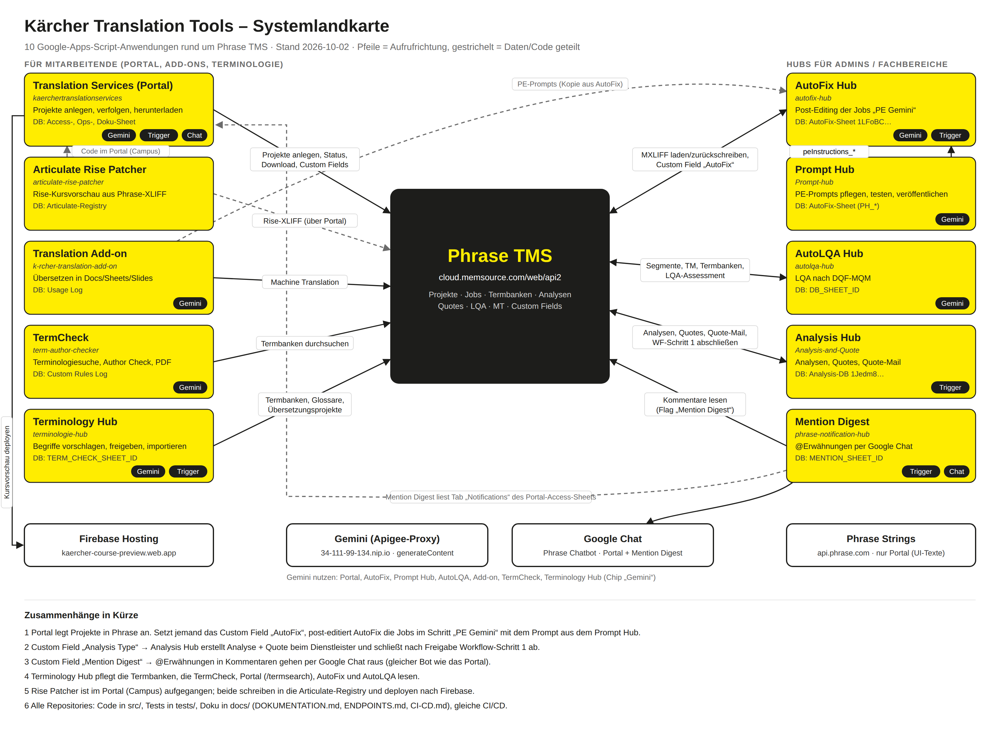

# Kärcher Translation Tools – Dokumentationspaket

Gesamtdokumentation aller zehn Google-Apps-Script-Anwendungen rund um Phrase TMS (Stand 2026-10-02).

| Datei | Inhalt |
|---|---|
| [`00-GESAMTUEBERSICHT.md`](00-GESAMTUEBERSICHT.md) | Systemlandkarte (Mermaid), Zusammenhänge, alle Datenbanken mit IDs, Phrase-Objekte (Custom Fields, Vorlagen), Gemini, Chat, Trigger, Abläufe, Rollen, CI/CD, Glossar, FAQ |
| [`ENDPOINTS-GESAMT.md`](ENDPOINTS-GESAMT.md) | alle Phrase-Endpunkte als Matrix Endpunkt × Anwendung, andere Dienste × Anwendung, Details je Anwendung |
| [`systemlandkarte.png`](systemlandkarte.png) · [`.svg`](systemlandkarte.svg) · [`.html`](systemlandkarte.html) | Grafik aller Anwendungen und Verbindungen |
| [`STRUKTUR-STANDARD.md`](STRUKTUR-STANDARD.md) | einheitlicher Aufbau aller Repositories, was sich je Repo geändert hat |
| [`anwendungen/`](anwendungen/) | umfassende Dokumentation je Anwendung (identisch mit `docs/DOKUMENTATION.md` im Repo) |

| # | Anwendung | Repository |
|---|---|---|
| 01 | Kärcher Translation Services (Portal) | `kaerchertranslationservices` |
| 02 | AutoFix Hub | `autofix-hub` |
| 03 | Prompt Hub | `Prompt-hub` |
| 04 | Analysis Hub (Analysis & Quotes) | `Analysis-and-Quote` |
| 05 | AutoLQA Hub | `autolqa-hub` |
| 06 | Mention Digest | `phrase-notification-hub` |
| 07 | Kärcher Translation Add-on | `k-rcher-translation-add-on` |
| 08 | Kärcher TermCheck | `term-author-checker` |
| 09 | Kärcher Terminology Hub | `terminologie-hub` |
| 10 | Articulate Rise Patcher | `articulate-rise-patcher` |

Die Dokumente enthalten Sheet-IDs, Phrase-UIDs und interne Links, aber keine Passwörter, Tokens oder API-Keys. Nur intern weitergeben.
