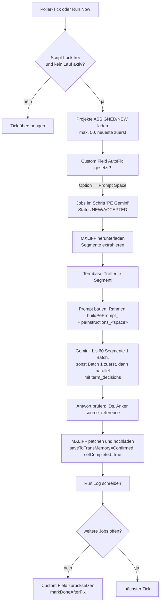

# AutoFix Hub (Repo `autofix-hub`)

> Kurz: Automatisches Post-Editing mit Gemini für Phrase TMS. AutoFix findet Projekte mit gesetztem Custom Field „AutoFix“, post-editiert die Jobs im Workflow-Schritt „PE Gemini“ mit dem Prompt des jeweiligen Dokumenttyps und schreibt die Korrekturen als MXLIFF zurück nach Phrase. Dazu eine Web-Oberfläche mit Dashboard, Run Log, Analysen (MQM, Term-Drift, Glossar) und Rollen.

---

## 1. Steckbrief

| Eigenschaft | Wert |
|---|---|
| Typ | Web-App, `executeAs: USER_ACCESSING`, `access: DOMAIN`; Zeit-Trigger `autoFixPoller` |
| Einstieg | `doGet`: `src/Index.html` (neue Oberfläche); `?page=prompts` = alter Prompt Editor |
| Datenbank | Google Sheet „AutoFix Hub - Database“, ID in Script Property `AUTOFIX_DB_SHEET_ID` (Standard laut Prompt Hub: `1LFoBCuz7h1xdi58djRPedAXgtj4RZ_T5EnvJbTKtkp8`) |
| KI | Gemini über Apigee-Proxy, Standardmodell `gemini-3.6-flash`, Temperature 0.1, Max Tokens 32768 |
| Phrase | `PHRASE_API_TOKEN`; API v1/v2 unter `https://cloud.memsource.com/web/api2/` |
| Tests/Deploy | `npm test`, `npm run test:ui`, Lint, gitleaks; `deploy.yml`: `main` → Staging, Tag `v*.*.*` → Produktion |

## 2. Ablauf eines Laufs



- Der Poller nimmt **pro Tick genau einen Job** (`processNextJob_`). „Run Now“ in der Oberfläche verarbeitet alle (`runAllJobsForAllProjects_`).
- Sperre gegen Doppelausführung: Script Lock + Property `AUTOFIX_RUNNING` (Timeout 25 min). Admins können sie lösen (`forceUnlock`).
- Projektliste wird 15 min gecacht (`AUTOFIX_PROJECT_CACHE`).
- Einheitliche Begriffe über Batch-Grenzen (FIX 18): Batch 1 liefert `language_variant` und `term_decisions`, die allen weiteren Batches vorgegeben werden.

## 3. Welcher Prompt wird verwendet?

1. Option des Custom Fields „AutoFix“ (`1uw8kvE6WNhT6Gw0XeX4Z4`) lesen.
2. Legacy-UIDs: `7d95rL0n0lA894J0CRXaL9` (True) und `2HtFqxLWLZp3126BkQ6li1` (Technical Documentation) → `technical`; `YddgPfvnHZ8A4li6KxmYS2` (Marketing) → `marketing`.
3. Sonst: **sichtbarer Optionstext** gegen das Label eines Prompt Space (aus dem Tab `Prompt Spaces`, gepflegt vom Prompt Hub, und der Property `AUTOFIX_PROMPT_TYPES_CONFIG`).
4. Fallback `technical`.
5. Prompt-Text = Zeile `peInstructions_<space>` im Tab `Settings`.

Der Rahmen um den Prompt (`buildPePrompt_`) ist fest im Code: Rolle, Sprachen, Dokumenttyp, Termbase-Regel („tbHit.tgt immer verwenden“), Segment-Isolation, Tags, Anker-Regel, Vollständigkeit, JSON-Ausgabe (`language_variant`, `term_decisions`, `results[id, source_reference, corrected, changed, reason]`). Der Prompt Hub hält eine wortgleiche Kopie davon (`AutoFixMirror.gs`).

## 4. Datenbank: AutoFix-Sheet

| Tab | Inhalt |
|---|---|
| `Settings` | Key/Value: `cfFieldUid`, `wfStepName`, `primaryModel`, `peTemperature`, `maxTokens`, `tmThreshold`, `pollerIntervalMinutes`, `markDoneAfterFix`, `peInstructions_<space>` je Space |
| `Run Log` | Timestamp, Project UID, Project Name, Job UID, Target Lang, Success, Total Segments, Changed Segments, Model, Message/Error, Changes JSON, AutoFix Type |
| `Audit Log` | Timestamp, Action, Details |
| `Prompt Spaces` | type, label, example, active – geschrieben vom Prompt Hub |
| `Prompt Hub Import` | Export des alten Prompt Editors für den Prompt Hub (`exportPromptEditorToPromptHub`) |
| MQM-Report-Tabs | von `exportMqmReportToSheet` erzeugt |
| `PH_*` | Daten des Prompt Hub (Spaces, Versionen, Nutzer, Anträge, Testfälle, Audit), falls kein eigenes Hub-Sheet |

Wirksam für echte Läufe sind nur `primaryModel`, `peTemperature`, `maxTokens` (global). `tmThreshold` und `pollerIntervalMinutes` liest der Code nicht; Werte pro Space aus dem alten Editor haben keine Wirkung.

> **Wichtig:** Die alte Funktion `saveAutoFixSettings()` leert den Tab `Settings` und schreibt ihn neu – das kann Prompts löschen. Die neue Oberfläche schreibt nur geänderte Zeilen.

## 5. Oberfläche

| Bereich | Inhalt | Rolle |
|---|---|---|
| Dashboard | Poller starten (5/10/30 min)/stoppen, Laufstatus, Kennzahlen 7 Tage, letzte Läufe | Ansehen (Steuern: Ausführen) |
| Live-Run | Lauf starten, Fortschritt live, Konsole | Ausführen |
| Warteschlange | Projekte mit Flag und Jobs in „PE Gemini“ | Ansehen |
| Run Log | Suche/Filter, Wort-Diff der Korrekturen, Fehler, **Re-Push** nach Phrase | Ansehen (Re-Push: Ausführen) |
| Analysen | MQM-Report (Export ins Sheet), Benchmark je Sprache, Term-Drift, Glossar-Vorschläge | Ausführen |
| Prompts | aktiver Prompt je Space, Herkunft (Prompt Hub / Fallback), wirksame Gemini-Werte, Link zum Prompt Hub | Ansehen |
| Admin | Anträge, Nutzer/Rollen, Admins, AutoFix-Einstellungen, Konfiguration, Wartung (Run-Sperre, Cache, Projektsuche), Audit-Log, „Ansicht als“ | Admin |
| Hilfe | FAQ | alle |

MQM-Schema der Analysen: Accuracy (Mistranslation, Omission, Addition, Untranslated), Terminology (Termbase, Inconsistency), Fluency (Grammar, Spelling, Register, Punctuation), Style (Kärcher Style, Formatting), Locale (Spelling Convention, Date/Number Format); Schweregrade minor/major/critical.

## 6. Rollen

| Rolle | Darf |
|---|---|
| Admin | alles |
| Ausführen (operator) | Läufe starten, Poller steuern, Re-Push, Analysen |
| Ansehen (viewer) | Dashboard, Warteschlange, Run Log, Prompts |

Gespeichert in Script Property `AUTOFIX_HUB_ACCESS`. Erster Admin: aus `PROMPT_EDITOR_ADMINS` übernommen oder `bootstrapAutoFixAdmin()` ausführen. **Offener Modus:** solange kein Admin existiert, darf jeder alles. Geschützt sind auch direkte Aufrufe von `runNow`, `runAutoFixForProject`, `replayChangesForJob`, `setupAutoFixTrigger`, `removeAutoFixTrigger`, `forceUnlock`, `recreateDatabase`.

## 7. Script Properties

| Property | Zweck |
|---|---|
| `PHRASE_API_TOKEN` | Phrase |
| `GEMINI_API_KEY` | Gemini-Proxy |
| `AUTOFIX_DB_SHEET_ID` | Datenbank-Sheet |
| `AUTOFIX_HUB_ACCESS` | Rollen, Anträge |
| `AUTOFIX_HUB_CONFIG` | `promptHubUrl`, `notifyEmails`, `chatWebhookUrl`, `allowedModels` |
| `AUTOFIX_HUB_UI_LANG` | Sprache |
| `AUTOFIX_RUNNING`, `AUTOFIX_RUN_LOG`, `AUTOFIX_PROJECT_CACHE` | Laufzeit |
| `AUTOFIX_PROMPT_TYPES_CONFIG`, `PROMPT_EDITOR_ADMINS`, `PROMPT_EDITOR_USERS`, `PROMPT_EDITOR_UI_LANG` | alter Prompt Editor |

## 8. Phrase-Endpunkte

Vollständige Liste mit Methode, Version, Zweck und Datei: [`docs/ENDPOINTS.md`](https://github.com/MMario996/autofix-hub/blob/main/docs/ENDPOINTS.md).

## 9. Dateien

| Pfad | Inhalt |
|---|---|
| `src/Code.gs` | Lauf-Logik, Gemini, MXLIFF, Poller, Analysen |
| `src/Database.gs` | Sheet anlegen, Run Log, MQM-Export |
| `src/Settings.gs` | Einstellungen, Standard-Prompts, Space-Zuordnung |
| `src/PromptEditorAccess.gs`, `src/PromptEditor.html` | alter Prompt Editor, liest Prompt-Hub-Spaces |
| `src/PromptHubExport.gs` | Export in den Prompt Hub |
| `src/HubAccess.gs`, `src/HubApi.gs` | Rollen, Anträge, Endpunkte der Oberfläche |
| `ui/` → `src/Index.html` | Oberfläche (`npm run build` erzeugt `src/Index.html`) |
| `dist/Doget patch.gs` | Kopiervorlage, wird nicht deployt |

## 10. Bezüge

- **Prompt Hub** schreibt Prompts und Spaces in dieses Sheet und spiegelt `buildPePrompt_`.
- **Translation Add-on** nutzt dieselben PE-Prompts (Kopie im Code).
- **Phrase:** Projektmanager setzen das Custom Field und den Workflow-Schritt „PE Gemini“ in den Vorlagen.

---

## Standard-Anhang (in allen Repositories gleich aufgebaut)

### A. Repository-Struktur

```
autofix-hub/
├── src/                  Apps-Script-Code (clasp rootDir) inkl. appsscript.json
├── ui/                   Quelle der Oberfläche → src/Index.html (npm run build)
├── dist/                 Kopiervorlagen, nicht Teil des Apps-Script-Projekts
├── tests/                Node-Tests (npm test), u. a. gas.syntax.test.js (Standard)
├── tests-ui/             Browser-Tests (npm run test:ui)
├── tools/                check-structure.js (Standard), check-encoding.js, Build-Skripte
├── docs/                 DOKUMENTATION.md, ENDPOINTS.md, CI-CD.md, mockups/
├── .github/              workflows/ci.yml, workflows/deploy.yml, actions/clasp-deploy/,
│                         dependabot.yml, CODEOWNERS, pull_request_template.md
├── .claspignore, .gitignore, .gitleaks.toml, eslint.config.js, package.json
└── README.md
```

Einheitliche Befehle: `npm ci`, `npm test`, `npm run lint`, `npm run check` (Struktur, Kodierung, generierte Dateien), `npm run ci` (alles).

### B. Schnittstellen

- **Phrase TMS:** 10 Endpunkt-Aufrufe, Token PHRASE_API_TOKEN (Bearer).
- **Weitere Dienste:** Gemini (Apigee-Proxy), Google Chat Webhook, MailApp, Google Sheets.
- Vollständig mit Methode, Version, Zweck und Datei: [`docs/ENDPOINTS.md`](https://github.com/MMario996/autofix-hub/blob/main/docs/ENDPOINTS.md). Alle Anwendungen im Vergleich: [`ENDPOINTS-GESAMT.md`](https://github.com/MMario996/kaerchertranslationservices/blob/main/docs/gesamt/ENDPOINTS-GESAMT.md).

### C. Zusammenhänge mit anderen Anwendungen

| Partner | Richtung | Was |
|---|---|---|
| Phrase TMS | ↔ | liest Projekte/Jobs im Schritt „PE Gemini“, lädt MXLIFF, schreibt korrigierte MXLIFF zurück |
| Prompt Hub | ← | schreibt `peInstructions_<space>`, `primaryModel`, `peTemperature`, `maxTokens` und Tab `Prompt Spaces` in das AutoFix-Sheet; spiegelt `buildPePrompt_` |
| Translation Add-on | Kopie | nutzt dieselben PE-Prompts (Kopie im Code) |
| Portal | indirekt über Phrase | Projekte aus dem Portal laufen durch AutoFix, wenn das Custom Field gesetzt ist |
| Analysis Hub | Design | gleiche Oberfläche/Pipeline (Basis für den Analysis Hub) |

Systemlandkarte aller zehn Anwendungen: [`systemlandkarte.svg`](https://github.com/MMario996/kaerchertranslationservices/blob/main/docs/gesamt/systemlandkarte.svg), Gesamtübersicht: [`00-GESAMTUEBERSICHT.md`](https://github.com/MMario996/kaerchertranslationservices/blob/main/docs/gesamt/00-GESAMTUEBERSICHT.md).

### D. Entwicklung, Tests, Deployment

CI `ci.yml`; CD `deploy.yml`: `main` → Staging, Tag `v*.*.*` → Produktion (Freigabe), Secrets `CLASPRC_JSON`, `STAGING_/PROD_SCRIPT_ID`, `STAGING_/PROD_DEPLOYMENT_ID`. Details: [`docs/CI-CD.md`](https://github.com/MMario996/autofix-hub/blob/main/docs/CI-CD.md).

> **clasp:** `clasp push` ersetzt den kompletten Code im Apps-Script-Projekt. Was nur im Online-Editor geändert wurde, geht verloren. Der Code liegt seit Oktober 2026 unter `src/` (`.clasp.json` mit `"rootDir": "src"`).

### E. Auffälligkeiten (Stand 2026-10-02)

- **Prompt-Rahmen weicht vom Prompt Hub ab:** `node tools/check-mirror.js --autofix=../autofix-hub` im Prompt Hub meldet, dass `buildPePrompt_`/`buildConsistencyBlock_` in AutoFix geändert wurden (war schon vor dem Umbau so). Im Prompt Hub mit `--write` übernehmen, sonst bildet der Live-Test den echten Lauf nicht exakt ab.
- `Doget patch.gs` war eine Kopiervorlage mit zweitem `doGet()` und liegt jetzt in `dist/`.
- Über den Proxy ist laut Code (FIX 14) nur `gemini-3.6-flash` sicher freigeschaltet.
