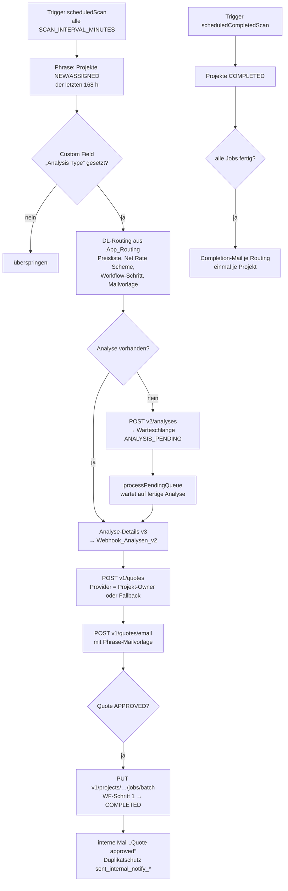

# Analysis Hub – Analysis & Quotes (Repo `Analysis-and-Quote`)

> Kurz: Erstellt für aktive Phrase-Projekte automatisch **Analysen** und **Quotes** (Angebote) beim richtigen Dienstleister, verschickt die Quote-Mail, schließt nach Freigabe der Quote den **Workflow-Schritt 1** ab und informiert intern. Gesteuert über das Custom Field **„Analysis Type“** und ein DL-Routing im Datenblatt. Oberfläche und Bedienung wie AutoFix Hub.

---

## 1. Steckbrief

| Eigenschaft | Wert |
|---|---|
| Typ | Web-App, `executeAs: USER_DEPLOYING`, `access: DOMAIN`; Zeit-Trigger `scheduledScan`, `scheduledCompletedScan` |
| Einstieg | `doGet` → `src/Index.html` (generiert aus `ui/`) |
| Datenbank | Google Sheet `1Jedm88GqXBp1-QxQCD-hgfQZO1007YVIdgXA_GOpiEY` (fest in `src/ConfigLoader.gs`, `SYSTEM_CONFIG.SPREADSHEET_ID`) |
| Konfiguration | Tabs `App_Config` (Key/Value), `App_Routing` (DL-Routing), `App_OptionMapping` (Custom-Field-Option → Analysis Type) |
| Phrase | Script Property `PHRASE_TOKEN`; Basis `PHRASE_BASE_URL` (Standard `https://cloud.memsource.com/web`) |
| KI | keine |
| Rollen | Script Property `ANALYSIS_HUB_ACCESS` (Admin, Ausführen, Ansehen); ohne Admin „offener Modus“ |
| Tests/Deploy | `npm test`, `npm run test:ui`, `npm run lint`, `npm run check`; `deploy.yml`: `main` → Staging, Tag `v*.*.*` → Produktion |

## 2. Ablauf



- **Provider:** `PROVIDER_SOURCE` (Standard `PROJECT_OWNER`), sonst `FIXED_PROVIDER_*`; Fallback `FALLBACK_PROVIDER_ID` `1182021` (Typ USER).
- **Duplikate:** `PREVENT_DUPLICATES` – je Analyse höchstens eine Quote, je Analyse höchstens eine Mail (Spalten `quote_uid`, `email_sent`).
- **Archivierung:** Einträge älter als `ARCHIVE_DATA_DAYS` (90) bzw. `ARCHIVE_QUEUE_DAYS` (30) wandern nach `Archiv_Analysen`/`Archiv_Queue`; automatisch nur mit `ARCHIVE_AUTO_ENABLED`.

## 3. Datenbank (Tabs)

| Tab | Inhalt |
|---|---|
| `App_Config` | Key/Value, u. a. `SCAN_INTERVAL_MINUTES` (5), `SCAN_PROJECT_STATUSES` (NEW, ASSIGNED), `PROJECT_SCAN_LOOKBACK_HOURS` (168), `AUTO_CREATE_ANALYSES`, `ANALYSE_CREATION_MAX_JOBS` (100), `ONLY_PRE_ANALYSE`, `DEFAULT_WORKFLOW_STEP_ID` (`1043109`), `DEFAULT_QUOTE_EMAIL_TEMPLATE_UID` (`tg5BURQ9kGGj3tg0LUGHW1`), `CF_ANALYSIS_TYPE_UID` (`s3rkXsPVn38K9t1dI0fRc7`), `COMPLETED_SCAN_*`, `HTTP_MAX_RETRIES`, `LOG_MIN_LEVEL` |
| `App_Routing` | je Dienstleister/Analysis Type: name, enabled, analyseType, quoteNamePrefix, priceListId/Uid, netRateSchemeId/Uid, workflowStepId, quoteEmailTemplateUid, emailEnabled/Cc/Bcc, customFieldOptionUid, note, internalNotifyTo/Cc/Bcc |
| `App_OptionMapping` | Option-UID des Custom Fields → Analysis-Type-Wert |
| `Webhook_Analysen_v2` | eine Zeile je Analyse und Sprachpaar: Analyse, Projekt, Wörter, Provider, Quote (UID, Preis, Status), Mailstatus, Rohdaten |
| `Webhook_Queue` | offene Analyse-Erstellungen und wartende Analysen, Versuche, Completed-Mail |
| `Webhook_Log` | Log der Läufe (Level INFO/WARN/ERROR) |
| `Archiv_Analysen`, `Archiv_Queue` | Archiv |
| `App_Audit` | jede Aktion aus der Oberfläche |

## 4. Oberfläche

Dashboard (Trigger, Kennzahlen, letzte Quotes), Projekte (Analyse/Quote erstellen), Analysen & Quotes (Detail, CSV, PDF), Warteschlange, Live-Scan, Statistik, Logs, Admin (Zugriff, DL-Routing, Custom-Field-Mapping, Einstellungen, **Script Properties bereinigen**, Wartung, Audit-Log), Hilfe. Deutsch/Englisch, Dark Mode, mobil.

**Script Properties bereinigen:** Die Flags `sent_internal_notify_<QuoteUid>` wachsen ohne Ende (Apps-Script-Grenze ≈ 500 kB). Admin → Script Properties filtert nach Alter und Quote-Status (aus Phrase geladen) und löscht geschützt: `PHRASE_TOKEN` und `ANALYSIS_HUB_*` nie, Flags jünger als das Scan-Fenster nur ausdrücklich.

## 5. Rollen

| Rolle | Darf |
|---|---|
| Admin | alles |
| Ausführen (operator) | Scans, Trigger, Analysen und Quotes erstellen, Warteschlange bereinigen, Archivierung, Testmail |
| Ansehen (viewer) | Dashboard, Projekte, Analysen & Quotes, Warteschlange, Statistik, Logs |

Erster Admin: Admin → Zugriff oder `bootstrapAnalysisHubAdmin()` im Editor.

## 6. Script Properties

| Property | Zweck |
|---|---|
| `PHRASE_TOKEN` | Phrase-API-Token |
| `ANALYSIS_HUB_ACCESS` | Rollen, Anträge |
| `ANALYSIS_HUB_CONFIG` | `notifyEmails`, `chatWebhookUrl` |
| `sent_internal_notify_<QuoteUid>` | Duplikatschutz der internen Mail (Zeitstempel) |
| Completed-Flags je Projekt | Duplikatschutz der Completion-Mail |

## 7. Dateien

| Pfad | Inhalt |
|---|---|
| `src/Code.gs` | Pipeline: Scan, Analyse, Quote, Mails, Phrase-Aufrufe |
| `src/CompletedScan.gs` | Completed-Scan und Completion-Mail |
| `src/ConfigLoader.gs`, `src/Config.gs` | Konfiguration aus den Sheets, Spaltenköpfe |
| `src/HubAccess.gs`, `src/HubApi.gs` | Rollen, Anträge, Audit; Funktionen der Oberfläche |
| `src/PropsCleanup.gs` | Script Properties auflisten und bereinigen |
| `src/Testing.gs` | Test- und Debug-Funktionen für den Editor |
| `ui/` → `src/Index.html` | Oberfläche (`npm run build`) |

---

## Standard-Anhang (in allen Repositories gleich aufgebaut)

### A. Repository-Struktur

```
Analysis-and-Quote/
├── src/                  Apps-Script-Code (clasp rootDir) inkl. appsscript.json
├── ui/                   Quelle der Oberfläche → src/Index.html (npm run build)
├── tests/                Node-Tests (npm test), u. a. gas.syntax.test.js (Standard)
├── tests-ui/             Browser-Tests (npm run test:ui)
├── tools/                check-structure.js (Standard), check-encoding.js, Build-Skripte
├── docs/                 DOKUMENTATION.md, ENDPOINTS.md, CI-CD.md, mockups/
├── .github/              workflows/ci.yml, workflows/deploy.yml, actions/clasp-deploy/,
│                         dependabot.yml, CODEOWNERS, pull_request_template.md
├── .claspignore, .gitignore, .gitleaks.toml, eslint.config.js, package.json
└── README.md
```

Einheitliche Befehle: `npm ci`, `npm test`, `npm run lint`, `npm run check` (Struktur, Kodierung, generierte Dateien), `npm run ci` (alles).

### B. Schnittstellen

- **Phrase TMS:** 17 Endpunkt-Aufrufe, Token PHRASE_TOKEN (Bearer), Basis aus `App_Config.PHRASE_BASE_URL`.
- **Weitere Dienste:** GmailApp, MailApp, Google Chat Webhook, Google Sheets.
- Vollständig mit Methode, Version, Zweck und Datei: [`docs/ENDPOINTS.md`](https://github.com/MMario996/Analysis-and-Quote/blob/main/docs/ENDPOINTS.md). Alle Anwendungen im Vergleich: [`ENDPOINTS-GESAMT.md`](https://github.com/MMario996/kaerchertranslationservices/blob/main/docs/gesamt/ENDPOINTS-GESAMT.md).

### C. Zusammenhänge mit anderen Anwendungen

| Partner | Richtung | Was |
|---|---|---|
| Phrase TMS | ↔ | Projekte, Analysen, Quotes, Mailvorlagen, Abschluss von Workflow-Schritt 1 |
| Dienstleister | → | Quote-Mail über Phrase (`/quotes/email`) |
| AutoFix Hub | Design | gleiche Oberfläche, gleiche CI/CD; beide in derselben Google Site |
| Portal | indirekt über Phrase | Portal-Projekte mit „Analysis Type“ werden automatisch analysiert und angeboten |

Systemlandkarte aller zehn Anwendungen: [`systemlandkarte.svg`](https://github.com/MMario996/kaerchertranslationservices/blob/main/docs/gesamt/systemlandkarte.svg), Gesamtübersicht: [`00-GESAMTUEBERSICHT.md`](https://github.com/MMario996/kaerchertranslationservices/blob/main/docs/gesamt/00-GESAMTUEBERSICHT.md).

### D. Entwicklung, Tests, Deployment

CI `ci.yml`; CD `deploy.yml`: `main` → Staging, Tag `v*.*.*` → Produktion, Secrets wie AutoFix Hub. Details: [`docs/CI-CD.md`](https://github.com/MMario996/Analysis-and-Quote/blob/main/docs/CI-CD.md).

> **clasp:** `clasp push` ersetzt den kompletten Code im Apps-Script-Projekt. Was nur im Online-Editor geändert wurde, geht verloren. Der Code liegt seit Oktober 2026 unter `src/` (`.clasp.json` mit `"rootDir": "src"`).

### E. Auffälligkeiten (Stand 2026-10-02)

- Sheet-ID `1Jedm88G…` steht fest im Code (`src/ConfigLoader.gs`), nicht in einer Script Property.
- Token heißt hier `PHRASE_TOKEN` (alle anderen Repos: `PHRASE_API_TOKEN`).
