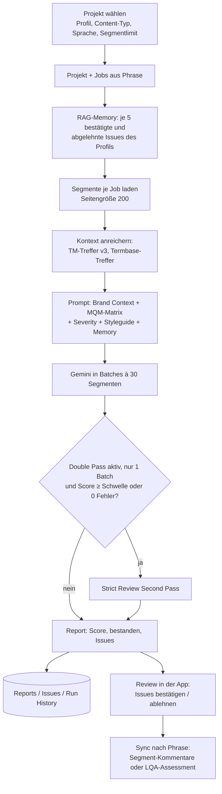

# AutoLQA Hub (Repo `autolqa-hub`)

> Kurz: Web-App für KI-gestützte Qualitätsprüfung (Language Quality Assessment, LQA) von Phrase-Projekten nach dem **DQF-MQM**-Modell. Gemini bewertet die Segmente eines Projekts mit Termbase- und TM-Kontext, vergibt Fehler mit Kategorie, Schweregrad und Strafpunkten, berechnet einen Score und schreibt die Befunde auf Wunsch als Segment-Kommentare oder als offizielles LQA-Assessment nach Phrase zurück.

---

## 1. Steckbrief

| Eigenschaft | Wert |
|---|---|
| Typ | Web-App, `executeAs: USER_DEPLOYING`, **`access: MYSELF`** – nur der Eigentümer kann sie öffnen |
| Einstieg | `doGet` → `src/Index.html` (Titel „AutoLQA Hub“) |
| Datenbank | Google Sheet „AutoLQA Hub - Database“, ID in Script Property `DB_SHEET_ID`; fehlt sie, wird das Sheet automatisch angelegt. Link in der App über „Datenbank öffnen“ (`getDatabaseUrl()`) |
| KI | Gemini über Apigee-Proxy; Standardmodell `gemini-2.5-pro` (Setting `primaryModel`) |
| Script Properties | `PHRASE_API_TOKEN`, `GEMINI_API_KEY`, `DB_SHEET_ID` |
| Tests/Deploy | `npm test` (Syntax, Manifest, Namensraum), `npm run lint`, `npm run check`; Standard-CI/CD (siehe Anhang D). Früher: Commits „Sync: Update …“ aus dem Apps-Script-Editor |

> ⚠️ Laut AutoFix-Code ist `gemini-2.5-pro` über den Kärcher-Proxy nicht mehr verfügbar (404). Falls AutoLQA-Läufe mit 404 scheitern, in den Einstellungen `primaryModel` auf `gemini-3.6-flash` setzen.

## 2. Ablauf



- **Referenzdatei:** Optional lässt sich ein Styleguide/Referenzdokument hochladen; es geht als Datei mit an Gemini. Dazu freie „Styleguide Notes“.
- **Report-Modus:** kombiniert (ein Report) oder je Sprache (`per_language`, ein Report je Zielsprache).
- **Content-Typen** (Brand Context): `universal` immer + `marketing`, `techdoc` oder `ui`. Die Kärcher-Regeln (Umlaut in „Kärcher“, Produktnamen wie „K 5“, „HD 6/13“ unverändert, Termbase ist Ground Truth, bei Confidence < 70 nicht melden) stehen als Standardtexte in `src/Settings.gs` und sind in der App editierbar.
- **Root Cause:** „Pre-translation“ (Fehler im Quelltext) oder „Production“ (Übersetzungsfehler).
- **Fortschritt:** im Script-Cache unter einer Task-ID, die Oberfläche fragt `getTaskProgress(taskId)` ab.

## 3. Datenbank-Tabs

| Tab | Spalten |
|---|---|
| `Settings` | Key, Value (siehe unten) |
| `Profiles` | ID, Name, JSON Data (komplettes MQM-Profil) |
| `Reports` | ReportID (`REP-<timestamp>[-<lang>]`), Date, ProjectID, ProjectName, Profile, Score, Passed, TotalSegs, TotalWords, Errors, Summary |
| `Issues` | ReportID, IssueID (Segment-ID), Category, Subcategory, Severity, Penalty, Confidence, Status (pending/approved/rejected), Source, Target, Suggestion, Explanation, RootCause |
| `Audit Log` | Timestamp, Action, Details |
| `Run History` | Timestamp, ReportID, Model, Duration_ms, Passes, IssuesFound |
| `LQA Export` | formatierter Export aller Reports und Issues (`exportReportsToSheet`) |

## 4. Einstellungen (Tab `Settings`)

| Key | Standard | Bedeutung |
|---|---|---|
| `primaryModel` | `gemini-2.5-pro` | Gemini-Modell |
| `tempPass1` / `tempPass2` | 0.1 / 0.05 | Temperature erster / zweiter Durchgang |
| `maxTokens` | 32768 | Ausgabe-Limit |
| `doublePassEnabled`, `doublePassThreshold` | true, 100 | strenger zweiter Durchgang („Strict Review“), wenn der Lauf nur einen Batch hatte und Score ≥ Schwelle oder keine Fehler |
| `phraseMaxSegments` | 30 | Standard-Segmentlimit |
| `defaultProjectCount` | 50 | Projekte in der Liste |
| `tmThreshold` | 0.7 | TM-Mindesttreffer |
| `tbLookupLimit`, `tbMinWordLength`, `tbMaxNgram` | 15, 3, 3 | Termbase-Suche |
| `lqaDefaultProfile` | `mqm_core_standard` | Standardprofil |
| `commentPrefix` | `[AutoLQA]` | Präfix für Phrase-Kommentare |
| `roiHourlyRate`, `roiWordsPerHour` | 50, 2500 | ROI-Berechnung in Analytics |
| `brandContextUniversal/Marketing/Techdoc/Ui` | Kärcher-Texte | Brand Context je Content-Typ |
| `uiTheme`, `uiLang`, `uiDefaultView` | light, de, projects | Oberfläche |

Werte, die mit `= + - @ * #` beginnen, werden mit Apostroph gespeichert, damit Sheets sie nicht als Formel liest.

## 5. Standard-MQM-Profil „MQM Core Standard“

| Kategorie | Subkategorien (Gewicht) |
|---|---|
| ACCURACY | Accuracy, Mistranslation, Omission, Improper exact TM match (1.0) |
| FLUENCY | Fluency, Grammar, Spelling (1.0) |
| TERMINOLOGY | Inconsistent with termbase, Terminology (1.5) |
| STYLE | Style, Unidiomatic (1.0) |

Strafpunkte: Neutral 0, Minor 1, Major 5, Critical 10. Bestehensgrenze 99,0 %. Profile sind im Reiter „Profiles“ editierbar, zurücksetzbar.

## 6. Oberfläche

| Reiter | Inhalt |
|---|---|
| Projects | aktive Phrase-Projekte, „Start AutoLQA“ |
| Reports | Reports, LQA-Review (Issues bestätigen/ablehnen, Sammelaktionen), „Sync to Phrase TMS LQA“, Export |
| Analytics | Auswertungen, ROI |
| Profiles | MQM Profile Editor |
| Settings | alle Einstellungen, Brand Context, Datenbank neu anlegen |

## 7. Phrase-Endpunkte

Vollständige Liste mit Methode, Version, Zweck und Datei: [`docs/ENDPOINTS.md`](https://github.com/MMario996/autolqa-hub/blob/main/docs/ENDPOINTS.md).

## 8. Dateien

| Datei | Inhalt |
|---|---|
| `src/Code.gs` | Phrase, Gemini, Prompt, Batches, Ablauf, Sync |
| `src/Database.gs` | Sheet, Reports, Issues, Export, RAG-Memory, Profile |
| `src/Settings.gs` | Standard-Einstellungen, Brand-Context-Texte, Reparaturfunktionen |
| `src/PromptBulk.gs` | `fixBrandContextInSheet()` – einmalige Reparatur |
| `src/Index.html` | Oberfläche |

Hilfsfunktionen im Editor: `recreateDatabase`, `repairSettingsSheet`, `migrateBrandContextSettings`, `forceMaxTokensUpdate`, `resetKaercherPrompts`.

---

## Standard-Anhang (in allen Repositories gleich aufgebaut)

### A. Repository-Struktur

```
autolqa-hub/
├── src/                  Apps-Script-Code (clasp rootDir) inkl. appsscript.json
├── tests/                Node-Tests (npm test), u. a. gas.syntax.test.js (Standard)
├── tools/                check-structure.js (Standard), check-encoding.js, Build-Skripte
├── docs/                 DOKUMENTATION.md, ENDPOINTS.md, CI-CD.md
├── .github/              workflows/ci.yml, workflows/deploy.yml, actions/clasp-deploy/,
│                         dependabot.yml, CODEOWNERS, pull_request_template.md
├── .claspignore, .gitignore, .gitleaks.toml, eslint.config.js, package.json
└── README.md
```

Einheitliche Befehle: `npm ci`, `npm test`, `npm run lint`, `npm run check` (Struktur, Kodierung, generierte Dateien), `npm run ci` (alles).

### B. Schnittstellen

- **Phrase TMS:** 13 Endpunkt-Aufrufe, Token PHRASE_API_TOKEN.
- **Weitere Dienste:** Gemini (Apigee-Proxy), Google Sheets.
- Vollständig mit Methode, Version, Zweck und Datei: [`docs/ENDPOINTS.md`](https://github.com/MMario996/autolqa-hub/blob/main/docs/ENDPOINTS.md). Alle Anwendungen im Vergleich: [`ENDPOINTS-GESAMT.md`](https://github.com/MMario996/kaerchertranslationservices/blob/main/docs/gesamt/ENDPOINTS-GESAMT.md).

### C. Zusammenhänge mit anderen Anwendungen

| Partner | Richtung | Was |
|---|---|---|
| Phrase TMS | ↔ | Segmente, TM- und Termbank-Kontext lesen; Befunde als Kommentar oder LQA-Assessment schreiben |
| Gemini | → | LQA nach DQF-MQM |
| AutoFix Hub | fachlich | unabhängig; prüft fertige Übersetzungen, AutoFix korrigiert MT vorher |

Systemlandkarte aller zehn Anwendungen: [`systemlandkarte.svg`](https://github.com/MMario996/kaerchertranslationservices/blob/main/docs/gesamt/systemlandkarte.svg), Gesamtübersicht: [`00-GESAMTUEBERSICHT.md`](https://github.com/MMario996/kaerchertranslationservices/blob/main/docs/gesamt/00-GESAMTUEBERSICHT.md).

### D. Entwicklung, Tests, Deployment

CI `ci.yml` (Standard); CD `deploy.yml`: `main` → Staging, Tag → Produktion, Secrets `CLASPRC_JSON`, `STAGING_/PROD_SCRIPT_ID`, `STAGING_/PROD_DEPLOYMENT_ID` (fehlen sie, wird übersprungen). Details: [`docs/CI-CD.md`](https://github.com/MMario996/autolqa-hub/blob/main/docs/CI-CD.md).

> **clasp:** `clasp push` ersetzt den kompletten Code im Apps-Script-Projekt. Was nur im Online-Editor geändert wurde, geht verloren. Der Code liegt seit Oktober 2026 unter `src/` (`.clasp.json` mit `"rootDir": "src"`).

### E. Auffälligkeiten (Stand 2026-10-02)

- Web-App nur für den Eigentümer (`access: MYSELF`).
- Standardmodell `gemini-2.5-pro` liefert über den Proxy laut AutoFix-Code 404; ggf. `primaryModel` auf `gemini-3.6-flash` setzen.
- Viele Umlaute im Code sind durch einen früheren Sync zu `?` geworden (Altlast, erfasst in `tools/encoding-baseline.json`, darf nur weniger werden).
- Segment-Kommentare gehen an `POST v1/projects/{p}/jobs/{j}/segments/{id}/comments`; die dokumentierte Phrase-API für Kommentare ist `…/conversations/plains`. Prüfen, ob der Aufruf in Phrase ankommt.
