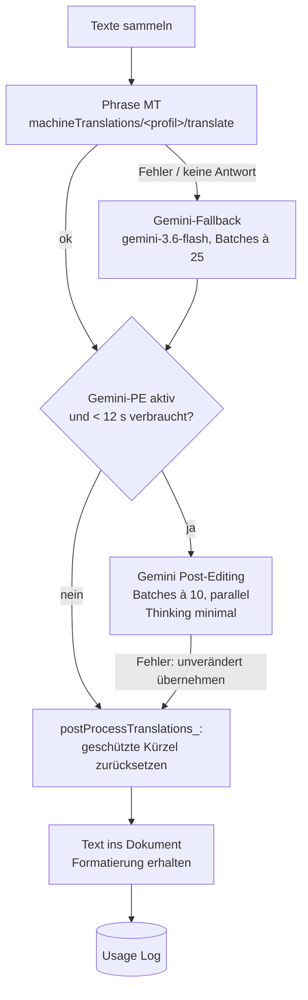

# Kärcher Translation Add-on (Repo `k-rcher-translation-add-on`)

> Kurz: Google-Workspace-Add-on für **Docs, Sheets und Slides**, das Inhalte direkt im Dokument übersetzt – über die **Machine Translation von Phrase** (Kärcher-Profile mit Glossar). Fällt Phrase aus, übersetzt **Gemini** weiter. Optional prüft ein zweiter Gemini-Durchgang (Post-Editing) die Übersetzung mit denselben Prompts wie der AutoFix Hub.

---

## 1. Steckbrief

| Eigenschaft | Wert |
|---|---|
| Typ | Workspace-Add-on (Karten-Oberfläche, CardService), Name „Kärcher Translation Add-on“ |
| Einstieg | `onHomepage` (Docs/Sheets/Slides), Universal Action „Settings“ → `onSettings` |
| Phrase | `PHRASE_API_TOKEN` (Script Property); `POST v1/machineTranslations/{profileUid}/translate` |
| Gemini | Proxy `https://34-111-99-134.nip.io/gemini`, Modell `gemini-3.6-flash`, Key `GEMINI_API_KEY` |
| URL-Whitelist | `https://cloud.memsource.com/`, `https://34-111-99-134.nip.io/` |
| Scopes | documents, spreadsheets, presentations, external_request, drive, userinfo.email |
| Datenbank | optional „Usage Log“-Sheet (`ADMIN_USAGE_LOG_SHEET_ID`) |
| Tests | `npm test` (Node ≥ 18, Stubs für Apps Script) |

## 2. Funktionen je App

| App | Aktionen |
|---|---|
| **Docs** | „Transl. Selection“ (Auswahl ersetzen) · „Transl. Entire Document“ (Absätze, Listen, Tabellenzellen; Zeichenformat bleibt, vorher automatische Sicherungskopie `[Backup <Datum>] <Name>`) |
| **Sheets** | „Transl. Selection“ (markierte Zellen) · „Transl. Entire Spreadsheet“ (alle Textzellen aller Blätter, Zahlen übersprungen) |
| **Slides** | „Transl. Selected Shapes“ · „Transl. Selected Slides“ · „Transl. All Slides and Notes“ · „Transl. Speaker Notes only“ (Schrift, Größe, Farbe bleiben) |

Einstellungen je Nutzer (User Properties): Profil (`KAERCHER_PROFILE`, Standard GENERAL), Quellsprache (`PHRASE_SOURCE_LANG`, Standard en, „auto“ möglich), Zielsprache (`PHRASE_TARGET_LANG`, Standard de). 31 Sprachen (de, en, es, sv, pt, ru, it, fr, nl, hu, sk, hr, tr, pl, fi, sr, ar, bg, el, ko, da, ja, vi, zh, lv, cs, uk, ro, et, sl, nb).

Grenzen: Warnung ab 3.000 Elementen, Sperre ab 8.000; Batches à 500 Texte; Laufzeitschutz 25 s (Add-ons werden nach 30 s beendet); 429-Retry (3 Versuche, 2 s × 2ⁿ).

## 3. Übersetzungsablauf



- **Post-Editing-Prompts** je Profil: `TECHNICAL`, `MARKETING`; `GENERAL` nutzt `TECHNICAL`. Inhalt entspricht den AutoFix-Prompts (fest in `src/Api.gs`, `GEMINI_PE_PROMPTS_`).
- **Fail-open:** Jeder Fehler im PE-Schritt gibt die ursprüngliche Übersetzung zurück.
- Lehnt der Proxy das Feld `thinkingConfig` ab, wird es automatisch weggelassen (Property `GEMINI_PE_THINKING_UNSUPPORTED`).
- **Geschützte Kürzel** (z. B. Kärcher-Gesellschaften `AK-DE`, `AK-US`, Bereiche `WOMA`, `FSG-PS` …) werden nach der Übersetzung wiederhergestellt.

## 4. Phrase-MT-Profile

| Profil | UID (Standard) | Phrase-Name |
|---|---|---|
| MARKETING | `Zpfa4GJsY5rl4J9q070rV5` | Add-on Marketing |
| TECHNICAL | `GrigHtkTDZUF4xYGWFmpI2` | Add-on Technical |
| GENERAL | `gC20LvuraAQGr2lXlrubL4` | Add-on General |

Überschreibbar per Script Property `MT_PROFILE_<KEY>` = `{ "uid": "…", "label": "…" }` (`ADMIN_setProfile("MARKETING", "<uid>", "Marketing")`).

## 5. Usage Log (Admin)

Sheet mit Tab `Usage Log`: Timestamp, User, App, Action, Profile, Source Lang, Target Lang, Segments, Words, Engine (Phrase/Gemini, +PE), Status (OK/ERROR), Error, Duration (s). Nicht in der Add-on-Oberfläche sichtbar. Plattform-Abbrüche („Exceeded maximum execution time“) erscheinen dort nicht.

## 6. Admin-Funktionen (nur im Apps-Script-Editor)

| Funktion | Zweck |
|---|---|
| `ADMIN_setApiToken()` / `ADMIN_clearApiToken()` / `ADMIN_debugTokenLocation()` | Phrase-Token |
| `ADMIN_setProfile`, `ADMIN_removeProfile`, `ADMIN_listStoredProfiles`, `ADMIN_seedDefaultProfiles`, `ADMIN_updateToOfficialAddonProfiles`, `ADMIN_listLanguageAiProfiles` | MT-Profile |
| `ADMIN_createUsageLogSheet`, `ADMIN_setUsageLogSheetId`, `ADMIN_getUsageLogSheetUrl`, `ADMIN_clearUsageLogSheetId`, `ADMIN_addUserColumnToLog` | Usage Log |
| `ADMIN_enableGeminiPostEdit`, `ADMIN_disableGeminiPostEdit`, `ADMIN_isGeminiPostEditEnabled` | PE an/aus (`GEMINI_PE_ENABLED`) |
| `ADMIN_testTranslation`, `ADMIN_testGeminiConnection`, `ADMIN_testGeminiTranslation`, `ADMIN_testGeminiPostEdit`, `ADMIN_testGeminiPostEditSpeed` | Tests |
| `ADMIN_resetWhatsNewForMe` | „What's New“-Popup erneut zeigen |

## 7. Script / User Properties

| Property | Ort | Zweck |
|---|---|---|
| `PHRASE_API_TOKEN` | Script | Phrase |
| `GEMINI_API_KEY` | Script | Gemini |
| `GEMINI_PE_ENABLED` | Script | `false` schaltet PE ab |
| `GEMINI_PE_THINKING_UNSUPPORTED` | Script | automatisch gesetzt |
| `MT_PROFILE_<KEY>` | Script | Profil-UIDs |
| `ADMIN_USAGE_LOG_SHEET_ID` | Script | Log-Sheet |
| `KAERCHER_PROFILE`, `PHRASE_SOURCE_LANG`, `PHRASE_TARGET_LANG` | User | Nutzerauswahl |
| `WHATS_NEW_SEEN_VERSION` | User | „What's New“ (aktuell Version 1.2) |

## 8. Dateien

| Datei | Inhalt |
|---|---|
| `src/Config.gs` | Konstanten, Profile, Sprachen, Grenzen, „What's New“ |
| `src/Config gemini ergaenzung.gs` | Gemini-Basis-URL, Fallback-Modell, Batchgröße |
| `src/Api.gs` | Phrase-Aufruf mit Retry, Gemini-Fallback, Gemini-PE, Nachbearbeitung |
| `src/Docs.gs`, `src/Sheets.gs`, `src/Slides.gs` | Übersetzen je App mit Formaterhalt |
| `src/UI.gs`, `src/Help.gs` | Karten (Start, Einstellungen, Hilfe, Fehler) |
| `src/Helpers.gs` | Einstellungen, Schreibrechte prüfen, Sicherungskopie, Usage Log |
| `src/Admin.gs` | Admin-Funktionen |
| `tests/` | Node-Tests |

Hilfe-Links in der Karte: Taskbox 4019 (Problem melden), 4030 (Übersetzungsproblem).

---

## Standard-Anhang (in allen Repositories gleich aufgebaut)

### A. Repository-Struktur

```
k-rcher-translation-add-on/
├── src/                  Apps-Script-Code (clasp rootDir) inkl. appsscript.json
├── tests/                Node-Tests (npm test), u. a. gas.syntax.test.js (Standard)
├── tools/                check-structure.js (Standard), check-encoding.js, Build-Skripte
├── docs/                 DOKUMENTATION.md, ENDPOINTS.md, CI-CD.md
├── .github/              workflows/ci.yml, workflows/deploy.yml, actions/clasp-deploy/,
│                         dependabot.yml, CODEOWNERS, pull_request_template.md
├── .claspignore, .gitignore, .gitleaks.toml, eslint.config.js, package.json
└── README.md
```

Einheitliche Befehle: `npm ci`, `npm test`, `npm run lint`, `npm run check` (Struktur, Kodierung, generierte Dateien), `npm run ci` (alles).

### B. Schnittstellen

- **Phrase TMS:** 2 Endpunkt-Aufrufe, Token PHRASE_API_TOKEN.
- **Weitere Dienste:** Gemini (Apigee-Proxy), Google Sheets, Docs/Sheets/Slides/Drive.
- Vollständig mit Methode, Version, Zweck und Datei: [`docs/ENDPOINTS.md`](https://github.com/MMario996/k-rcher-translation-add-on/blob/main/docs/ENDPOINTS.md). Alle Anwendungen im Vergleich: [`ENDPOINTS-GESAMT.md`](https://github.com/MMario996/kaerchertranslationservices/blob/main/docs/gesamt/ENDPOINTS-GESAMT.md).

### C. Zusammenhänge mit anderen Anwendungen

| Partner | Richtung | Was |
|---|---|---|
| Phrase TMS | → | Maschinelle Übersetzung über MT-Profile |
| Gemini | → | Fallback-Übersetzung und Post-Editing |
| AutoFix Hub | Kopie | PE-Prompts (Technical/Marketing) aus AutoFix übernommen |

Systemlandkarte aller zehn Anwendungen: [`systemlandkarte.svg`](https://github.com/MMario996/kaerchertranslationservices/blob/main/docs/gesamt/systemlandkarte.svg), Gesamtübersicht: [`00-GESAMTUEBERSICHT.md`](https://github.com/MMario996/kaerchertranslationservices/blob/main/docs/gesamt/00-GESAMTUEBERSICHT.md).

### D. Entwicklung, Tests, Deployment

Standard-CI/CD; als Add-on genügt `clasp push` (Deployment-ID optional). Details: [`docs/CI-CD.md`](https://github.com/MMario996/k-rcher-translation-add-on/blob/main/docs/CI-CD.md).

> **clasp:** `clasp push` ersetzt den kompletten Code im Apps-Script-Projekt. Was nur im Online-Editor geändert wurde, geht verloren. Der Code liegt seit Oktober 2026 unter `src/` (`.clasp.json` mit `"rootDir": "src"`).

### E. Auffälligkeiten (Stand 2026-10-02)

- Manifest-Name war „K?rcher Translation Add-on“ (kaputter Umlaut) und ist jetzt „Kärcher Translation Add-on“.
