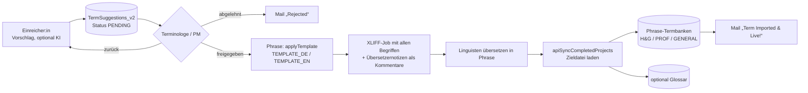

# Kärcher Terminology Hub (Repo `terminologie-hub`)

> Kurz: Web-App für die Terminologiearbeit in Phrase TMS. Mitarbeitende schlagen Begriffe vor (auf Wunsch mit KI-Vorschlag), Terminologen prüfen und geben frei, freigegebene Begriffe werden als Übersetzungsprojekt in Phrase übersetzt und danach automatisch in die Termbanken (und optional das Glossar) importiert. Dazu Termbank-Pflege, Export, Begriffsnetz (Ontologie) und eine tägliche Konzept-Anreicherung. Design „Kaercher Glass“ wie Translation Services.

---

## 1. Steckbrief

| Eigenschaft | Wert |
|---|---|
| Typ | Web-App, `executeAs: USER_ACCESSING`, `access: DOMAIN`; Trigger `processMailQueue`, `runDailyConceptEnrichment` |
| Einstieg | `doGet` → `src/TerminologyHub.html` |
| Datenbank | Google Sheet aus Script Property `TERM_CHECK_SHEET_ID` |
| Konfiguration | Tab `Settings` (Key/Value, in der App unter Admin pflegbar) |
| Phrase | `PHRASE_API_TOKEN` (v1/v2) |
| KI | Gemini über Apigee-Proxy, Setting `AI_MODEL` (Standard `gemini-2.5-flash`; Termvorschlag fällt im Code auf `gemini-3.6-flash` zurück), `AI_TEMPERATURE` 0.2 |
| Kopiervorlage | `dist/` (alle Dateien einzeln für Copy & Paste in den Editor, Anleitung `dist/ANLEITUNG.md`) |
| Tests/Deploy | `npm test`, `npm run test:ui`, `npm run lint`, `npm run check`; `deploy.yml`: `main` → Staging, Tag → Produktion |

## 2. Ablauf eines Begriffsvorschlags



- Mails laufen über die Warteschlange `MailQueue` und den Trigger `processMailQueue` (einrichten mit `setupMailTrigger`).
- Termbanken werden über Namensmuster erkannt: `TB_HNG_PATTERNS` (`H&G TERMS ONLY`, `HNG`), `TB_PROF_PATTERNS` (`PROF TERMS ONLY`), `TB_GENERAL_PATTERNS` (`[GENERAL]`, `GENERAL`).
- **Konzept-Anreicherung** (`runDailyConceptEnrichment`, täglich): Konzepte ohne URL bekommen `https://www.karcher.com/de/de` und die Subdomains ihrer Kategorie; max. 15 Seiten à 50 je Termbank und Lauf, Fortschritt in Script Properties.
- **KI-Termvorschlag** (`apiSuggestTermAI`): Prompt `AI_PROMPT_TEMPLATE`, optional mit Termbank-Grounding (ähnliche bestehende Begriffe), iteratives Verfeinern.
- **Begriffsnetz** (`apiAnalyzeTermOntology`): Ober-/Unter-/Nebenbegriffe, Synonyme via Gemini, abgeglichen mit den Termbanken; nur für TERMINOLOGIST/PM.

## 3. Datenbank (Tabs im Sheet `TERM_CHECK_SHEET_ID`)

| Tab | Inhalt |
|---|---|
| `Settings` | Key/Value: `APP_TITLE`, `MAINTENANCE_MODE`, `NOTIFICATION_ALIAS` (`ml-de10-MA-Terminology@karcher.com`), `TEMPLATE_DE` (`YxBstdQcgjot6FAHNcQk91`), `TEMPLATE_EN` (`kTeg0BK17nzhqk8xJm7kTc`), `ADMIN_EMAILS`, `TERMINOLOGIST_EMAILS`, `PM_EMAILS`, `SUBMITTER_EMAILS`, `PERMISSIONS_MATRIX`, `EMAIL_TEMPLATES`, `AI_*`, `GEMINI_API_URL`, `TB_*_PATTERNS`, `GLOSSARY_*`, `DEFAULT_PROJECT_PREFIX` (`[AKW]`), `CSV_MAX_ROWS` |
| `TermSuggestions_v2` | Vorschläge mit Status, Prüfer, Kommentar, Projekt-UID |
| `MailQueue` | ausstehende Mails |
| `TermCheckProjects` | Übersetzungsprojekte (uid, name, channel, tbCategory, status, Sprachen, Datei, Frist, Jobs) |
| `GlossaryUploadLog` | Glossar-Uploads |
| `AuditLog` | Timestamp, User, Action, Details |

## 4. Rollen und Rechte

| Rolle | BROWSE | SUGGEST | APPROVE | TRANSLATE | MANAGE_TERMS | IMPORT_EXPORT | IMPORT_PROJECTS | ONTOLOGY |
|---|:-:|:-:|:-:|:-:|:-:|:-:|:-:|:-:|
| ADMIN | alles | | | | | | | |
| PM | ● | ● | ● | ● | ● | ● | ● | ● |
| TERMINOLOGIST | ● | ● | ● | ● | | | | ● |
| SUBMITTER | ● | ● | | | | | | |
| GUEST | – | | | | | | | |

Rollen aus den E-Mail-Listen im Tab `Settings`. **Achtung:** Ist `ADMIN_EMAILS` leer, ist jeder Admin; ist `SUBMITTER_EMAILS` leer, ist jeder Einreicher. Die Matrix ist in der App editierbar (`PERMISSIONS_MATRIX`).

## 5. Oberfläche

Startseite (Suche/Befehle `Strg/⌘+K`, Schnellstart, Kennzahlen, Meine Arbeit, Review-Queue, Projekte), Termbanken (Blättern, Bearbeiten, Import/Export), Vorschläge, Review, Projekte, Glossar, Begriffsnetz, Admin (Einstellungen, Rechte, Mailvorlagen, KI-Prompts, Verbindungstest). Tastenkürzel `N`, `H`, `T`, `P`, `?`. Hell/Dunkel, Schriftgröße, Dichte.

## 6. Script Properties

| Property | Zweck |
|---|---|
| `PHRASE_API_TOKEN` | Phrase |
| `GEMINI_API_KEY` | Gemini-Proxy |
| `TERM_CHECK_SHEET_ID` | Datenbank-Sheet |
| `SRC_TERMS_<projectUid>`, `TC_PROJECTS` | Zwischenspeicher für Projekte |
| Concept-Enrichment-Fortschritt | Seite je Termbank, Subdomain-Cache |

## 7. Dateien

| Pfad | Inhalt |
|---|---|
| `src/Webappentry.gs` | `doGet`, Einstellungen, Rollen, Audit, Phrase-Auth, Verbindungstest |
| `src/Terminologyapi.gs` | Termbanken: Liste, Blättern, Suche, Anlegen/Ändern/Löschen, Import/Export, KI-Vorschlag, Begriffsnetz |
| `src/TermSuggestions.gs` | Vorschläge, Freigabe, Mail-Warteschlange, Übersetzernotizen |
| `src/Termcheckhub.gs` | Übersetzungsprojekt anlegen, fertige Projekte synchronisieren, Import in Termbanken |
| `src/GlossaryHub.gs` | Glossar-Upload |
| `src/ConceptEnrichmentHub.gs` | tägliche Konzept-Anreicherung |
| `src/Setup.gs` | Trigger einrichten |
| `src/TerminologyHub.html` | Oberfläche |
| `dist/` | Kopiervorlage (`npm run build:dist`) |

---

## Standard-Anhang (in allen Repositories gleich aufgebaut)

### A. Repository-Struktur

```
terminologie-hub/
├── src/                  Apps-Script-Code (clasp rootDir) inkl. appsscript.json
├── dist/                 Kopiervorlagen, nicht Teil des Apps-Script-Projekts
├── tests/                Node-Tests (npm test), u. a. gas.syntax.test.js (Standard)
├── tests-ui/             Browser-Tests (npm run test:ui)
├── tools/                check-structure.js (Standard), check-encoding.js, Build-Skripte
├── docs/                 DOKUMENTATION.md, ENDPOINTS.md, CI-CD.md
├── .github/              workflows/ci.yml, workflows/deploy.yml, actions/clasp-deploy/,
│                         dependabot.yml, CODEOWNERS, pull_request_template.md
├── .claspignore, .gitignore, .gitleaks.toml, eslint.config.js, package.json
└── README.md
```

Einheitliche Befehle: `npm ci`, `npm test`, `npm run lint`, `npm run check` (Struktur, Kodierung, generierte Dateien), `npm run ci` (alles).

### B. Schnittstellen

- **Phrase TMS:** 24 Endpunkt-Aufrufe, Token PHRASE_API_TOKEN (Präfix `ApiToken`/`Bearer` wird entfernt).
- **Weitere Dienste:** Gemini (Apigee-Proxy), Google Sheets, MailApp, CDN.
- Vollständig mit Methode, Version, Zweck und Datei: [`docs/ENDPOINTS.md`](https://github.com/MMario996/terminologie-hub/blob/main/docs/ENDPOINTS.md). Alle Anwendungen im Vergleich: [`ENDPOINTS-GESAMT.md`](https://github.com/MMario996/kaerchertranslationservices/blob/main/docs/gesamt/ENDPOINTS-GESAMT.md).

### C. Zusammenhänge mit anderen Anwendungen

| Partner | Richtung | Was |
|---|---|---|
| Phrase TMS | ↔ | Termbanken, Konzepte, Glossare pflegen; Übersetzungsprojekte anlegen und abholen |
| Gemini | → | KI-Termvorschlag, Begriffsnetz |
| TermCheck | fachlich | nutzt dieselben Termbanken für Suche und Author Check |
| Portal | Design | gleiches Designsystem „Kaercher Glass“ |

Systemlandkarte aller zehn Anwendungen: [`systemlandkarte.svg`](https://github.com/MMario996/kaerchertranslationservices/blob/main/docs/gesamt/systemlandkarte.svg), Gesamtübersicht: [`00-GESAMTUEBERSICHT.md`](https://github.com/MMario996/kaerchertranslationservices/blob/main/docs/gesamt/00-GESAMTUEBERSICHT.md).

### D. Entwicklung, Tests, Deployment

CI `ci.yml`; CD `deploy.yml`: `main` → Staging, Tag → Produktion; alternativ Copy & Paste aus `dist/`. Details: [`docs/CI-CD.md`](https://github.com/MMario996/terminologie-hub/blob/main/docs/CI-CD.md).

> **clasp:** `clasp push` ersetzt den kompletten Code im Apps-Script-Projekt. Was nur im Online-Editor geändert wurde, geht verloren. Der Code liegt seit Oktober 2026 unter `src/` (`.clasp.json` mit `"rootDir": "src"`).

### E. Auffälligkeiten (Stand 2026-10-02)

- Ist `ADMIN_EMAILS` leer, ist **jeder** Nutzer Admin; ist `SUBMITTER_EMAILS` leer, darf jeder einreichen.
- Standardmodell `gemini-2.5-flash` (Setting `AI_MODEL`); laut AutoFix-Code ist über den Proxy nur `gemini-3.6-flash` sicher freigeschaltet.
- Die Kopiervorlage heißt jetzt `dist/` (vorher `apps-script/`).
