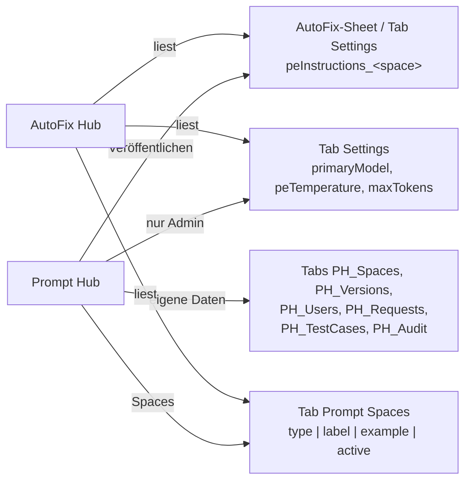

# Prompt Hub (Repo `Prompt-hub`)

> Kurz: Web-App zum Pflegen der Post-Editing-Prompts des AutoFix Hub. Jeder Prompt folgt einem festen Muster aus 13 Feldern, wird vor dem Veröffentlichen geprüft, lässt sich live gegen Gemini testen und landet beim Veröffentlichen genau in der Zeile, die AutoFix liest. Design und Bedienung wie Kärcher Translation Services.

---

## 1. Steckbrief

| Eigenschaft | Wert |
|---|---|
| Typ | Web-App, läuft als Eigentümer (*Ausführen als: Ich*), *Zugriff: Alle in der Domain* |
| Quellcode | `src/` (clasp `rootDir: src`); `dist/Installer.gs` = Ein-Datei-Installer |
| Datenbank | AutoFix-Sheet `1LFoBCuz7h1xdi58djRPedAXgtj4RZ_T5EnvJbTKtkp8` (Standard), Tabs `PH_*`; optional eigenes Hub-Sheet |
| Konfiguration | Script Property `PH_CONFIG` (JSON), Admins in `PH_ADMINS`, Key in `GEMINI_API_KEY` |
| KI | Gemini-Proxy `https://34-111-99-134.nip.io/gemini/v1beta/models/`, freigegebene Modelle `gemini-3.6-flash`, `gemini-3.6-flash-lite`, `gemini-3.5-flash`, `gemini-3.5-flash-lite`, `gemini-3.1-flash-lite`, `gemini-3-flash-preview` |
| Tests/Deploy | `npm test`, `npm run test:ui`, `npm run check` (AutoFix-Spiegel); `deploy.yml` (Staging/Produktion), `autofix-drift.yml` montags |

## 2. Anbindung an AutoFix

- Die Post-Editing-Logik von AutoFix bleibt unverändert; der Hub schreibt nur den Prompt-Text.
- AutoFix speichert Settings, indem es den Tab leert und neu schreibt. Der Hub schreibt deshalb einzelne Zeilen und prüft danach, ob der Text angekommen ist. Abweichungen (z. B. durch den alten Prompt Editor) zeigt er an; Admins beheben sie mit einem Klick („Resync“).
- Neuer Space: in Phrase im Custom Field „AutoFix“ eine Option **mit exakt demselben Namen** anlegen.

## 3. Prompt-Muster (13 Felder)

| # | Feld | Pflicht | Inhalt |
|---|---|---|---|
| 1 | Titel | ja | `=== POST-EDITIERUNG (PE) — KÄRCHER <TITEL> ===` |
| 2 | Auftrag | ja | Rolle, Textsorten, Quellsprache, Herkunft der MT, Ziel |
| 3 | Prioritäten | eins von 3/4 | Konfliktreihenfolge: Segmentgrenzen > Tags > Nomenklatur > Bedeutung > Sprache |
| 4 | Pflicht-Korrekturen | eins von 3/4 | Termbase, Produktnamen, Zahlen, Tags, Vollständigkeit; standardmäßig vom Admin gesperrt |
| 5 | Aktive Verbesserungen | | Natürlichkeit, Stil, Fluss |
| 6 | Grundregeln Nomenklatur | | wie die Liste anzuwenden ist |
| 7 | Nomenklatur-Tabelle | | Englisch · Deutsch · Kategorie · Regel; Listen „nur Englisch“, „nur Teil übersetzen“, „komplett“, „immer übersetzen“ |
| 8 | Vermeide | | bekannte Fehler mit „falsch: …“ |
| 9 | Stil & Register | | Anrede, Tonalität |
| 10 | Sprachregeln | | je Zielsprache (z. B. pt-BR) |
| 11 | Eigene Abschnitte | | z. B. Zeichenlimits |
| 12 | Nicht verändern | | wann `changed=false` |
| 13 | Wichtig | ja | Grundhaltung, Vorgabe für `reason` |

**Prüfung (blockiert Veröffentlichen):** Pflichtfelder fehlen, Pflichtthemen fehlen (Tags & Platzhalter, Zahlen & Einheiten, Terminologie – Admin-pflegbar), Widerspruch zum AutoFix-Ausgabeformat (Code-Blöcke, eigene JSON-Felder), `===`-Zeilen in Feldern, doppelte Begriffe, gesperrter Abschnitt geändert, > 50.000 Zeichen. Warnungen u. a. bei „Karcher“ ohne Umlaut oder > 25.000 Zeichen.

Referenz-Prompts: `prompts/pnd.txt` (P&D Dialogue, HR, mit Nomenklatur), `prompts/technical.txt`, `prompts/marketing.txt` → daraus `src/Templates.gs`.

## 4. Funktionen

| Bereich | Funktion |
|---|---|
| Editor | Felder, Autosave als Entwurf mit Konflikterkennung, Nomenklatur aus Excel/Sheets einfügen |
| Live-Test | gleicher Rahmen (`buildPePrompt_` wortgleich), gleiches Modell, gleiche Temperature/Max Tokens wie ein echter Lauf; Quelltext, MT, Termbase-Treffer, Erwartungen; Vergleich Entwurf vs. Live; automatische Checks (Tags, Zahlen, Nomenklatur, Termbase, Anker); gespeicherte Testfälle; Quote 20 Tests / 10 min, max. 60 Segmente |
| Versionen | Veröffentlichen mit Notiz, Diff, Wiederherstellen |
| Freigaben | Anträge auf neue Spaces und Zugriff; Benachrichtigung per Chat-Webhook und E-Mail |
| Admin | Nutzer/Rollen je Space, Admins, gesperrte Abschnitte, wirksame Gemini-Werte, Pflichtthemen, Sheet-IDs, Endpunkt, Key (nur schreibbar), Quoten, Import aus AutoFix, Export, Abgleich, Audit-Log, „Ansicht als“ |

## 5. Rollen

| Rolle | Darf |
|---|---|
| Admin | alles; Skript-Eigentümer wird beim ersten Aufruf Admin |
| Bearbeiten | Prompt eines Space bearbeiten, testen, veröffentlichen, wiederherstellen, Testfälle |
| Ansehen | ansehen, Vorschau, Live-Test |
| ohne Zugriff | Antrag stellen |

## 6. Datenmodell (`PH_*`-Tabs)

| Tab | Spalten |
|---|---|
| `PH_Spaces` | type, label, status, description, example, lockedSections, liveVersion, draft, draftUpdatedAt, draftUpdatedBy, createdAt, createdBy |
| `PH_Versions` | type, version, fields, composed, note, createdAt, createdBy |
| `PH_Users` | email, spaces, active, addedBy, addedAt |
| `PH_Requests` | id, kind, email, payload, status, createdAt, decidedBy, decidedAt, comment |
| `PH_TestCases` | id, type, name, data, updatedAt, updatedBy |
| `PH_Audit` | timestamp, email, action, details |

## 7. Konfiguration `PH_CONFIG`

`autofixSheetId`, `hubSheetId`, `geminiBaseUrl`, `allowedModels`, `guardrails` (Pflichtthemen), `ticketUrl` (Taskbox 4030), `chatWebhookUrl`, `notifyEmails`, `testQuotaPer10Min` (20), `maxTestSegments` (60), `defaultLockedSections` (`mandatory`).

## 8. Einrichtung

1. Apps-Script-Projekt mit Konto, das Schreibrecht auf das AutoFix-Sheet hat.
2. Code per CD oder `clasp push` übertragen.
3. Als Web-App bereitstellen (Ich / Domain).
4. Admin → Einstellungen: Gemini-Key, „Verbindung testen“, ggf. Chat-Webhook und E-Mails.
5. Admin → Spaces → „Aus AutoFix übernehmen“.
6. Für neue Spaces gleichnamige Option im Phrase-Custom-Field „AutoFix“ anlegen.

## 9. Dateien

| Pfad | Inhalt |
|---|---|
| `src/PromptCore.gs` | compose, parse, validate, checkOutput, Diffs (Server und Browser) |
| `src/Api.gs` | alle Endpunkte mit Rechteprüfung (`apiBootstrap`, `apiSaveDraft`, `apiPublish`, `apiRunTest`, `apiAdmin*` …) |
| `src/AutoFixBridge.gs` | Lesen/Schreiben im AutoFix-Sheet, Abgleich |
| `src/AutoFixMirror.gs` | wortgleiche Kopie von `buildPePrompt_` – nicht von Hand ändern |
| `src/LiveTest.gs` | Live-Test |
| `src/Store.gs`, `src/Access.gs`, `src/Config.gs`, `src/Notify.gs` | Speicher, Rechte, Konfiguration, Benachrichtigung |
| `src/*.html` | Oberfläche |
| `tools/` | Vorschau, Mockups, Vorlagen-Generator, `check-mirror.js` |
| `docs/mockups/*.png` | 14 Bildschirmfotos |
