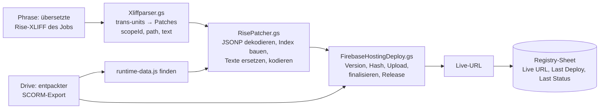

# Articulate Rise Patcher (Repo `articulate-rise-patcher`)

> Kurz: Apps-Script-Code, der aus einem **Articulate-Rise-SCORM-Export** und der **übersetzten Rise-XLIFF aus Phrase** eine übersetzte, live klickbare Kursvorschau baut und auf **Firebase Hosting** veröffentlicht – ohne den Kurs neu in Rise zu importieren. Der Code wurde (leicht weiterentwickelt) ins Portal Kärcher Translation Services übernommen (Campus → Preview-Generator).

---

## 1. Steckbrief

| Eigenschaft | Wert |
|---|---|
| Typ | Apps-Script-Projekt ohne eigene Oberfläche (Funktionen im Editor, `api*` für das Portal) |
| Erweiterter Dienst | Drive v3 |
| Registry-Sheet | `1V6oyZVw7-CPy8Bs5_sGl9Cg886b2T6r7FLGgp1gfBRY`, Tab `Projects` (gleiches Sheet wie im Portal) |
| Firebase | Site `kaercher-course-preview`, Live-URL `https://kaercher-course-preview.web.app/<pfad>/scormcontent/index.html` |
| Auth Firebase | Service Account aus Script Property `SERVICE_ACCOUNT_JSON`, selbst signiertes JWT (RS256), Scopes `firebase.hosting`, `cloud-platform` |
| Phrase | über die Portal-Funktionen `phraseDownloadTargetFile_`, `getPhraseAuthHeader_` (im Portal vorhanden) |
| Testdaten | SCORM-Ordner `1n6OXBnrC2i--M7yLaUeJRE6RthjZ1hTg`, SCORM-ZIP `1_qD1Me64jNdxDKfU_jv8-MYxWawVhIf2` (in `Test.gs`) |

## 2. Funktionsweise

- Rise speichert alle Kurstexte in `scormcontent/runtime-data.js` als Base64-JSON in einem JSONP-Aufruf `__jsonp("runtime-data.js","…")`.
- Übersetzbare Felder: `title`, `description`, `paragraph`, `caption`, `heading`, `completeHint`, `name`. Unbekannte Felder landen in der Liste „unmatched“ – nichts geht kaputt.
- XLIFF-Inline-Tags (`<g ctype="x-html-P">` …) werden zurück in HTML (`
`, `<strong>`, ` `, `<ul>`, `<li>` …) übersetzt.
- Verifiziert am Kurs „Growth Mindset: unlock the power of openness (Deutsch)“: 127 von 127 Trans-Units gefunden.
- Firebase-Deploy nach REST-API: neue Version → SHA256 der gzip-Dateien melden → nur unbekannte Dateien hochladen → finalisieren → Release. Mehrere Kurse teilen sich eine Site über Pfad-Präfixe (z. B. `growth-mindset/de-DE`).
- Fortschritt im Script-Cache (`artprev_progress_<sessionId>`, 5 min), abrufbar über `apiGetPreviewProgress`.
- Grenzen: UrlFetch ≈ 50 MB pro Anfrage, 6 min Laufzeit; der Ordner-Weg (`patchAndDeployScormFolderToFirebase`) umgeht die Größenbeschränkung von `Utilities.unzip`.

## 3. Registry-Sheet `Projects`

ID · Course Name · Target Lang · Project UID · Job UID · Drive Folder ID · Firebase Site · Firebase Path · Live URL · Last Deploy · Last Status · Created By · (weitere Spalten per Kopfzeile)

## 4. Funktionen

| Funktion | Zweck |
|---|---|
| `apiListArticulateProjects`, `apiCreateArticulateProject`, `apiDeleteArticulateProject` | Registry pflegen |
| `apiGenerateArticulatePreviewById(id, sessionId)` | Vorschau für einen Registry-Eintrag |
| `apiGenerateArticulatePreview(params)` | Vorschau aus freien Parametern |
| `apiGetPreviewProgress(sessionId)` | Fortschritt |
| `patchAndDeployScormFolderToFirebase(folderId, patches, siteId, prefix)` | Kern: Ordner patchen und deployen |
| `patchAndDeployScormToFirebase(zipId, …)` | dasselbe aus einer ZIP |
| `generatePatchedScormZip(zipId, patches, options)` | gepatchte ZIP in Drive statt Deploy |
| `parseTranslatedXliffToPatches_` | XLIFF → Patches |
| `deployBlobsToFirebaseHosting(siteId, entries, prefix)` | Firebase-Deploy |
| `testPatchDemo`, `testFirebaseDeployDemo`, `testFirebaseDeployFromFolderDemo`, `testCreateArticulateProject`, `testListArticulateProjects`, `testGeneratePreviewById`, `testParseXliffFromPhrase` | Tests im Editor |

## 5. Dateien

`Articulatepreview.gs`, `Articulateregistry.gs`, `DriveFolderUtils.gs`, `FirebaseAuth.gs`, `FirebaseHostingDeploy.gs`, `Orchestration.gs`, `RisePatcher.gs`, `ScormPatcher.gs`, `Xliffparser.gs`, `Test.gs`, `Testregistry.gs`.

## 6. Verhältnis zum Portal

Identisch im Portal: `DriveFolderUtils.gs`, `FirebaseAuth.gs`, `Orchestration.gs`, `RisePatcher.gs`, `ScormPatcher.gs`. Weiterentwickelt im Portal: `Articulateregistry.gs`, `Articualtepreview.gs` (Schreibfehler im Dateinamen), `FirebaseHostingDeploy.gs`, `Xliffparser.gs`, Tests. Änderungen sollten im Portal gemacht werden; dieses Repo ist der Ursprung/Prototyp.

Hinweis: Im Portal prüfen die Kernfunktionen der Registry keine Rechte (nur die `…FromUi`-Varianten), siehe Auffälligkeit S3.
