# Kärcher Translation Tools – Wissensbasis (komplett)

Automatisch erzeugt aus `wissensbasis/*.md` und `docs/*.md` im Repo `kaerchertranslationservices` (`node tools/build-wissensbasis.js`). Nicht von Hand bearbeiten.

## Inhalt

- 00-GESAMTUEBERSICHT.md
- 01-translation-services.md
- 02-autofix-hub.md
- 03-prompt-hub.md
- 04-autolqa-hub.md
- 05-mention-digest.md
- 06-translation-add-on.md
- 07-termcheck.md
- 08-articulate-rise-patcher.md
- Anhang Translation Services: ARCHITEKTUR-UND-DATEN.md
- Anhang Translation Services: API.md
- Anhang Translation Services: UI-UX.md
- Anhang Translation Services: AUFFAELLIGKEITEN.md

---

# Datei: 00-GESAMTUEBERSICHT.md

## Kärcher Translation Tools – Gesamtübersicht

Diese Wissensbasis beschreibt alle acht GitHub-Repositories von `MMario996` rund um Übersetzung, Phrase TMS und Gemini bei Kärcher.
Sie ist so geschrieben, dass ein Mensch oder ein KI-Assistent (Gemini Gem, NotebookLM) Fragen beantworten kann wie
„Welche Datenbank steckt hinter dem AutoFix Hub?“, „Wo stelle ich das Gemini-Modell ein?“ oder „Was passiert, wenn ein Projekt das AutoFix-Flag bekommt?“.

Stand: aus dem Code der Branches `main` abgeleitet (Oktober 2026). Bei Widersprüchen gilt der Code.

---

### 1. Die acht Repositories auf einen Blick

| # | Repository | Produktname | Art | Zweck in einem Satz |
|---|---|---|---|---|
| 1 | `kaerchertranslationservices` | **Kärcher Translation Services** (Portal, „Translation Hub“) | Web-App (Apps Script), eingebettet in Google Sites | Mitarbeitende legen Übersetzungsprojekte in Phrase TMS an, verfolgen, teilen und laden sie herunter – ohne eigenen Phrase-Zugang. |
| 2 | `autofix-hub` | **AutoFix Hub** | Web-App + Zeit-Trigger | Post-editiert automatisch Phrase-Jobs im Workflow-Schritt „PE Gemini“ mit Gemini und schreibt die Korrekturen zurück. |
| 3 | `Prompt-hub` | **Prompt Hub** | Web-App | Pflege, Prüfung, Live-Test und Versionierung der Post-Editing-Prompts, die AutoFix verwendet. |
| 4 | `autolqa-hub` | **AutoLQA Hub** | Web-App | KI-gestützte Qualitätsprüfung (LQA nach DQF-MQM) von Phrase-Projekten, mit Rückschreiben als Kommentar oder LQA-Assessment. |
| 5 | `phrase-notification-hub` | **Mention Digest** (Phrase Notification Hub) | Web-App + Zeit-Trigger | Benachrichtigt per Google Chat, wenn jemand in Phrase-Kommentaren @erwähnt wird – sofort oder als Digest. |
| 6 | `k-rcher-translation-add-on` | **Kärcher Translation Add-on** | Google-Workspace-Add-on (Docs, Sheets, Slides) | Übersetzt Inhalte direkt im Dokument über Phrase MT, mit Gemini-Fallback und Gemini-Post-Editing. |
| 7 | `term-author-checker` | **Kärcher TermCheck** | Google-Workspace-Add-on (Docs, Sheets, Slides, Drive) + Web-App | Terminologiesuche in Phrase-Termbanken und „Author Check“ (Grammatik, Terminologie, Stil) inkl. PDF-Prüfung. |
| 8 | `articulate-rise-patcher` | **Articulate Rise Patcher** | Apps-Script-Bibliothek / Prototyp | Baut aus übersetzter Rise-XLIFF eine live klickbare Kursvorschau auf Firebase Hosting. Ist inzwischen auch Teil des Portals (Reiter „Campus“). |

Alle Projekte sind **Google Apps Script (V8)**, laufen in der Workspace-Domain `karcher.com`, nutzen **Google Sheets als Datenbank** und sprechen mit **Phrase TMS** (`https://cloud.memsource.com/web`, früher Memsource).
Die KI-Funktionen laufen über den **Kärcher-Gemini-Proxy (Apigee)** `https://34-111-99-134.nip.io/gemini/v1beta/models/<modell>:generateContent` mit Header `x-api-key: <GEMINI_API_KEY>`.

---

### 2. Systemlandkarte

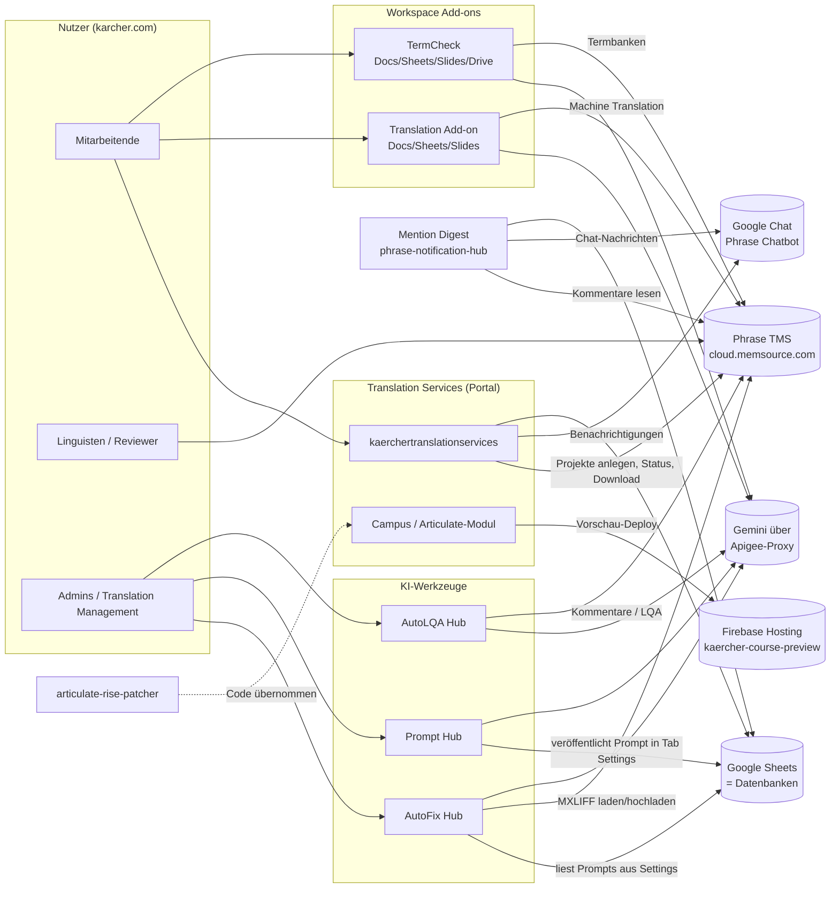

Die grafische Fassung liegt als `systemlandkarte.png` / `systemlandkarte.html` in diesem Ordner.

#### Wie die Projekte zusammenhängen

1. **Portal → Phrase:** Das Portal legt Projekte aus Phrase-Vorlagen an (technischer API-Nutzer), setzt den Einreicher als Owner und überwacht den Status alle 15 Minuten.
2. **Phrase → AutoFix:** Hat ein Projekt das Custom Field **„AutoFix“** gesetzt und Jobs im Workflow-Schritt **„PE Gemini“**, holt AutoFix die Jobs, lässt Gemini post-editieren und lädt die Datei zurück.
3. **Prompt Hub → AutoFix:** Der Prompt je Dokumenttyp („Space“) wird im Prompt Hub gepflegt und beim Veröffentlichen in genau die Zeile `peInstructions_<space>` im AutoFix-Sheet geschrieben, die AutoFix liest.
4. **Add-on ↔ AutoFix:** Das Translation Add-on nutzt dieselben Post-Editing-Prompts (fest im Code, Stand AutoFix) für seinen optionalen Gemini-PE-Schritt.
5. **AutoLQA:** Unabhängig von AutoFix; prüft fertige Übersetzungen nach MQM und schreibt Befunde zurück nach Phrase.
6. **Mention Digest:** Nutzt denselben Google-Chat-Bot (Service Account) wie das Portal und als Fallback das Tab `Notifications` des Portal-Access-Sheets, um Chat-IDs zu finden. Ein Code-Schnipsel zeigt, wie das Portal pro Projekt einen Link in den Mention Digest bekommt.
7. **Articulate Rise Patcher:** Ursprünglich eigenständig entwickelt, der Code steckt heute (leicht weiterentwickelt) im Portal unter Campus → Articulate-Vorschau.
8. **TermCheck:** Eigenständig; nutzt Phrase-Termbanken und Gemini. Zwei Gemini-Gems helfen beim Formulieren eigener Regeln.

---

### 3. Alle verlinkten Datenbanken (Google Sheets)

> **Antwort auf „Von was ist die verlinkte DB?“**: Hier stehen alle Sheets, ihre IDs (soweit im Code), welches Projekt sie nutzt, wie sie konfiguriert werden und welche Tabs sie haben.
> Link-Muster: `https://docs.google.com/spreadsheets/d/<ID>/edit`

| Datenbank | Sheet-ID | Gehört zu | Konfiguriert über | Tabs (Auszug) |
|---|---|---|---|---|
| **Access-Sheet** („Sync DB“ im Admin) | `1mU8zWhR-E8_fmBcLtMh1qIwST9FibKT5UfH7oaivs0Q` | Translation Services | Script Property `ACCESS_SHEET_ID` (Fallback im Code `Config.gs`) | `Whitelist`, `Whitelist_Marketing`, `Whitelist_KeC`, `Whitelist_Documentation`, `Whitelist_Woma`, `Whitelist_CC`, `Whitelist_Articulate`, `Whitelist_AdminLight`, `FetchTemplate-Prod`, `FetchTMS_USERS-Prod`, `Maintenance`, `Notifications`, `UserPrefs`, `CalendarSync`, `User_Presets`, `Announcements`, `NotificationLog`, `AuditLog`, `Message_Templates`, `Watchers`, `PivotTemplateLinks`, `PivotLanguageMap` |
| **Ops-Sheet** („Uploads DB“ im Admin) | `1xi0ZtFxxurNu25URrhpHmfSLy8nld_SXm0KmkXxRCpQ` | Translation Services | Script Property `OPS_SHEET_ID` (Fallback `Config.gs`) | `Queue` – eine Zeile pro angelegtem Phrase-Projekt |
| **Dokumentations-Sheet** | `1_EFW_ItawRvutiVrcNIamKTSYPFsA5XFGR1s6PctYxs` | Translation Services (Bereich Dokumentation) | fest im Code (`DocQueue.gs`, `DocBoard.gs`, `DocImport.gs`, `DocArchive.gs`) | `Queue` (gid `2102542301`), `Board`, `Archive` |
| **Articulate-Registry** | `1V6oyZVw7-CPy8Bs5_sGl9Cg886b2T6r7FLGgp1gfBRY` | Translation Services (Campus) **und** articulate-rise-patcher | fest im Code (`Articulateregistry.gs`) | `Projects`: ID, Course Name, Target Lang, Project UID, Job UID, Drive Folder ID, Firebase Site, Firebase Path, Live URL, Last Deploy, Last Status, Created By … |
| **AutoFix-Sheet** („AutoFix Hub - Database“) | `1LFoBCuz7h1xdi58djRPedAXgtj4RZ_T5EnvJbTKtkp8` (Standard im Prompt Hub) | AutoFix Hub **und** Prompt Hub | AutoFix: Script Property `AUTOFIX_DB_SHEET_ID` (fehlt sie, legt AutoFix ein neues Sheet an). Prompt Hub: `PH_CONFIG.autofixSheetId` | `Settings` (Key/Value inkl. `peInstructions_<space>`), `Run Log`, `Audit Log`, `Prompt Spaces`, `Prompt Hub Import`, MQM-Report-Tabs, sowie die Prompt-Hub-Tabs `PH_Spaces`, `PH_Versions`, `PH_Users`, `PH_Requests`, `PH_TestCases`, `PH_Audit` |
| **Prompt-Hub-Sheet (optional)** | leer = im AutoFix-Sheet | Prompt Hub | `PH_CONFIG.hubSheetId` (Admin → Einstellungen) | die `PH_*`-Tabs, falls getrennt |
| **AutoLQA-Datenbank** („AutoLQA Hub - Database“) | nicht im Code – wird beim ersten Start automatisch angelegt | AutoLQA Hub | Script Property `DB_SHEET_ID`; URL in der App über `getDatabaseUrl()` | `Settings`, `Profiles`, `Reports`, `Issues`, `Audit Log`, `Run History`, `LQA Export` |
| **Mention-Digest-Sheet** | nicht im Code | Mention Digest | Script Property `MENTION_SHEET_ID` | `User_Settings`, `Pending_Mentions`, `Global_Settings`, `Mention_Templates`, `Run_Log`, `Notification_Rules` |
| **Access-Sheet (vom Mention Digest gelesen)** | nicht im Code, in der Praxis das Portal-Access-Sheet | Mention Digest | Script Property `ACCESS_SHEET_ID` | nur Tab `Notifications` (E-Mail → Chat-User-ID) |
| **Add-on Usage Log** | nicht im Code | Translation Add-on | Script Property `ADMIN_USAGE_LOG_SHEET_ID` (anlegen mit `ADMIN_createUsageLogSheet()`) | `Usage Log`: Timestamp, User, App, Action, Profile, Source Lang, Target Lang, Segments, Words, Engine, Status, Error, Duration (s) |
| **TermCheck Custom Rules Log** | nicht im Code | TermCheck | Script Property `CUSTOM_RULES_LOG_SHEET_ID` (Admin-Einstellungen) | `Custom` – protokolliert neu angelegte eigene Regeln |

#### Datenbank-Diagramm

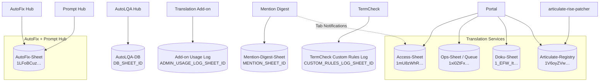

---

### 4. Phrase-TMS-Objekte, die im Code verdrahtet sind

| Objekt | UID / Wert | Verwendet von | Bedeutung |
|---|---|---|---|
| Custom Field **AutoFix** | `1uw8kvE6WNhT6Gw0XeX4Z4` | AutoFix Hub (Setting `cfFieldUid`) | Projekt soll automatisch post-editiert werden; die gewählte Option bestimmt den Prompt-Space |
| Option „True“ (Legacy) | `7d95rL0n0lA894J0CRXaL9` | AutoFix | → Space `technical` |
| Option „Technical Documentation“ | `2HtFqxLWLZp3126BkQ6li1` | AutoFix | → Space `technical` |
| Option „Marketing“ | `YddgPfvnHZ8A4li6KxmYS2` | AutoFix | → Space `marketing` |
| weitere Optionen (z. B. „Campus“, „P&D“) | – | AutoFix | werden über den **sichtbaren Optionstext** dem gleichnamigen Prompt Space zugeordnet; unbekannt → `technical` |
| Workflow-Schritt | `PE Gemini` | AutoFix (Setting `wfStepName`) | nur Jobs in diesem Schritt mit Status NEW/ACCEPTED werden bearbeitet |
| Custom Field **Mention Digest** | `AxFjBOkLFMEx9VW5H0hwN1`, Option „True“ `BHRFl72Ug1nt8iU3FR0Xy1` | Mention Digest | nur Projekte mit diesem Flag werden nach @Erwähnungen gescannt |
| MT-Profil Marketing | `Zpfa4GJsY5rl4J9q070rV5` | Translation Add-on | Phrase „Add-on Marketing“ (mit Kärcher-Glossar) |
| MT-Profil Technical | `GrigHtkTDZUF4xYGWFmpI2` | Translation Add-on | Phrase „Add-on Technical“ |
| MT-Profil General | `gC20LvuraAQGr2lXlrubL4` | Translation Add-on | Phrase „Add-on General“ |
| Projektvorlage Terminology check LLM | `pNoERiZ1YTileyUe4Za1j6` „[AKW] Terminology check [MT+Review LLM]“ | TermCheck (`TEMPLATE_LLM`) | liefert die Sprachen der Terminologiesuche |
| Projektvorlage Terminology check ALG | `arpmvYCEAqGl0OmKV9f3s3` „[AKW] Terminology check [MT+Review ALG]“ | TermCheck (`TEMPLATE_ALG`) | dito |
| Brand-Review-Vorlagen | siehe `term-author-checker/workflows/mapping-value.txt` | Phrase Orchestrator Workflows | Zuordnung Review-Schlüssel → Vorlage je Workflow-Schritt |
| Custom Fields „Project Creator“, „Pivot languages“ | per Name | Translation Services | Einreicher bzw. Pivot-Workflow |
| KeC-Zuordnung | Script Properties `KEC_CLIENT_ID`, `KEC_DOMAIN_ID`, `KEC_BUSINESS_UNIT_ID` | Translation Services | welche Phrase-Projekte als KeC gelten |
| Termbase für `/termsearch` | Script Property `TERMBASE_UID` | Translation Services (Chat) | Termbank für den Slash-Command |

Web-Links in Phrase: Projekt `https://cloud.memsource.com/web/project/show/<projectUid>`, Job `https://cloud.memsource.com/web/job/<jobUid>/translate`.

---

### 5. Gemeinsame Infrastruktur

#### Gemini

| Projekt | Modell (Standard) | Wo einstellen | Wofür |
|---|---|---|---|
| AutoFix Hub | `gemini-3.6-flash`, Temperature 0.1, Max Tokens 32768 | Tab `Settings` (`primaryModel`, `peTemperature`, `maxTokens`) – über Prompt Hub (Admin) oder AutoFix-Admin | Post-Editing, MQM-Klassifikation, Glossar-Vorschläge |
| Prompt Hub | freigegebene Liste: `gemini-3.6-flash`, `-3.6-flash-lite`, `-3.5-flash`, `-3.5-flash-lite`, `-3.1-flash-lite`, `-3-flash-preview` | Admin → Einstellungen (`PH_CONFIG`) | Live-Test mit Produktionsparametern |
| AutoLQA Hub | `gemini-2.5-pro` (Default), zwei Durchgänge (Temp 0.1 / 0.05) | Tab `Settings` der AutoLQA-DB (`primaryModel`) | LQA nach MQM |
| Translation Add-on | `gemini-3.6-flash` (Fallback-Übersetzung und PE, Thinking „minimal“) | Konstanten in `Api.gs` / `Config gemini ergaenzung.gs` | Fallback-MT und Post-Editing |
| TermCheck | `gemini-3.6-flash`, Temperature 0.2 | Script Properties `AI_MODEL`, `AI_TEMPERATURE`, `GEMINI_API_URL` (Admin-Einstellungen) | KI-Suche, Author Check, PDF-Prüfung |
| Translation Services | `gemini-2.0-flash` | Konstante in `Chatbot.gs` | Chat-Bot mit Function Calling (nur lesend) |

> Hinweis aus dem AutoFix-Code (FIX 14): Über den Kärcher-Proxy ist aktuell nur **`gemini-3.6-flash`** sicher freigeschaltet; `gemini-2.5-pro` liefert 404. Der AutoLQA-Default `gemini-2.5-pro` und das Chatbot-Modell `gemini-2.0-flash` sollten daher geprüft werden.

#### Google Chat Bot

- Ein Bot („Phrase Chatbot“, Marketplace-App `175040441162`) wird von **Translation Services** und **Mention Digest** gemeinsam genutzt.
- Authentifizierung: Service Account über die OAuth2-Bibliothek, Script Properties `CHAT_CLIENT_EMAIL`, `CHAT_PRIVATE_KEY`, Scope `chat.bot`.
- Chat-User-ID (`users/…`): Admin Directory oder Tab `Notifications` im Access-Sheet (Spalte C).
- Nur das Portal empfängt Chat-Events (`doPost`, Slash-Commands); der Mention Digest sendet nur.

#### Gemeinsame Script-Property-Namen

| Property | Projekte |
|---|---|
| `PHRASE_API_TOKEN` | alle außer Prompt Hub und articulate-rise-patcher (dort über das Portal) |
| `GEMINI_API_KEY` | Portal, AutoFix, Prompt Hub, AutoLQA, Add-on, TermCheck |
| `ADMIN_EMAILS` | Portal, Mention Digest, TermCheck |
| `ACCESS_SHEET_ID` | Portal, Mention Digest |
| `CHAT_CLIENT_EMAIL`, `CHAT_PRIVATE_KEY` | Portal, Mention Digest |
| `SERVICE_ACCOUNT_JSON` | Portal / Rise Patcher (Firebase) |

Werte stehen nie im Code, sondern nur in den Script Properties des jeweiligen Apps-Script-Projekts (Editor → Projekteinstellungen → Skripteigenschaften).

#### Externe Links, die in den Oberflächen vorkommen

| Link | Zweck |
|---|---|
| `https://sites.google.com/karcher.com/phrase` | Google Site, in die das Portal eingebettet ist (Links aus Chat-Nachrichten) |
| Taskbox `…/portal/97/create/4019` | „Report an application problem“ (Fehler melden) |
| Taskbox `…/portal/97/create/2916` | „Request Authorisations“ (Zugang beantragen) |
| Taskbox `…/portal/97/create/4030` | „Consulting for Phrase“ / Übersetzungsproblem melden; auch Ticket-Link in Prompt Hub/AutoFix |
| `https://elearning.kaercher.com/publisher/dispatch.do?node=13265` | E-Learnings |
| Smartbox `spaces/PHRAS/pages/697862203/FAQ` | FAQ zu Phrase |
| Smartbox `spaces/PHRAS/pages/697861389/Translation+-+PHRASE+TMS` | Allgemeine Phrase-Doku |
| Gem „Regel mit Gemini vorbereiten“ `https://gemini.google.com/gem/1U9keOE3XPTPG3QEq63ZCYZ-5EOTruqgC` | TermCheck: eine eigene Regel formulieren |
| Gem „Kärcher Regel-Importer“ `https://gemini.google.com/gem/1bgoe1LSjDPZMId5lf98dBbVQp1KMH2CO` | TermCheck: Leitfaden-PDF → Import-JSON |
| Firebase `https://kaercher-course-preview.web.app/<pfad>/scormcontent/index.html` | Live-Vorschau übersetzter Rise-Kurse |

---

### 6. Zeitgesteuerte Abläufe (Trigger)

| Projekt | Funktion | Takt | Was passiert |
|---|---|---|---|
| Translation Services | `autoSyncProjectStatuses_` | alle 15 min | Status aus Phrase holen, Chat/Glocke benachrichtigen, Pivot-Kinder verfolgen |
| Translation Services | `calendarSyncAllTrigger` | stündlich | Fristen in Nutzerkalender |
| Translation Services | `psNightlySync_` | täglich ~02:00 | UI-Texte aus Phrase Strings |
| Translation Services | `cleanupChatDedupProperties_` | täglich ~03:00 | Aufräumen |
| AutoFix Hub | `autoFixPoller` | 5, 10 oder 30 min (Start-Knopf im Dashboard) | nimmt **einen** offenen Job und post-editiert ihn |
| Mention Digest | `mentionScanRun_` | alle 5 min | neue @Erwähnungen in markierten Projekten finden |
| Mention Digest | `intervalDigestRun_` | alle 5 min | Intervall-Digests senden |
| Mention Digest | `dailyDigestRun_` / `weeklyDigestRun_` | täglich bzw. montags zur `DAILY_DIGEST_HOUR` (Standard 8 Uhr) | Tages-/Wochen-Digest |
| Mention Digest | `warmProjectCache_` | alle 10 min | Projektliste fürs Regel-Dropdown vorwärmen |

AutoLQA, Prompt Hub, Add-on, TermCheck und Rise Patcher haben keine Zeit-Trigger.

---

### 7. Typische Abläufe Ende-zu-Ende

#### A) Übersetzung über das Portal mit automatischem Post-Editing

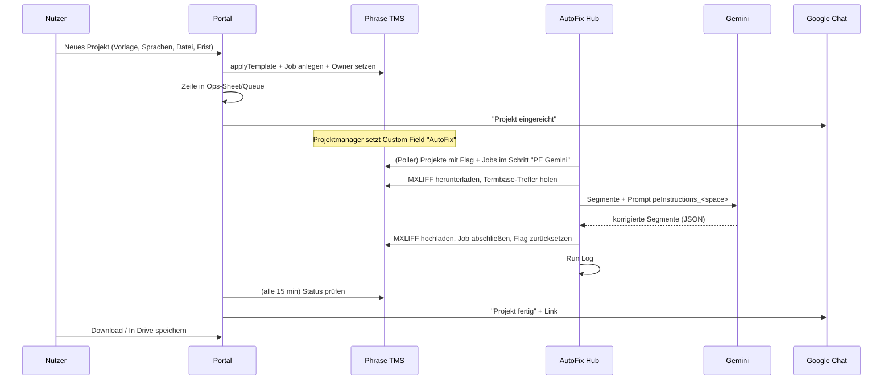

#### B) Prompt ändern

Prompt Hub öffnen → Space wählen → Felder bearbeiten (Autosave als Entwurf) → Prüfung muss grün sein → Live-Test gegen Gemini mit echten Segmenten → **Veröffentlichen** → Hub schreibt `peInstructions_<space>` ins AutoFix-Sheet und prüft, ob der Text angekommen ist → der nächste AutoFix-Lauf nutzt den neuen Prompt.

#### C) Neuer Dokumenttyp / Space

Space im Prompt Hub beantragen oder (Admin) anlegen → Hub schreibt ihn in den Tab `Prompt Spaces` → in Phrase im Custom Field „AutoFix“ eine Option **mit exakt demselben Namen** anlegen → AutoFix ordnet Projekte mit dieser Option automatisch dem Space zu.

#### D) @Erwähnung in Phrase

Projekt hat Custom Field „Mention Digest“ = True → alle 5 min liest der Mention Digest die Kommentare aller Jobs → für jede neue @Erwähnung: Abwesenheit prüfen (ggf. an Vertretung) → je nach Nutzereinstellung sofort Chat-Nachricht oder Puffer für Intervall/Tag/Woche → zusätzlich Projekt-Regeln („bei allen Kommentaren Person X informieren“).

#### E) Rise-Kurs-Vorschau

Rise-Kurs als SCORM exportieren und entpackt in Drive legen → im Portal (Campus) Registry-Eintrag mit Phrase-Projekt/Job und Drive-Ordner → „Play“ lädt die übersetzte XLIFF aus Phrase, baut Patches, ersetzt die Texte in `scormcontent/runtime-data.js` und deployt nach Firebase Hosting → Live-URL wird im Registry-Sheet gespeichert.

---

### 8. Rollen und Zugriff (Vergleich)

| Projekt | Wer darf rein | Rollen | Wo gepflegt |
|---|---|---|---|
| Translation Services | Domain; Funktionen nur mit Whitelist | Admin, Admin-Light, General, exklusive Bereiche (Marketing, KeC, Doku, WOMA, CC, Articulate) | `ADMIN_EMAILS` + Whitelist-Tabs im Access-Sheet |
| AutoFix Hub | Domain (läuft als zugreifender Nutzer) | Admin, Ausführen (operator), Ansehen (viewer); ohne Admin „offener Modus“ | Script Property `AUTOFIX_HUB_ACCESS` |
| Prompt Hub | Domain (läuft als Eigentümer) | Admin, Bearbeiten, Ansehen je Space; Anträge in der App | `PH_ADMINS`, Tab `PH_Users` |
| AutoLQA Hub | **nur der Eigentümer** (`access: MYSELF`) | – | Bereitstellung |
| Mention Digest | Domain | Nutzer, Admin | `ADMIN_EMAILS` |
| Translation Add-on | alle mit installiertem Add-on | Admin-Funktionen nur im Script-Editor (`ADMIN_*`) | – |
| TermCheck | alle mit installiertem Add-on / Domain für Web-App | ADMIN, GUEST | `ADMIN_EMAILS` |
| Rise Patcher | Script-Editor | – | – |

---

### 9. Deployment und CI/CD

| Projekt | Tests | Deploy |
|---|---|---|
| Translation Services | `npm test`, `npm run test:ui` (Playwright), Selbsttest in der App | `ci.yml`: nach grünem CI auf `main` `clasp push` (+ optional `clasp deploy`); Secrets `CLASPRC_JSON`, `APPS_SCRIPT_ID`, `APPS_SCRIPT_DEPLOYMENT_ID` |
| AutoFix Hub | `npm test`, `npm run test:ui`, Lint, gitleaks | `deploy.yml`: `main` → Staging, Tag `v*.*.*` → Produktion; Secrets `CLASPRC_JSON`, `STAGING_/PROD_SCRIPT_ID`, `STAGING_/PROD_DEPLOYMENT_ID` |
| Prompt Hub | wie AutoFix + Abgleich mit AutoFix (`check-mirror`) | wie AutoFix; zusätzlich `autofix-drift.yml` montags; `AUTOFIX_REPO_TOKEN` |
| TermCheck | `node ci/check.js`, UI-Smoke | `deploy.yml`: `main` → `clasp push` + Version; Secrets `CLASPRC_JSON`, `SCRIPT_ID`, `DEPLOYMENT_ID` |
| Translation Add-on | `npm test` (Node, ohne CI-Workflow) | manuell |
| AutoLQA, Mention Digest, Rise Patcher | keine | manuell; Commits „Sync: Update …“ kommen aus einem Apps-Script→GitHub-Sync |

> **Achtung bei clasp:** `clasp push` ersetzt den kompletten Code im Apps-Script-Projekt. Was nur im Online-Editor geändert wurde, geht verloren.

---

### 10. Glossar

| Begriff | Bedeutung |
|---|---|
| **Phrase TMS** (früher Memsource) | Translation-Management-System; Projekte, Jobs, Workflow-Schritte, Termbanken, TM |
| **Projekt / Job** | Ein Projekt enthält Jobs; ein Job = eine Datei in einer Zielsprache in einem Workflow-Schritt |
| **Workflow-Schritt** | z. B. Übersetzung, „PE Gemini“, Review; nummeriert als `workflowLevel` |
| **Custom Field** | Zusatzfeld am Phrase-Projekt; steuert AutoFix und Mention Digest |
| **MXLIFF** | Phrase-Bilingualformat; AutoFix lädt es herunter, patcht `<target>` und lädt es hoch |
| **PE / Post-Editing** | Nachbearbeitung maschineller Übersetzung, hier durch Gemini |
| **Prompt Space** | Dokumenttyp mit eigenem Prompt (z. B. `technical`, `marketing`, `pnd`, `campus`) |
| **`peInstructions_<space>`** | Zeile im AutoFix-Settings-Tab mit dem Prompt-Text des Space |
| **LQA / MQM** | Language Quality Assessment nach dem DQF-MQM-Fehlermodell (Kategorien, Schweregrade, Strafpunkte) |
| **Termbase / TB-Hits** | Terminologie-Datenbank in Phrase; Treffer gelten als „Ground Truth“ |
| **Pivot-Workflow** | Übersetzung über eine Zwischensprache: Elternprojekt → Kindprojekt |
| **KeC, WOMA, CC** | Bereiche im Portal (Kärcher eCommerce, WOMA, Competence Center) mit eigener Whitelist |
| **Campus** | E-Learning-Bereich; Articulate-Rise-Kurse |
| **Apigee-Proxy** | Kärcher-Gateway vor der Gemini-API (`34-111-99-134.nip.io`) |
| **clasp** | Kommandozeilen-Tool von Google zum Hoch-/Herunterladen von Apps-Script-Code |
| **Script Properties** | Schlüssel-Wert-Speicher eines Apps-Script-Projekts für Konfiguration und Geheimnisse |

---

### 11. Häufige Fragen

**Welche Datenbank nutzt der AutoFix Hub?** Das Sheet „AutoFix Hub - Database“, ID in der Script Property `AUTOFIX_DB_SHEET_ID`; der Prompt Hub verweist standardmäßig auf `1LFoBCuz7h1xdi58djRPedAXgtj4RZ_T5EnvJbTKtkp8`. Tabs: `Settings`, `Run Log`, `Audit Log`, `Prompt Spaces` und die `PH_*`-Tabs des Prompt Hub.

**Wo liegen die Projekte, die im Portal angelegt wurden?** In Phrase TMS; die Übersicht der Portal-Projekte im Ops-Sheet `1xi0ZtFxxurNu25URrhpHmfSLy8nld_SXm0KmkXxRCpQ`, Tab `Queue`. Zeilen dort nie löschen, nur Status `CANCELLED` setzen.

**Wer darf das Portal nutzen?** Wer im Access-Sheet in einer Whitelist steht. Admins stehen in der Script Property `ADMIN_EMAILS`. Zugang beantragen über Taskbox 2916.

**Warum sehe ich im Portal eine Vorlage nicht?** Vorlagen sind fail-closed: Client, Domain, Subdomain und Business Unit der Vorlage (`FetchTemplate-Prod`) müssen in den Werten des Nutzers (`FetchTMS_USERS-Prod`) vorkommen. Admins können das im User Template Debugger prüfen.

**Wie bekomme ich ein Projekt automatisch post-editiert?** Im Phrase-Projekt das Custom Field „AutoFix“ auf den passenden Dokumenttyp setzen; die Jobs müssen im Schritt „PE Gemini“ stehen (NEW/ACCEPTED). Der Poller nimmt pro Takt einen Job. Danach wird das Flag zurückgesetzt (`markDoneAfterFix`).

**Wo ändere ich den Prompt für Marketing?** Im Prompt Hub, Space `marketing`. Nicht mehr im alten Prompt Editor (`?page=prompts` im AutoFix Hub), sonst entstehen Abweichungen.

**Warum wirkt die Temperature, die ich je Space im alten Editor gesetzt habe, nicht?** AutoFix liest nur `primaryModel`, `peTemperature` und `maxTokens` global. Werte pro Space haben keine Wirkung. `tmThreshold` und `pollerIntervalMinutes` liest der Code ebenfalls nicht.

**Wie kommt jemand an Mention-Benachrichtigungen?** Projekt mit Custom Field „Mention Digest“ markieren, Phrase Chatbot in Google Chat einmal öffnen, im Mention Digest Modus wählen (sofort, Intervall, täglich, wöchentlich).

**Was macht das Translation Add-on, wenn Phrase ausfällt?** Es übersetzt mit Gemini (`gemini-3.6-flash`) weiter. Das Post-Editing wird übersprungen, sobald ein Lauf schon 12 s gedauert hat.

**Wie lege ich eigene Author-Check-Regeln aus einem Leitfaden an?** Gem „Kärcher Regel-Importer“ mit dem PDF füttern, JSON in TermCheck unter Regeln → JSON-Import laden (Details im TermCheck-Kapitel).

**Wo laufen die Rise-Kursvorschauen?** Firebase Hosting, Site `kaercher-course-preview`; Zuordnung im Articulate-Registry-Sheet `1V6oyZVw7-CPy8Bs5_sGl9Cg886b2T6r7FLGgp1gfBRY`.

**Welche Probleme sind bekannt?** Siehe Abschnitt „Bekannte Auffälligkeiten“ in den Kapiteln, insbesondere Translation Services (Downloads ohne Besitzprüfung, `doPost` ohne Herkunftsprüfung).

---

### 12. Weitere Kapitel dieser Wissensbasis

| Datei | Inhalt |
|---|---|
| `01-translation-services.md` | Portal: Bereiche, Datenmodell, Rollen, Endpunkte, Chat, Trigger |
| `02-autofix-hub.md` | Automatisches Post-Editing |
| `03-prompt-hub.md` | Prompt-Pflege, Prompt-Muster |
| `04-autolqa-hub.md` | KI-LQA nach MQM |
| `05-mention-digest.md` | Benachrichtigungen bei @Erwähnungen |
| `06-translation-add-on.md` | Add-on für Docs/Sheets/Slides |
| `07-termcheck.md` | Terminologiesuche und Author Check |
| `08-articulate-rise-patcher.md` | Rise-Kursvorschau |
| `KOMPLETT.md` | alles in einer Datei (für Gemini Gem) |

---

# Datei: 01-translation-services.md

## Kärcher Translation Services (Repo `kaerchertranslationservices`)

> Kurz: Internes Portal (Google-Apps-Script-Web-App, eingebettet in die Google Site `https://sites.google.com/karcher.com/phrase`), über das Kärcher-Mitarbeitende Übersetzungsprojekte in **Phrase TMS** anlegen, verfolgen, teilen und herunterladen – ohne eigenen Phrase-Zugang. Wird intern auch „Translation Hub“ genannt.

Ausführliche Fachdokumente im Repo: `docs/ARCHITEKTUR-UND-DATEN.md`, `docs/API.md`, `docs/UI-UX.md`, `docs/AUFFAELLIGKEITEN.md` (in `KOMPLETT.md` als Anhang enthalten).

---

### 1. Steckbrief

| Eigenschaft | Wert |
|---|---|
| Typ | Web-App, `executeAs: USER_DEPLOYING`, `access: DOMAIN` (alle in karcher.com) |
| Laufzeit | Apps Script V8, Zeitzone Europe/Berlin |
| Einstieg | `doGet` in `WebApp.gs`: `Index.html`; `?page=kb` (auch `knowledgebase`, `knowledge-base`, `wissen`) = Knowledge Base; `?tab=history` = direkt „Meine Projekte“ |
| Chat | `doPost` (Google-Chat-Events, Slash-Commands), Chat-App-Funktionen `onAddedToSpace`, `onMessage`, `onRemovedFromSpace`, `onAppCommand` |
| Bibliotheken | OAuth2 (`1B7FSrk5Zi6L1rSxxTDgDEUsPzlukDsi4KGuTMorsTQHhGBzBkMun4iDF`, v43) |
| Erweiterte Dienste | Drive v2, Admin Directory |
| Sprachen der Oberfläche | de, en, fr, es, pt, zh (`I18nDicts.gs`), übersetzbar über Phrase Strings |
| Design | „Kaercher Glass“ (Kärcher-Gelb `#FFED00`, Glas-Optik, Dark Mode) |
| Tests | `npm test`, `npm run test:ui` (Playwright), Admin → Tests in der App |
| Deploy | GitHub Actions `ci.yml` → `clasp push` auf `main` |

### 2. Architektur

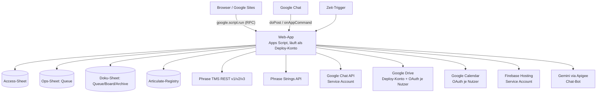

Wichtige Laufzeit-Eigenschaften:
- **Läuft als Deploy-Konto.** Drive, Sheets und Kalender werden mit den Rechten dieses Kontos angesprochen. Für „In mein Drive speichern“ und „Kalender-Sync“ gibt es deshalb eigene OAuth-Flows je Nutzer.
- **Identität** = `Session.getActiveUser().getEmail()`. In Chat-Events und Triggern leer → E-Mail aus dem Event (`callerOverride`).
- **Größengrenzen:** Startdokument ≈ 600 KB, nachgeladene Inhalte ≈ 144 KB. Große Bereiche (Startseite, Einstellungen, Anleitung, Admin, Dark Mode, Campus) werden nachgeladen.
- **Ausführungszeit** max. 6 min; Upload bricht nach 5 min mit `timedOut` ab.

### 3. Bereiche der Oberfläche

```
Kopf: Sprache · Glocke · Einstellungen · Hilfe (Knowledge Base)
Reiter: Start │ Neues Projekt │ Meine Projekte │ Dashboard* │ Anleitung │ Hilfe & Support │ Admin* │ Health*
Neues Projekt → General │ Marketing │ WOMA │ Competence Center │ KeC │ Dokumentation │ Campus
* nur mit Recht
```

| Bereich | Was man dort tut |
|---|---|
| **Start** | Suche/Befehle (Strg+K), Schnellstart, Kennzahlen, „Meine Arbeit“, nächste Frist, 7-Tage-Ansicht, Aktivitäten, Tipps |
| **Neues Projekt** | Vorlage wählen (nur passende), Sprachen, Name, Frist (Feiertags-/Wochenendprüfung, Express ≤ 72 h), Notiz, Hauptdateien (PC, Drive, Drive-Link), Referenzdateien, Presets |
| **General / Marketing / WOMA / CC** | Projektformulare mit eigener Whitelist |
| **KeC** | Dateien zu einem bestehenden Phrase-Projekt hinzufügen |
| **Dokumentation** | Import eines Drive-Ordners mit Sprach-Unterordnern, IA-Nummer; eigenes Sheet (Queue/Board/Archive) |
| **Campus** | Rise-Kurse: Projekt anlegen, Preview-Generator (Phrase-Job + SCORM-Ordner → Firebase-Vorschau), Batch |
| **Meine Projekte** | Tabelle/Kalender, Filter (meine, geteilt, Team), Details, Frist, Umbenennen, Notizen, Teilen, Abbrechen, Download (Datei, ZIP, in Drive speichern), Archiv (> 30 Tage) |
| **Dashboard** | Kennzahlen und Diagramme über Projekte (Admin, Admin-Light „dashboard“) |
| **Anleitung / Hilfe & Support** | Anleitung, FAQ, Taskbox-Formulare, E-Learnings |
| **Knowledge Base** (`?page=kb`) | komplette Phrase-Dokumentation (TMS, Strings, Orchestrator, Portal, Studio, Global; 414 Artikel), durchsuchbar |
| **Admin** | Console (System, Properties, Wartung, Ankündigungen, Datenbank-Links), Nutzer/Whitelists, Template Manager, User Template Debugger, Pivot-Admin, Translate UI (Phrase Strings), Tests, Protokoll |
| **Health** | `apiHealthCheck` – Zustand der Anbindungen |

### 4. Datenbanken (Google Sheets)

| Sheet | ID | Konfiguration |
|---|---|---|
| **Access-Sheet** („Sync DB“) | `1mU8zWhR-E8_fmBcLtMh1qIwST9FibKT5UfH7oaivs0Q` | `ACCESS_SHEET_ID` (Fallback in `Config.gs`) |
| **Ops-Sheet** („Uploads DB“) | `1xi0ZtFxxurNu25URrhpHmfSLy8nld_SXm0KmkXxRCpQ` | `OPS_SHEET_ID` (Fallback in `Config.gs`) |
| **Dokumentations-Sheet** | `1_EFW_ItawRvutiVrcNIamKTSYPFsA5XFGR1s6PctYxs` | fest in `DocQueue.gs`/`DocBoard.gs`/`DocImport.gs` |
| **Articulate-Registry** | `1V6oyZVw7-CPy8Bs5_sGl9Cg886b2T6r7FLGgp1gfBRY` | fest in `Articulateregistry.gs` |

#### Access-Sheet – Tabs

| Tab | Zweck |
|---|---|
| `Whitelist` | Zugang General Projects (Spalte Email) |
| `Whitelist_Marketing`, `_KeC`, `_Documentation`, `_Woma`, `_CC`, `_Articulate` | Spezialbereiche (exklusiv) |
| `Whitelist_AdminLight` | Teil-Admins: Email, Subtabs (`users,templates,pivot,tests,dashboard`) |
| `FetchTemplate-Prod` | Phrase-Vorlagen (per Sync): Display Name, Template UID, Source, Targets, Active, Client, Domain, Subdomain, Business Unit |
| `FetchTMS_USERS-Prod` | Nutzer-Zuordnung (per Sync): Email, Client, Domain, Subdomain, Business Unit |
| `Maintenance` | Wartungsfenster: ID, StartTime, EndTime, Message, Active |
| `Notifications` | Email · ON/OFF · Chat-User-ID (`users/…`) – auch vom Mention Digest gelesen |
| `UserPrefs` | Email · Prefs JSON · Updated At |
| `CalendarSync` | Email, Enabled, Calendar ID, Include Done, Lang, Last Sync, Last Result |
| `User_Presets` | gespeicherte Formular-Vorlagen |
| `Announcements` | Banner/Chat-Ankündigungen |
| `NotificationLog` | Einträge der Glocke |
| `AuditLog` | Admin-/Projektaktionen, Phrase-Owner, jede Chat-Nachricht |
| `Message_Templates` | Chat-Texte DE/EN (`MSG_PROJECT_SUBMITTED`, `MSG_COMPLETED`, `MSG_SHARED`, `MSG_CANCELLED` …) |
| `Watchers` | wer bei neuen Projekten einer Vorlage informiert wird |
| `PivotTemplateLinks`, `PivotLanguageMap` | Pivot-Workflow |

#### Ops-Sheet – Tab `Queue` (eine Zeile je Phrase-Projekt; nie löschen, Status `CANCELLED`)

A Timestamp · B User Email (Eigentümer) · C Project UID · D File ID · E File Name · F Mime Type · G Target Lang(s) · H Status · I Job UIDs · J Async ID · K Notification Email · L Project Name · M Due Date · N CC Email · O Analysis UID · P Total Words · Q Net Words · R Shared With · S Template Name · T Chat-Thread · U Chat-Threads der Geteilten · V Downloaded At · (per Kopfzeile) JobMapping, Pivot Role, Pivot Link.

Status: `NEW`, `QUEUED_UPLOAD`, `UPLOADED`, `ASSIGNED`, `ACCEPTED`, `COMPLETED`, `NOTIFIED`, `DELIVERED`, `CANCELLED`, `REJECTED`, Pivot `WAITING_CHILD`.

### 5. Rollen

| Rolle | Quelle | Wirkung |
|---|---|---|
| Admin | Script Property `ADMIN_EMAILS` | alles, sieht alle Projekte, Simulation anderer Nutzer |
| Admin-Light | `Whitelist_AdminLight` | nur freigegebene Admin-Bereiche |
| General | `Whitelist` | Reiter General Projects |
| Exklusive Bereiche | `Whitelist_Marketing` usw. | nur der jeweilige Bereich |
| ohne Eintrag | – | sieht keine Bereiche, Upload abgelehnt |

Vorlagen-Sichtbarkeit ist **fail-closed**: Client, Domain, Subdomain und Business Unit der Vorlage müssen zu den Werten des Nutzers passen. Projekte sieht man, wenn man Eigentümer ist, sie geteilt bekam oder (WOMA) im selben Team ist.

### 6. Script Properties

`ADMIN_EMAILS`, `ACCESS_SHEET_ID`, `OPS_SHEET_ID`, `PHRASE_API_TOKEN` (Aliase `PHRASE_TOKEN`, `GLOBAL_PHRASE_TOKEN`), `PHRASE_API_BASE_URL` (Standard `https://cloud.memsource.com/web`), `PHRASE_STRINGS_TOKEN`, `PHRASE_STRINGS_PROJECT`, `PHRASE_STRINGS_REGION`, `PHRASE_STRINGS_NIGHTLY`, `CHAT_CLIENT_EMAIL`, `CHAT_PRIVATE_KEY`, `SERVICE_ACCOUNT_JSON` (Firebase), `DRIVE_SAVE_OAUTH_CLIENT_ID`, `DRIVE_SAVE_OAUTH_CLIENT_SECRET`, `GEMINI_API_KEY`, `MAX_FILE_SIZE_MB` (100), `PHRASE_SET_REAL_OWNER` (`false` = API-Nutzer bleibt Owner), `MAINT_START`, `MAINT_END`, `MAINT_MSG`, `KEC_CLIENT_ID`, `KEC_DOMAIN_ID`, `KEC_BUSINESS_UNIT_ID`, `AUTO_SYNC_ENABLED`, `CAMPUS_BATCH_ENABLED`, `CAMPUS_BATCH_TEMPLATE_NAMES`, `TERMBASE_UID`; dynamisch `CHAT_USER_MAP__<email>`, `CHAT_NOTIFIED__<uid>`, `oauth2.*`, `Cal_*`.

Admin → Console → System zeigt Properties; Werte mit `token`, `key`, `secret`, `password`, `private` im Namen werden nie angezeigt.

### 7. Trigger

| Funktion | Takt | Zweck |
|---|---|---|
| `autoSyncProjectStatuses_` | 15 min | Status aus Phrase, Chat/Glocke, Pivot-Kinder |
| `calendarSyncAllTrigger` | stündlich | Fristen in Nutzerkalender |
| `psNightlySync_` | täglich ~02:00 | UI-Texte aus Phrase Strings |
| `cleanupChatDedupProperties_` | täglich ~03:00 | Aufräumen |

### 8. Wichtige Abläufe

#### Projekt anlegen

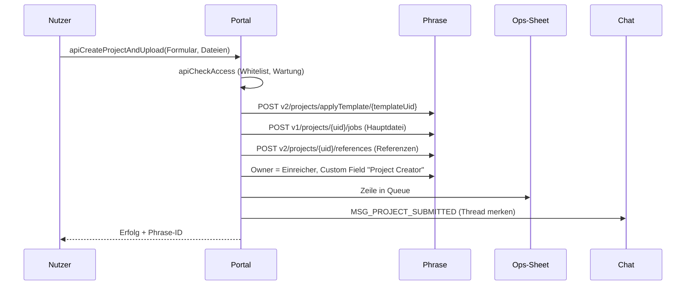

#### Status und Benachrichtigung
Alle 15 min liest `autoSyncProjectStatuses_` die Phrase-Status der offenen Queue-Zeilen, schreibt sie zurück, schickt bei Abschluss eine Chat-Antwort in den Projekt-Thread (auch an Geteilte) und legt Glocken-Einträge an.

#### Pivot-Workflow
Pivot-Vorlagen (`PivotTemplateLinks`) erzeugen nach Abschluss des Elternprojekts ein Kindprojekt mit den Sprachen aus `PivotLanguageMap`; Status `WAITING_CHILD` bis dahin.

#### Download
Höchster Workflow-Schritt je Sprache, Einzeldatei oder ZIP (`DownloadZip.gs`), oder „In Google Drive speichern“ per Nutzer-OAuth (`drive.file`), optional in Google-Format umgewandelt.

### 9. Google Chat

- Bot mit Service Account (`CHAT_CLIENT_EMAIL`, `CHAT_PRIVATE_KEY`), Nachrichten im 1:1-Space, Antworten im selben Thread.
- Slash-Commands (`ChatCommands.gs`): `/changeprojectname`, `/changeduedate`, `/changerevisor`, `/projectstatus`, `/assignlinguist`, `/closeproject`, `/termsearch` (`TERMBASE_UID`), `/quotestatus`, `/notifyvendor`, `/jobstats`.
- Freitext-Nachrichten beantwortet ein Gemini-Bot (`Chatbot.gs`, `gemini-2.0-flash`, max. 5 Tool-Runden, nur lesende Tools).

### 10. Externe Dienste

| Dienst | Zugang |
|---|---|
| Phrase TMS | `PHRASE_API_TOKEN` (Bearer), 429-Retry |
| Phrase Strings | `PHRASE_STRINGS_TOKEN`: klassischer Token oder Plattform-Token → JWT über `https://eu.phrase.com/idm/oauth/token` |
| Google Chat | Service Account, Scope `chat.bot` |
| Drive „Save to Drive“ / Kalender | OAuth-Client `DRIVE_SAVE_OAUTH_CLIENT_ID/SECRET`, Redirect `https://script.google.com/macros/d/{SCRIPT_ID}/usercallback` |
| Firebase Hosting | `SERVICE_ACCOUNT_JSON`, Site `kaercher-course-preview` |
| Gemini | `GEMINI_API_KEY` über Apigee-Proxy |
| Workspace | Admin Directory, People API, Cloud Identity Groups, Contacts (lesen) |

### 11. Dateien (Auswahl)

| Bereich | Dateien |
|---|---|
| Einstieg/Konfiguration | `WebApp.gs`, `Code.gs`, `Config.gs`, `Apialiases.gs` |
| Rollen | `AdminAccess.gs`, `AdminLight.gs`, `AdminMarketing.gs`, `AdminWoma.gs`, `AdminCc.gs` |
| Projekte | `Upload.gs`, `ProjectsApi.gs`, `KeCProjects.gs`, `DocImport.gs`, `AutoSync.gs`, `Sync.gs`, `Watchers.gs` |
| Download | `DownloadZip.gs`, `DownloadTargetFile.gs`, `DriveSaveConfig.gs`, `DriveHelpers.gs`, `DocExport.gs` |
| Dokumentation | `DocQueue.gs`, `DocBoard.gs`, `DocArchive.gs`, `DocDriveConfig.gs`, `DocDriveTree.gs` |
| Pivot | `PivotProjects.gs`, `PivotAdmin.gs`, `PivotTemplateLinks.gs`, `PivotLanguageMap.gs` |
| Campus | `Articulateapi.gs`, `Articulateregistry.gs`, `Articualtepreview.gs`, `RisePatcher.gs`, `ScormPatcher.gs`, `Xliffparser.gs`, `CampusBatch.gs`, `FirebaseAuth.gs`, `FirebaseHostingDeploy.gs` |
| Chat | `Upload.gs` (Senden, doPost), `ChatToken.gs`, `ChatCommands.gs`, `Chatbot.gs`, `Messagetemplates.gs` |
| Persönlich | `UserPrefs.gs`, `Presets.gs`, `CalendarSync.gs`, `Announcements.gs`, `GermanHolidays.gs` |
| UI-Übersetzung | `I18nDicts.gs`, `AdminI18n.gs`, `PhraseStrings.gs`, `PhraseStringsSync.gs` |
| Knowledge Base | `KnowledgebaseApi.gs`, `Knowledgebase.html`, `KbData*.html` (aus `kb-src/*.md` mit `npm run build:kb`) |
| Betrieb | `Auditlog.gs`, `Adminadvanced.gs`, `SelfTests.gs`, `Triggers.gs`, `SheetSetup.gs`, `HeaderRepair.gs`, `Debug.gs` |
| Oberfläche | `Index.html`, `Styles.html`, `Js*.html`, `HomeUi.html`, `PrefsUi.html`, `AdminConsole.html`, `AdminScript.html`, `DarkTheme.html`, `GuideContent.html` |

### 12. Bekannte Auffälligkeiten (Auszug aus `docs/AUFFAELLIGKEITEN.md`)

- 🔴 Downloads prüfen nur die Whitelist, nicht den Projektbesitz.
- 🔴 Drive-Auswahl läuft als Deploy-Konto (Nutzer sehen dessen Ordner).
- 🟠 Articulate-Registry-Funktionen ohne Rechteprüfung; `doPost` prüft die Herkunft nicht; `apiGetJobNotes` ohne Prüfung.
- 🟠 Doppelte Funktionsnamen (`apiSetMaintenance`, `apiDownloadTargetFile`, `onMessage`) – welche gewinnt, hängt von der Dateireihenfolge ab.
- 🟠 Zwei Quellen für den Wartungsmodus (Sheet `Maintenance` vs. Properties `MAINT_*`).

### 13. Bezüge zu anderen Repos

- **articulate-rise-patcher:** Ursprung des Campus-Vorschau-Moduls (Dateien übernommen und weiterentwickelt).
- **phrase-notification-hub:** nutzt denselben Chat-Bot und das Tab `Notifications`; `Hub snippet mentiondigest.gs` zeigt, wie „Meine Projekte“ einen Link in den Mention Digest bekommt.
- **Design-Vorlage** für Prompt Hub und AutoFix Hub (gleiche Optik und Bedienung).

---

# Datei: 02-autofix-hub.md

## AutoFix Hub (Repo `autofix-hub`)

> Kurz: Automatisches Post-Editing mit Gemini für Phrase TMS. AutoFix findet Projekte mit gesetztem Custom Field „AutoFix“, post-editiert die Jobs im Workflow-Schritt „PE Gemini“ mit dem Prompt des jeweiligen Dokumenttyps und schreibt die Korrekturen als MXLIFF zurück nach Phrase. Dazu eine Web-Oberfläche mit Dashboard, Run Log, Analysen (MQM, Term-Drift, Glossar) und Rollen.

---

### 1. Steckbrief

| Eigenschaft | Wert |
|---|---|
| Typ | Web-App, `executeAs: USER_ACCESSING`, `access: DOMAIN`; Zeit-Trigger `autoFixPoller` |
| Einstieg | `doGet`: `Index.html` (neue Oberfläche); `?page=prompts` = alter Prompt Editor |
| Datenbank | Google Sheet „AutoFix Hub - Database“, ID in Script Property `AUTOFIX_DB_SHEET_ID` (Standard laut Prompt Hub: `1LFoBCuz7h1xdi58djRPedAXgtj4RZ_T5EnvJbTKtkp8`) |
| KI | Gemini über Apigee-Proxy, Standardmodell `gemini-3.6-flash`, Temperature 0.1, Max Tokens 32768 |
| Phrase | `PHRASE_API_TOKEN`; API v1/v2 unter `https://cloud.memsource.com/web/api2/` |
| Tests/Deploy | `npm test`, `npm run test:ui`, Lint, gitleaks; `deploy.yml`: `main` → Staging, Tag `v*.*.*` → Produktion |

### 2. Ablauf eines Laufs

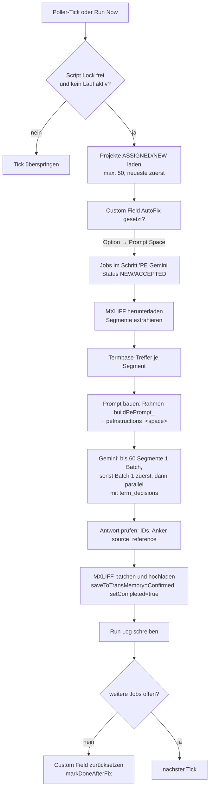

- Der Poller nimmt **pro Tick genau einen Job** (`processNextJob_`). „Run Now“ in der Oberfläche verarbeitet alle (`runAllJobsForAllProjects_`).
- Sperre gegen Doppelausführung: Script Lock + Property `AUTOFIX_RUNNING` (Timeout 25 min). Admins können sie lösen (`forceUnlock`).
- Projektliste wird 15 min gecacht (`AUTOFIX_PROJECT_CACHE`).
- Einheitliche Begriffe über Batch-Grenzen (FIX 18): Batch 1 liefert `language_variant` und `term_decisions`, die allen weiteren Batches vorgegeben werden.

### 3. Welcher Prompt wird verwendet?

1. Option des Custom Fields „AutoFix“ (`1uw8kvE6WNhT6Gw0XeX4Z4`) lesen.
2. Legacy-UIDs: `7d95rL0n0lA894J0CRXaL9` (True) und `2HtFqxLWLZp3126BkQ6li1` (Technical Documentation) → `technical`; `YddgPfvnHZ8A4li6KxmYS2` (Marketing) → `marketing`.
3. Sonst: **sichtbarer Optionstext** gegen das Label eines Prompt Space (aus dem Tab `Prompt Spaces`, gepflegt vom Prompt Hub, und der Property `AUTOFIX_PROMPT_TYPES_CONFIG`).
4. Fallback `technical`.
5. Prompt-Text = Zeile `peInstructions_<space>` im Tab `Settings`.

Der Rahmen um den Prompt (`buildPePrompt_`) ist fest im Code: Rolle, Sprachen, Dokumenttyp, Termbase-Regel („tbHit.tgt immer verwenden“), Segment-Isolation, Tags, Anker-Regel, Vollständigkeit, JSON-Ausgabe (`language_variant`, `term_decisions`, `results[id, source_reference, corrected, changed, reason]`). Der Prompt Hub hält eine wortgleiche Kopie davon (`AutoFixMirror.gs`).

### 4. Datenbank: AutoFix-Sheet

| Tab | Inhalt |
|---|---|
| `Settings` | Key/Value: `cfFieldUid`, `wfStepName`, `primaryModel`, `peTemperature`, `maxTokens`, `tmThreshold`, `pollerIntervalMinutes`, `markDoneAfterFix`, `peInstructions_<space>` je Space |
| `Run Log` | Timestamp, Project UID, Project Name, Job UID, Target Lang, Success, Total Segments, Changed Segments, Model, Message/Error, Changes JSON, AutoFix Type |
| `Audit Log` | Timestamp, Action, Details |
| `Prompt Spaces` | type, label, example, active – geschrieben vom Prompt Hub |
| `Prompt Hub Import` | Export des alten Prompt Editors für den Prompt Hub (`exportPromptEditorToPromptHub`) |
| MQM-Report-Tabs | von `exportMqmReportToSheet` erzeugt |
| `PH_*` | Daten des Prompt Hub (Spaces, Versionen, Nutzer, Anträge, Testfälle, Audit), falls kein eigenes Hub-Sheet |

Wirksam für echte Läufe sind nur `primaryModel`, `peTemperature`, `maxTokens` (global). `tmThreshold` und `pollerIntervalMinutes` liest der Code nicht; Werte pro Space aus dem alten Editor haben keine Wirkung.

> **Wichtig:** Die alte Funktion `saveAutoFixSettings()` leert den Tab `Settings` und schreibt ihn neu – das kann Prompts löschen. Die neue Oberfläche schreibt nur geänderte Zeilen.

### 5. Oberfläche

| Bereich | Inhalt | Rolle |
|---|---|---|
| Dashboard | Poller starten (5/10/30 min)/stoppen, Laufstatus, Kennzahlen 7 Tage, letzte Läufe | Ansehen (Steuern: Ausführen) |
| Live-Run | Lauf starten, Fortschritt live, Konsole | Ausführen |
| Warteschlange | Projekte mit Flag und Jobs in „PE Gemini“ | Ansehen |
| Run Log | Suche/Filter, Wort-Diff der Korrekturen, Fehler, **Re-Push** nach Phrase | Ansehen (Re-Push: Ausführen) |
| Analysen | MQM-Report (Export ins Sheet), Benchmark je Sprache, Term-Drift, Glossar-Vorschläge | Ausführen |
| Prompts | aktiver Prompt je Space, Herkunft (Prompt Hub / Fallback), wirksame Gemini-Werte, Link zum Prompt Hub | Ansehen |
| Admin | Anträge, Nutzer/Rollen, Admins, AutoFix-Einstellungen, Konfiguration, Wartung (Run-Sperre, Cache, Projektsuche), Audit-Log, „Ansicht als“ | Admin |
| Hilfe | FAQ | alle |

MQM-Schema der Analysen: Accuracy (Mistranslation, Omission, Addition, Untranslated), Terminology (Termbase, Inconsistency), Fluency (Grammar, Spelling, Register, Punctuation), Style (Kärcher Style, Formatting), Locale (Spelling Convention, Date/Number Format); Schweregrade minor/major/critical.

### 6. Rollen

| Rolle | Darf |
|---|---|
| Admin | alles |
| Ausführen (operator) | Läufe starten, Poller steuern, Re-Push, Analysen |
| Ansehen (viewer) | Dashboard, Warteschlange, Run Log, Prompts |

Gespeichert in Script Property `AUTOFIX_HUB_ACCESS`. Erster Admin: aus `PROMPT_EDITOR_ADMINS` übernommen oder `bootstrapAutoFixAdmin()` ausführen. **Offener Modus:** solange kein Admin existiert, darf jeder alles. Geschützt sind auch direkte Aufrufe von `runNow`, `runAutoFixForProject`, `replayChangesForJob`, `setupAutoFixTrigger`, `removeAutoFixTrigger`, `forceUnlock`, `recreateDatabase`.

### 7. Script Properties

| Property | Zweck |
|---|---|
| `PHRASE_API_TOKEN` | Phrase |
| `GEMINI_API_KEY` | Gemini-Proxy |
| `AUTOFIX_DB_SHEET_ID` | Datenbank-Sheet |
| `AUTOFIX_HUB_ACCESS` | Rollen, Anträge |
| `AUTOFIX_HUB_CONFIG` | `promptHubUrl`, `notifyEmails`, `chatWebhookUrl`, `allowedModels` |
| `AUTOFIX_HUB_UI_LANG` | Sprache |
| `AUTOFIX_RUNNING`, `AUTOFIX_RUN_LOG`, `AUTOFIX_PROJECT_CACHE` | Laufzeit |
| `AUTOFIX_PROMPT_TYPES_CONFIG`, `PROMPT_EDITOR_ADMINS`, `PROMPT_EDITOR_USERS`, `PROMPT_EDITOR_UI_LANG` | alter Prompt Editor |

### 8. Phrase-Endpunkte

| Aufruf | Zweck |
|---|---|
| `GET v1/projects?statuses=ASSIGNED&statuses=NEW` | Kandidaten |
| `GET/PUT v1/projects/{uid}/customFields` | Flag lesen / zurücksetzen |
| `GET v1/projects/{uid}` + `/jobs?workflowLevel=` | Jobs im Schritt „PE Gemini“ |
| `POST v1/projects/{uid}/jobs/bilingualFile?format=MXLF` | MXLIFF herunterladen |
| `POST v2/bilingualFiles?saveToTransMemory=Confirmed&setCompleted=true` | MXLIFF hochladen, Job abschließen |
| `POST v2/projects/{uid}/jobs/{job}/termBases/searchInTextByJob` | Termbase-Treffer |

### 9. Dateien

| Pfad | Inhalt |
|---|---|
| `Code.gs` | Lauf-Logik, Gemini, MXLIFF, Poller, Analysen |
| `Database.gs` | Sheet anlegen, Run Log, MQM-Export |
| `Settings.gs` | Einstellungen, Standard-Prompts, Space-Zuordnung |
| `PromptEditorAccess.gs`, `PromptEditor.html` | alter Prompt Editor, liest Prompt-Hub-Spaces |
| `PromptHubExport.gs` | Export in den Prompt Hub |
| `HubAccess.gs`, `HubApi.gs` | Rollen, Anträge, Endpunkte der Oberfläche |
| `ui/` → `Index.html` | Oberfläche (`npm run build` erzeugt `Index.html`) |
| `Doget patch.gs` | Kopiervorlage, wird nicht deployt |

### 10. Bezüge

- **Prompt Hub** schreibt Prompts und Spaces in dieses Sheet und spiegelt `buildPePrompt_`.
- **Translation Add-on** nutzt dieselben PE-Prompts (Kopie im Code).
- **Phrase:** Projektmanager setzen das Custom Field und den Workflow-Schritt „PE Gemini“ in den Vorlagen.

---

# Datei: 03-prompt-hub.md

## Prompt Hub (Repo `Prompt-hub`)

> Kurz: Web-App zum Pflegen der Post-Editing-Prompts des AutoFix Hub. Jeder Prompt folgt einem festen Muster aus 13 Feldern, wird vor dem Veröffentlichen geprüft, lässt sich live gegen Gemini testen und landet beim Veröffentlichen genau in der Zeile, die AutoFix liest. Design und Bedienung wie Kärcher Translation Services.

---

### 1. Steckbrief

| Eigenschaft | Wert |
|---|---|
| Typ | Web-App, läuft als Eigentümer (*Ausführen als: Ich*), *Zugriff: Alle in der Domain* |
| Quellcode | `src/` (clasp `rootDir: src`); `dist/Installer.gs` = Ein-Datei-Installer |
| Datenbank | AutoFix-Sheet `1LFoBCuz7h1xdi58djRPedAXgtj4RZ_T5EnvJbTKtkp8` (Standard), Tabs `PH_*`; optional eigenes Hub-Sheet |
| Konfiguration | Script Property `PH_CONFIG` (JSON), Admins in `PH_ADMINS`, Key in `GEMINI_API_KEY` |
| KI | Gemini-Proxy `https://34-111-99-134.nip.io/gemini/v1beta/models/`, freigegebene Modelle `gemini-3.6-flash`, `gemini-3.6-flash-lite`, `gemini-3.5-flash`, `gemini-3.5-flash-lite`, `gemini-3.1-flash-lite`, `gemini-3-flash-preview` |
| Tests/Deploy | `npm test`, `npm run test:ui`, `npm run check` (AutoFix-Spiegel); `deploy.yml` (Staging/Produktion), `autofix-drift.yml` montags |

### 2. Anbindung an AutoFix

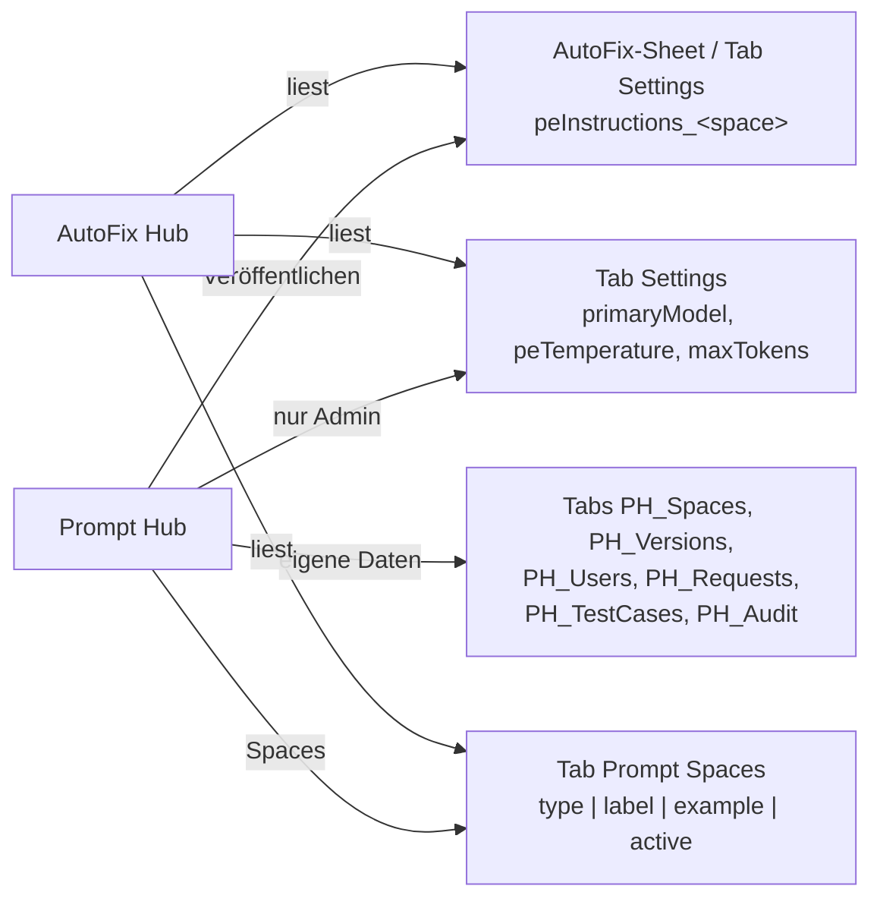

- Die Post-Editing-Logik von AutoFix bleibt unverändert; der Hub schreibt nur den Prompt-Text.
- AutoFix speichert Settings, indem es den Tab leert und neu schreibt. Der Hub schreibt deshalb einzelne Zeilen und prüft danach, ob der Text angekommen ist. Abweichungen (z. B. durch den alten Prompt Editor) zeigt er an; Admins beheben sie mit einem Klick („Resync“).
- Neuer Space: in Phrase im Custom Field „AutoFix“ eine Option **mit exakt demselben Namen** anlegen.

### 3. Prompt-Muster (13 Felder)

| # | Feld | Pflicht | Inhalt |
|---|---|---|---|
| 1 | Titel | ja | `=== POST-EDITIERUNG (PE) — KÄRCHER <TITEL> ===` |
| 2 | Auftrag | ja | Rolle, Textsorten, Quellsprache, Herkunft der MT, Ziel |
| 3 | Prioritäten | eins von 3/4 | Konfliktreihenfolge: Segmentgrenzen > Tags > Nomenklatur > Bedeutung > Sprache |
| 4 | Pflicht-Korrekturen | eins von 3/4 | Termbase, Produktnamen, Zahlen, Tags, Vollständigkeit; standardmäßig vom Admin gesperrt |
| 5 | Aktive Verbesserungen | | Natürlichkeit, Stil, Fluss |
| 6 | Grundregeln Nomenklatur | | wie die Liste anzuwenden ist |
| 7 | Nomenklatur-Tabelle | | Englisch · Deutsch · Kategorie · Regel; Listen „nur Englisch“, „nur Teil übersetzen“, „komplett“, „immer übersetzen“ |
| 8 | Vermeide | | bekannte Fehler mit „falsch: …“ |
| 9 | Stil & Register | | Anrede, Tonalität |
| 10 | Sprachregeln | | je Zielsprache (z. B. pt-BR) |
| 11 | Eigene Abschnitte | | z. B. Zeichenlimits |
| 12 | Nicht verändern | | wann `changed=false` |
| 13 | Wichtig | ja | Grundhaltung, Vorgabe für `reason` |

**Prüfung (blockiert Veröffentlichen):** Pflichtfelder fehlen, Pflichtthemen fehlen (Tags & Platzhalter, Zahlen & Einheiten, Terminologie – Admin-pflegbar), Widerspruch zum AutoFix-Ausgabeformat (Code-Blöcke, eigene JSON-Felder), `===`-Zeilen in Feldern, doppelte Begriffe, gesperrter Abschnitt geändert, > 50.000 Zeichen. Warnungen u. a. bei „Karcher“ ohne Umlaut oder > 25.000 Zeichen.

Referenz-Prompts: `prompts/pnd.txt` (P&D Dialogue, HR, mit Nomenklatur), `prompts/technical.txt`, `prompts/marketing.txt` → daraus `src/Templates.gs`.

### 4. Funktionen

| Bereich | Funktion |
|---|---|
| Editor | Felder, Autosave als Entwurf mit Konflikterkennung, Nomenklatur aus Excel/Sheets einfügen |
| Live-Test | gleicher Rahmen (`buildPePrompt_` wortgleich), gleiches Modell, gleiche Temperature/Max Tokens wie ein echter Lauf; Quelltext, MT, Termbase-Treffer, Erwartungen; Vergleich Entwurf vs. Live; automatische Checks (Tags, Zahlen, Nomenklatur, Termbase, Anker); gespeicherte Testfälle; Quote 20 Tests / 10 min, max. 60 Segmente |
| Versionen | Veröffentlichen mit Notiz, Diff, Wiederherstellen |
| Freigaben | Anträge auf neue Spaces und Zugriff; Benachrichtigung per Chat-Webhook und E-Mail |
| Admin | Nutzer/Rollen je Space, Admins, gesperrte Abschnitte, wirksame Gemini-Werte, Pflichtthemen, Sheet-IDs, Endpunkt, Key (nur schreibbar), Quoten, Import aus AutoFix, Export, Abgleich, Audit-Log, „Ansicht als“ |

### 5. Rollen

| Rolle | Darf |
|---|---|
| Admin | alles; Skript-Eigentümer wird beim ersten Aufruf Admin |
| Bearbeiten | Prompt eines Space bearbeiten, testen, veröffentlichen, wiederherstellen, Testfälle |
| Ansehen | ansehen, Vorschau, Live-Test |
| ohne Zugriff | Antrag stellen |

### 6. Datenmodell (`PH_*`-Tabs)

| Tab | Spalten |
|---|---|
| `PH_Spaces` | type, label, status, description, example, lockedSections, liveVersion, draft, draftUpdatedAt, draftUpdatedBy, createdAt, createdBy |
| `PH_Versions` | type, version, fields, composed, note, createdAt, createdBy |
| `PH_Users` | email, spaces, active, addedBy, addedAt |
| `PH_Requests` | id, kind, email, payload, status, createdAt, decidedBy, decidedAt, comment |
| `PH_TestCases` | id, type, name, data, updatedAt, updatedBy |
| `PH_Audit` | timestamp, email, action, details |

### 7. Konfiguration `PH_CONFIG`

`autofixSheetId`, `hubSheetId`, `geminiBaseUrl`, `allowedModels`, `guardrails` (Pflichtthemen), `ticketUrl` (Taskbox 4030), `chatWebhookUrl`, `notifyEmails`, `testQuotaPer10Min` (20), `maxTestSegments` (60), `defaultLockedSections` (`mandatory`).

### 8. Einrichtung

1. Apps-Script-Projekt mit Konto, das Schreibrecht auf das AutoFix-Sheet hat.
2. Code per CD oder `clasp push` übertragen.
3. Als Web-App bereitstellen (Ich / Domain).
4. Admin → Einstellungen: Gemini-Key, „Verbindung testen“, ggf. Chat-Webhook und E-Mails.
5. Admin → Spaces → „Aus AutoFix übernehmen“.
6. Für neue Spaces gleichnamige Option im Phrase-Custom-Field „AutoFix“ anlegen.

### 9. Dateien

| Pfad | Inhalt |
|---|---|
| `src/PromptCore.gs` | compose, parse, validate, checkOutput, Diffs (Server und Browser) |
| `src/Api.gs` | alle Endpunkte mit Rechteprüfung (`apiBootstrap`, `apiSaveDraft`, `apiPublish`, `apiRunTest`, `apiAdmin*` …) |
| `src/AutoFixBridge.gs` | Lesen/Schreiben im AutoFix-Sheet, Abgleich |
| `src/AutoFixMirror.gs` | wortgleiche Kopie von `buildPePrompt_` – nicht von Hand ändern |
| `src/LiveTest.gs` | Live-Test |
| `src/Store.gs`, `src/Access.gs`, `src/Config.gs`, `src/Notify.gs` | Speicher, Rechte, Konfiguration, Benachrichtigung |
| `src/*.html` | Oberfläche |
| `tools/` | Vorschau, Mockups, Vorlagen-Generator, `check-mirror.js` |
| `docs/mockups/*.png` | 14 Bildschirmfotos |

---

# Datei: 04-autolqa-hub.md

## AutoLQA Hub (Repo `autolqa-hub`)

> Kurz: Web-App für KI-gestützte Qualitätsprüfung (Language Quality Assessment, LQA) von Phrase-Projekten nach dem **DQF-MQM**-Modell. Gemini bewertet die Segmente eines Projekts mit Termbase- und TM-Kontext, vergibt Fehler mit Kategorie, Schweregrad und Strafpunkten, berechnet einen Score und schreibt die Befunde auf Wunsch als Segment-Kommentare oder als offizielles LQA-Assessment nach Phrase zurück.

---

### 1. Steckbrief

| Eigenschaft | Wert |
|---|---|
| Typ | Web-App, `executeAs: USER_DEPLOYING`, **`access: MYSELF`** – nur der Eigentümer kann sie öffnen |
| Einstieg | `doGet` → `Index.html` (Titel „AutoLQA Hub“) |
| Datenbank | Google Sheet „AutoLQA Hub - Database“, ID in Script Property `DB_SHEET_ID`; fehlt sie, wird das Sheet automatisch angelegt. Link in der App über „Datenbank öffnen“ (`getDatabaseUrl()`) |
| KI | Gemini über Apigee-Proxy; Standardmodell `gemini-2.5-pro` (Setting `primaryModel`) |
| Script Properties | `PHRASE_API_TOKEN`, `GEMINI_API_KEY`, `DB_SHEET_ID` |
| Tests/Deploy | keine; Commits „Sync: Update …“ aus dem Apps-Script-Editor |

> ⚠️ Laut AutoFix-Code ist `gemini-2.5-pro` über den Kärcher-Proxy nicht mehr verfügbar (404). Falls AutoLQA-Läufe mit 404 scheitern, in den Einstellungen `primaryModel` auf `gemini-3.6-flash` setzen.

### 2. Ablauf

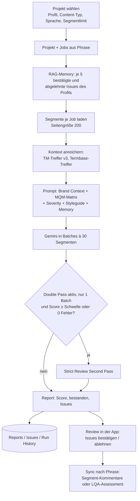

- **Referenzdatei:** Optional lässt sich ein Styleguide/Referenzdokument hochladen; es geht als Datei mit an Gemini. Dazu freie „Styleguide Notes“.
- **Report-Modus:** kombiniert (ein Report) oder je Sprache (`per_language`, ein Report je Zielsprache).
- **Content-Typen** (Brand Context): `universal` immer + `marketing`, `techdoc` oder `ui`. Die Kärcher-Regeln (Umlaut in „Kärcher“, Produktnamen wie „K 5“, „HD 6/13“ unverändert, Termbase ist Ground Truth, bei Confidence < 70 nicht melden) stehen als Standardtexte in `Settings.gs` und sind in der App editierbar.
- **Root Cause:** „Pre-translation“ (Fehler im Quelltext) oder „Production“ (Übersetzungsfehler).
- **Fortschritt:** im Script-Cache unter einer Task-ID, die Oberfläche fragt `getTaskProgress(taskId)` ab.

### 3. Datenbank-Tabs

| Tab | Spalten |
|---|---|
| `Settings` | Key, Value (siehe unten) |
| `Profiles` | ID, Name, JSON Data (komplettes MQM-Profil) |
| `Reports` | ReportID (`REP-<timestamp>[-<lang>]`), Date, ProjectID, ProjectName, Profile, Score, Passed, TotalSegs, TotalWords, Errors, Summary |
| `Issues` | ReportID, IssueID (Segment-ID), Category, Subcategory, Severity, Penalty, Confidence, Status (pending/approved/rejected), Source, Target, Suggestion, Explanation, RootCause |
| `Audit Log` | Timestamp, Action, Details |
| `Run History` | Timestamp, ReportID, Model, Duration_ms, Passes, IssuesFound |
| `LQA Export` | formatierter Export aller Reports und Issues (`exportReportsToSheet`) |

### 4. Einstellungen (Tab `Settings`)

| Key | Standard | Bedeutung |
|---|---|---|
| `primaryModel` | `gemini-2.5-pro` | Gemini-Modell |
| `tempPass1` / `tempPass2` | 0.1 / 0.05 | Temperature erster / zweiter Durchgang |
| `maxTokens` | 32768 | Ausgabe-Limit |
| `doublePassEnabled`, `doublePassThreshold` | true, 100 | strenger zweiter Durchgang („Strict Review“), wenn der Lauf nur einen Batch hatte und Score ≥ Schwelle oder keine Fehler |
| `phraseMaxSegments` | 30 | Standard-Segmentlimit |
| `defaultProjectCount` | 50 | Projekte in der Liste |
| `tmThreshold` | 0.7 | TM-Mindesttreffer |
| `tbLookupLimit`, `tbMinWordLength`, `tbMaxNgram` | 15, 3, 3 | Termbase-Suche |
| `lqaDefaultProfile` | `mqm_core_standard` | Standardprofil |
| `commentPrefix` | `[AutoLQA]` | Präfix für Phrase-Kommentare |
| `roiHourlyRate`, `roiWordsPerHour` | 50, 2500 | ROI-Berechnung in Analytics |
| `brandContextUniversal/Marketing/Techdoc/Ui` | Kärcher-Texte | Brand Context je Content-Typ |
| `uiTheme`, `uiLang`, `uiDefaultView` | light, de, projects | Oberfläche |

Werte, die mit `= + - @ * #` beginnen, werden mit Apostroph gespeichert, damit Sheets sie nicht als Formel liest.

### 5. Standard-MQM-Profil „MQM Core Standard“

| Kategorie | Subkategorien (Gewicht) |
|---|---|
| ACCURACY | Accuracy, Mistranslation, Omission, Improper exact TM match (1.0) |
| FLUENCY | Fluency, Grammar, Spelling (1.0) |
| TERMINOLOGY | Inconsistent with termbase, Terminology (1.5) |
| STYLE | Style, Unidiomatic (1.0) |

Strafpunkte: Neutral 0, Minor 1, Major 5, Critical 10. Bestehensgrenze 99,0 %. Profile sind im Reiter „Profiles“ editierbar, zurücksetzbar.

### 6. Oberfläche

| Reiter | Inhalt |
|---|---|
| Projects | aktive Phrase-Projekte, „Start AutoLQA“ |
| Reports | Reports, LQA-Review (Issues bestätigen/ablehnen, Sammelaktionen), „Sync to Phrase TMS LQA“, Export |
| Analytics | Auswertungen, ROI |
| Profiles | MQM Profile Editor |
| Settings | alle Einstellungen, Brand Context, Datenbank neu anlegen |

### 7. Phrase-Endpunkte

| Aufruf | Zweck |
|---|---|
| `GET v1/projects`, `v1/projects/{uid}`, `/jobs` | Projekte und Jobs |
| `GET v1/projects/{uid}/jobs/{job}/segments` | Segmente |
| `POST v3/projects/{uid}/jobs/{job}/transMemories/search` | TM-Kontext |
| `POST v2/projects/{uid}/jobs/{job}/termBases/searchInTextByJob` | Termbase-Treffer |
| `GET v1/termBases` | Termbanken |
| `POST v1/projects/{uid}/jobs/{job}/segments/{id}/comments` | Befund als Kommentar |
| `v1/lqa/assessments/…`, `v1/projects/{uid}/jobs/{job}/conversations/lqa` | offizielles LQA-Assessment |

### 8. Dateien

| Datei | Inhalt |
|---|---|
| `Code.gs` | Phrase, Gemini, Prompt, Batches, Ablauf, Sync |
| `Database.gs` | Sheet, Reports, Issues, Export, RAG-Memory, Profile |
| `Settings.gs` | Standard-Einstellungen, Brand-Context-Texte, Reparaturfunktionen |
| `PromptBulk.gs` | `fixBrandContextInSheet()` – einmalige Reparatur |
| `Index.html` | Oberfläche |

Hilfsfunktionen im Editor: `recreateDatabase`, `repairSettingsSheet`, `migrateBrandContextSettings`, `forceMaxTokensUpdate`, `resetKaercherPrompts`.

---

# Datei: 05-mention-digest.md

## Mention Digest (Repo `phrase-notification-hub`)

> Kurz: Web-App mit Zeit-Triggern, die Kommentare in Phrase-TMS-Jobs überwacht und Personen per **Google Chat** benachrichtigt, wenn sie mit **@Erwähnung** angesprochen werden – sofort, im Intervall, täglich oder wöchentlich. Dazu Abwesenheitsvertretung und Projekt-Regeln („informiere bei Projekt X immer Person A und B“). Nutzt denselben Chat-Bot („Phrase Chatbot“) wie Kärcher Translation Services.

---

### 1. Steckbrief

| Eigenschaft | Wert |
|---|---|
| Typ | Web-App, `executeAs: USER_ACCESSING`, `access: DOMAIN`; Titel „Mention Digest“ |
| Datenbank | Google Sheet, ID in Script Property `MENTION_SHEET_ID` |
| Zweites Sheet | Script Property `ACCESS_SHEET_ID` (Access-Sheet des Portals) – nur Tab `Notifications` als Fallback für Chat-IDs |
| Phrase | `PHRASE_API_TOKEN`, `PHRASE_API_BASE_URL` (Standard `https://cloud.memsource.com/web`) |
| Chat | Service Account `CHAT_CLIENT_EMAIL`, `CHAT_PRIVATE_KEY` (OAuth2-Bibliothek, Service „MentionDigestBot“, Scope `chat.bot`); nur ausgehend, kein `doPost` |
| Chat-App im Marketplace | `https://workspace.google.com/marketplace/app/phrase_chatbot/175040441162` – muss jeder Nutzer einmal öffnen |
| Admins | Script Property `ADMIN_EMAILS` |
| Erweiterte Dienste | Admin Directory (Chat-User-ID aus E-Mail), Bibliothek OAuth2 v43 |

### 2. Welche Projekte werden gescannt?

Nur aktive Projekte (nicht COMPLETED/CANCELLED) mit dem Custom Field **„Mention Digest“** (`AxFjBOkLFMEx9VW5H0hwN1`) auf **True** (Option `BHRFl72Ug1nt8iU3FR0Xy1`). Das Flag wird je Projekt 6 h gecacht (`MENTION_CF__<projectUid>`). Jobs im Status DELIVERED/COMPLETED/CANCELLED/REJECTED/DECLINED werden übersprungen; gescannt werden die Workflow-Stufen aus `SCAN_WORKFLOW_LEVELS` (Standard 1–5).

### 3. Ablauf

```mermaid
flowchart TD
  T[Trigger alle 5 min: mentionScanRun_] --> F{FEATURE_ENABLED = yes?}
  F -- nein --> X[Ende]
  F -- ja --> P[Markierte aktive Projekte<br/>ab SCAN_CURSOR_INDEX,<br/>max. SCAN_PROJECTS_PER_RUN = 25, max. 4,5 min]
  P --> J[Alle Jobs, Kommentare seit<br/>MENTION_LAST_SEEN__&lt;projekt&gt;]
  J --> M[@Erwähnungen parsen]
  M --> A{Empfänger abwesend?}
  A -- ja --> V[an Vertretung umleiten]
  A -- nein --> E[Empfänger]
  V & E --> S{Modus des Empfängers}
  S -- immediate --> C[sofort Chat-Nachricht]
  S -- interval/daily/weekly --> B[(Pending_Mentions puffern)]
  S -- off --> O[nichts]
  J --> R[Projekt-Regeln:<br/>mentions_only / all_comments]
  R --> C
  B --> I[intervalDigestRun_ 5 min /<br/>dailyDigestRun_ / weeklyDigestRun_]
  I --> C
```

- `ignoreOwn`: eigene Kommentare werden nicht gemeldet (Standard ja).
- Nachrichten gruppiert nach Projekt und Datei, mit Link direkt aufs Segment bzw. den Kommentar in Phrase.
- Vor dem ersten Aktivieren `DEBUG_setBaseline()` ausführen, sonst werden alle alten Erwähnungen auf einmal gemeldet.

### 4. Benachrichtigungsmodi (je Nutzer)

| Modus | Wirkung |
|---|---|
| `immediate` | sofort nach dem nächsten Scan (≤ 5 min) |
| `interval` | gesammelt alle `IntervalMin` Minuten (15–480) |
| `daily_digest` | einmal täglich zur `DAILY_DIGEST_HOUR` (Standard 8 Uhr) |
| `weekly_digest` | montags zur `DAILY_DIGEST_HOUR` |
| `off` | keine Nachrichten |

Abwesenheit: gespeichert als Script Property `ABSENCE__<email>` = `{ active, until, substitute }`; Nachrichten gehen bis zum Datum an die Vertretung.

### 5. Datenbank-Tabs (`MENTION_SHEET_ID`)

| Tab | Spalten |
|---|---|
| `User_Settings` | Email, Mode, IntervalMin, Lang, IgnoreOwn, UpdatedAt |
| `Pending_Mentions` | Id, ProjectUID, ProjectName, JobUID, SegmentId, AuthorEmail, AuthorName, MentionedEmail, CommentText, CommentedText, DateCreated, SentMode, FileName, ThreadUid, CommentUid |
| `Global_Settings` | Key, Value, Description |
| `Mention_Templates` | Key, Text_DE, Text_EN (Nachrichtentexte mit Platzhaltern wie `{{PROJECT_NAME}}`, `{{AUTHOR}}`, `{{COMMENT}}`, `{{SEGMENT_LINK}}`) |
| `Run_Log` | Timestamp, Message (max. 200 Zeilen) |
| `Notification_Rules` | RuleId, CreatedBy, ProjectUID, ProjectName, NotifyEmails, TriggerType (`mentions_only`/`all_comments`), Active, CreatedAt |

`setupSheets()` legt alle Tabs mit Kopfzeile (gelb) an; `MIGRATE_addPendingColumns()` ergänzt FileName/ThreadUid/CommentUid.

#### Global Settings

| Key | Standard | Bedeutung |
|---|---|---|
| `DAILY_DIGEST_HOUR` | 8 | Stunde für Tages-/Wochen-Digest |
| `DEFAULT_MODE` | immediate | Modus neuer Nutzer |
| `DEFAULT_LANG` | en | Sprache (de/en) |
| `DEFAULT_IGNORE_OWN` | yes | eigene Kommentare ignorieren |
| `MIN_INTERVAL_MIN` / `MAX_INTERVAL_MIN` | 15 / 480 | Intervallgrenzen |
| `FEATURE_ENABLED` | yes | Hauptschalter |
| `SCAN_WORKFLOW_LEVELS` | 1,2,3,4,5 | gescannte Workflow-Stufen |
| `SCAN_PROJECTS_PER_RUN` | 25 | Projekte pro Lauf (Cursor über Läufe) |
| `HUB_URL` | leer | Link zum Translation-Services-Portal |

### 6. Trigger (`setupAllTriggers()` einmal ausführen)

| Funktion | Takt |
|---|---|
| `mentionScanRun_` | alle 5 min |
| `intervalDigestRun_` | alle 5 min |
| `dailyDigestRun_` | täglich zur `DAILY_DIGEST_HOUR` |
| `weeklyDigestRun_` | montags zur `DAILY_DIGEST_HOUR` |
| `warmProjectCache_` | alle 10 min (Projektliste für das Regel-Dropdown, Cache `ACTIVE_PROJECTS_CACHE`, 10 min) |

### 7. Script Properties

`MENTION_SHEET_ID`, `ACCESS_SHEET_ID`, `PHRASE_API_TOKEN`, `PHRASE_API_BASE_URL`, `CHAT_CLIENT_EMAIL`, `CHAT_PRIVATE_KEY`, `ADMIN_EMAILS`; dynamisch: `MENTION_LAST_SEEN__<projectUid>`, `MENTION_CF__<projectUid>`, `SCAN_CURSOR_INDEX`, `INTERVAL_LAST_SENT__<email>`, `ABSENCE__<email>`, `INTRO_SEEN__<email>`.

### 8. Oberfläche

Begrüßungs-Popup beim ersten Besuch, Einstellungen (Modus-Karten, Intervall, Sprache, eigene Kommentare), Abwesenheit mit Vertretung, eigene Projekt-Regeln (Projekt aus Dropdown, Empfänger, Auslöser), Benutzerhandbuch (DE/EN), Hilfe & Support (Taskbox 4019/2916/4030, E-Learnings, Smartbox-FAQ). Admins: globale Einstellungen, Nachrichtenvorlagen, Run Log, Trigger-Status, alle Regeln und Nutzereinstellungen, manueller Scan, Simulation.

Server-Endpunkte: `apiGetContext`, `apiMarkIntroSeen`, `apiGetMySettings`, `apiSaveMySettings`, `apiGetMyAbsence`, `apiSaveMyAbsence`, `apiGetMyRules`, `apiAddRule`, `apiRemoveRule`, `apiToggleRule`, `apiGetActiveProjectsDropdown`; Admin: `apiGetAllRules`, `apiGetAllUserSettings`, `apiGetGlobalSettings`, `apiSaveGlobalSetting`, `apiGetMentionTemplates`, `apiSaveMentionTemplate`, `apiResetMentionTemplate`, `apiGetRunLog`, `apiGetTriggerStatus`, `apiManualScanNow`, `apiGetPendingMentions`, `apiGetFlaggedProjects`, `apiClearMentionFlagCache`, `apiSimulateScan`, `apiTestChatMessage`.

### 9. Dateien

| Datei | Inhalt |
|---|---|
| `Config.gs` | Sheet-Namen, Identität, Properties, Sheet-Zugriff, Global Settings, Run Log, `setupSheets` |
| `Phraseapi.gs` | Phrase-Aufrufe, Mention-Flag, Jobs, Kommentare, Erwähnungen parsen |
| `Mentiondigest.gs` | Scan, Regeln, Digests, Nachrichten bauen |
| `Notificationrules.gs` | Projekt-Regeln |
| `Usersettings.gs` | Nutzereinstellungen, Abwesenheit |
| `Adminsettings.gs` | Standard-Nachrichtenvorlagen, Admin-Endpunkte |
| `Chatbot.gs` | Chat-Versand über Service Account |
| `Triggers.gs`, `Webapp.gs` | Trigger, Einstieg |
| `Debug.gs`, `Debug setbaseline.gs` | Diagnose, Baseline setzen |
| `Hub snippet mentiondigest.gs` | **Kein Projektcode**: Schnipsel für das Portal (Glocken-Button in „Meine Projekte“, öffnet `<Mention-Digest-URL>?project=<uid>`) |
| `Index.html` | Oberfläche |

### 10. Einrichtung

1. Sheet anlegen, ID als `MENTION_SHEET_ID`; `ACCESS_SHEET_ID`, `PHRASE_API_TOKEN`, `CHAT_CLIENT_EMAIL`, `CHAT_PRIVATE_KEY`, `ADMIN_EMAILS` setzen.
2. `setupSheets()` ausführen.
3. `DEBUG_setBaseline()` ausführen.
4. `setupAllTriggers()` ausführen.
5. Als Web-App bereitstellen; in Phrase das Custom Field „Mention Digest“ an Projekten setzen.

---

# Datei: 06-translation-add-on.md

## Kärcher Translation Add-on (Repo `k-rcher-translation-add-on`)

> Kurz: Google-Workspace-Add-on für **Docs, Sheets und Slides**, das Inhalte direkt im Dokument übersetzt – über die **Machine Translation von Phrase** (Kärcher-Profile mit Glossar). Fällt Phrase aus, übersetzt **Gemini** weiter. Optional prüft ein zweiter Gemini-Durchgang (Post-Editing) die Übersetzung mit denselben Prompts wie der AutoFix Hub.

---

### 1. Steckbrief

| Eigenschaft | Wert |
|---|---|
| Typ | Workspace-Add-on (Karten-Oberfläche, CardService), Name „Kärcher Translation Add-on“ |
| Einstieg | `onHomepage` (Docs/Sheets/Slides), Universal Action „Settings“ → `onSettings` |
| Phrase | `PHRASE_API_TOKEN` (Script Property); `POST v1/machineTranslations/{profileUid}/translate` |
| Gemini | Proxy `https://34-111-99-134.nip.io/gemini`, Modell `gemini-3.6-flash`, Key `GEMINI_API_KEY` |
| URL-Whitelist | `https://cloud.memsource.com/`, `https://34-111-99-134.nip.io/` |
| Scopes | documents, spreadsheets, presentations, external_request, drive, userinfo.email |
| Datenbank | optional „Usage Log“-Sheet (`ADMIN_USAGE_LOG_SHEET_ID`) |
| Tests | `npm test` (Node ≥ 18, Stubs für Apps Script) |

### 2. Funktionen je App

| App | Aktionen |
|---|---|
| **Docs** | „Transl. Selection“ (Auswahl ersetzen) · „Transl. Entire Document“ (Absätze, Listen, Tabellenzellen; Zeichenformat bleibt, vorher automatische Sicherungskopie `[Backup <Datum>] <Name>`) |
| **Sheets** | „Transl. Selection“ (markierte Zellen) · „Transl. Entire Spreadsheet“ (alle Textzellen aller Blätter, Zahlen übersprungen) |
| **Slides** | „Transl. Selected Shapes“ · „Transl. Selected Slides“ · „Transl. All Slides and Notes“ · „Transl. Speaker Notes only“ (Schrift, Größe, Farbe bleiben) |

Einstellungen je Nutzer (User Properties): Profil (`KAERCHER_PROFILE`, Standard GENERAL), Quellsprache (`PHRASE_SOURCE_LANG`, Standard en, „auto“ möglich), Zielsprache (`PHRASE_TARGET_LANG`, Standard de). 31 Sprachen (de, en, es, sv, pt, ru, it, fr, nl, hu, sk, hr, tr, pl, fi, sr, ar, bg, el, ko, da, ja, vi, zh, lv, cs, uk, ro, et, sl, nb).

Grenzen: Warnung ab 3.000 Elementen, Sperre ab 8.000; Batches à 500 Texte; Laufzeitschutz 25 s (Add-ons werden nach 30 s beendet); 429-Retry (3 Versuche, 2 s × 2ⁿ).

### 3. Übersetzungsablauf

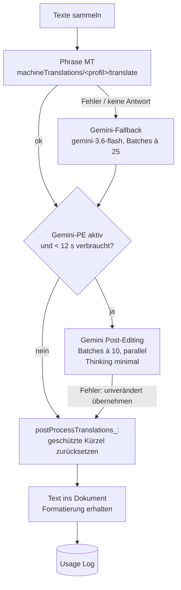

- **Post-Editing-Prompts** je Profil: `TECHNICAL`, `MARKETING`; `GENERAL` nutzt `TECHNICAL`. Inhalt entspricht den AutoFix-Prompts (fest in `Api.gs`, `GEMINI_PE_PROMPTS_`).
- **Fail-open:** Jeder Fehler im PE-Schritt gibt die ursprüngliche Übersetzung zurück.
- Lehnt der Proxy das Feld `thinkingConfig` ab, wird es automatisch weggelassen (Property `GEMINI_PE_THINKING_UNSUPPORTED`).
- **Geschützte Kürzel** (z. B. Kärcher-Gesellschaften `AK-DE`, `AK-US`, Bereiche `WOMA`, `FSG-PS` …) werden nach der Übersetzung wiederhergestellt.

### 4. Phrase-MT-Profile

| Profil | UID (Standard) | Phrase-Name |
|---|---|---|
| MARKETING | `Zpfa4GJsY5rl4J9q070rV5` | Add-on Marketing |
| TECHNICAL | `GrigHtkTDZUF4xYGWFmpI2` | Add-on Technical |
| GENERAL | `gC20LvuraAQGr2lXlrubL4` | Add-on General |

Überschreibbar per Script Property `MT_PROFILE_<KEY>` = `{ "uid": "…", "label": "…" }` (`ADMIN_setProfile("MARKETING", "<uid>", "Marketing")`).

### 5. Usage Log (Admin)

Sheet mit Tab `Usage Log`: Timestamp, User, App, Action, Profile, Source Lang, Target Lang, Segments, Words, Engine (Phrase/Gemini, +PE), Status (OK/ERROR), Error, Duration (s). Nicht in der Add-on-Oberfläche sichtbar. Plattform-Abbrüche („Exceeded maximum execution time“) erscheinen dort nicht.

### 6. Admin-Funktionen (nur im Apps-Script-Editor)

| Funktion | Zweck |
|---|---|
| `ADMIN_setApiToken()` / `ADMIN_clearApiToken()` / `ADMIN_debugTokenLocation()` | Phrase-Token |
| `ADMIN_setProfile`, `ADMIN_removeProfile`, `ADMIN_listStoredProfiles`, `ADMIN_seedDefaultProfiles`, `ADMIN_updateToOfficialAddonProfiles`, `ADMIN_listLanguageAiProfiles` | MT-Profile |
| `ADMIN_createUsageLogSheet`, `ADMIN_setUsageLogSheetId`, `ADMIN_getUsageLogSheetUrl`, `ADMIN_clearUsageLogSheetId`, `ADMIN_addUserColumnToLog` | Usage Log |
| `ADMIN_enableGeminiPostEdit`, `ADMIN_disableGeminiPostEdit`, `ADMIN_isGeminiPostEditEnabled` | PE an/aus (`GEMINI_PE_ENABLED`) |
| `ADMIN_testTranslation`, `ADMIN_testGeminiConnection`, `ADMIN_testGeminiTranslation`, `ADMIN_testGeminiPostEdit`, `ADMIN_testGeminiPostEditSpeed` | Tests |
| `ADMIN_resetWhatsNewForMe` | „What's New“-Popup erneut zeigen |

### 7. Script / User Properties

| Property | Ort | Zweck |
|---|---|---|
| `PHRASE_API_TOKEN` | Script | Phrase |
| `GEMINI_API_KEY` | Script | Gemini |
| `GEMINI_PE_ENABLED` | Script | `false` schaltet PE ab |
| `GEMINI_PE_THINKING_UNSUPPORTED` | Script | automatisch gesetzt |
| `MT_PROFILE_<KEY>` | Script | Profil-UIDs |
| `ADMIN_USAGE_LOG_SHEET_ID` | Script | Log-Sheet |
| `KAERCHER_PROFILE`, `PHRASE_SOURCE_LANG`, `PHRASE_TARGET_LANG` | User | Nutzerauswahl |
| `WHATS_NEW_SEEN_VERSION` | User | „What's New“ (aktuell Version 1.2) |

### 8. Dateien

| Datei | Inhalt |
|---|---|
| `Config.gs` | Konstanten, Profile, Sprachen, Grenzen, „What's New“ |
| `Config gemini ergaenzung.gs` | Gemini-Basis-URL, Fallback-Modell, Batchgröße |
| `Api.gs` | Phrase-Aufruf mit Retry, Gemini-Fallback, Gemini-PE, Nachbearbeitung |
| `Docs.gs`, `Sheets.gs`, `Slides.gs` | Übersetzen je App mit Formaterhalt |
| `UI.gs`, `Help.gs` | Karten (Start, Einstellungen, Hilfe, Fehler) |
| `Helpers.gs` | Einstellungen, Schreibrechte prüfen, Sicherungskopie, Usage Log |
| `Admin.gs` | Admin-Funktionen |
| `tests/` | Node-Tests |

Hilfe-Links in der Karte: Taskbox 4019 (Problem melden), 4030 (Übersetzungsproblem).

---

# Datei: 07-termcheck.md

## Kärcher TermCheck (Repo `term-author-checker`)

> Kurz: Google-Workspace-Add-on (Docs, Sheets, Slides, Drive) und Web-App mit zwei Werkzeugen: 🔍 **Terminologiesuche** in den Phrase-Termbanken (mit KI-gestützter Freitext- und Bildsuche) und ✍️ **Author Check** – Grammatik-, Terminologie- und Stilprüfung mit Gemini nach einstellbaren Regeln, auch für **PDFs in Google Drive**. Oberfläche in 15 Sprachen.

---

### 1. Steckbrief

| Eigenschaft | Wert |
|---|---|
| Typ | Workspace-Add-on „Kärcher TermCheck“ (Farbe `#FFED00`/`#3A3A3A`) + Web-App (`executeAs: USER_ACCESSING`, `access: DOMAIN`) |
| Einstiege | `onHomepage` (Docs/Sheets/Slides: Wahl Terminologiesuche oder Author Check), `onDriveHomepage`, `onDriveItemsSelected` (PDF), Web-App `doGet` → `TermSearch.html`; `?page=pdfcheck` → PDF-Prüffenster |
| Phrase | `PHRASE_API_TOKEN`, API v1 (Termbanken, Projektvorlagen) |
| Gemini | `GEMINI_API_URL` (Standard Proxy `https://34-111-99-134.nip.io/gemini/v1beta/models/`), `AI_MODEL` (`gemini-3.6-flash`), `AI_TEMPERATURE` (0.2), Retry bei 429/5xx |
| Datenbank | optional „Custom Rules Log“-Sheet (`CUSTOM_RULES_LOG_SHEET_ID`, Tab `Custom`); Nutzerregeln in User Properties + JSON-Datei in Drive |
| Erweiterte Dienste | Drive v3, Sheets v4 |
| Rollen | `ADMIN` (in `ADMIN_EMAILS`), sonst `GUEST`; leere Admin-Liste → niemand ist Admin |
| CI/CD | `ci.yml` (`node ci/check.js`, UI-Smoke), `deploy.yml` (`main` → `clasp push` + Version; Secrets `CLASPRC_JSON`, `SCRIPT_ID`, `DEPLOYMENT_ID`) |

### 2. Aufbau

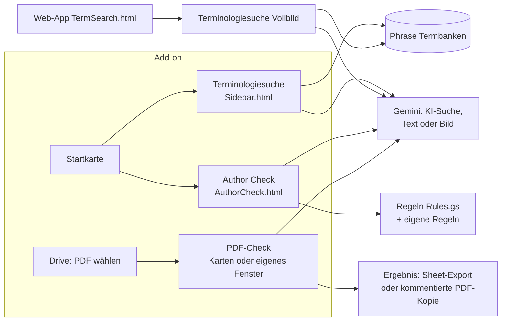

### 3. Terminologiesuche

- Durchsucht die erlaubten Termbanken (`ALLOWED_TB_UIDS`, leer = alle) in Phrase, zeigt Benennungen je Sprache mit Flaggen.
- **KI-Suche:** Freitext oder Bild → Gemini schlägt 1–3 Fachbegriffe vor (Prompt `AI_PROMPT`), dann Termbank-Suche.
- **Browse:** Termbank seitenweise durchblättern, sortieren, filtern; Export ins Sheet.
- Sprachen der Suche aus den Projektvorlagen `TEMPLATE_LLM` (`pNoERiZ1YTileyUe4Za1j6`, „[AKW] Terminology check [MT+Review LLM]“) und `TEMPLATE_ALG` (`arpmvYCEAqGl0OmKV9f3s3`, „[AKW] Terminology check [MT+Review ALG]“).
- Teilbare Links: Web-App-URL + `?q=<suchbegriff>`.

### 4. Author Check

- Prüft das ganze Dokument oder nur die Auswahl (Docs, Sheets, Slides), max. 60.000 Zeichen, bis 5 parallele KI-Anfragen.
- Prompt: `AUTHORCHECK_PROMPT` (Admin-pflegbar) mit Glossar aus der Termbank, aktiven Standardregeln und eigenen Regeln (`SPECIFIC CHECK`).
- Ergebnisse: Fehlerliste mit Vorschlag; **Ersetzen**, **Zur Stelle springen**, **als Kommentar einfügen**; Export als Audit-Report oder Regelübersicht.
- **Regeln:** Standardregeln für Deutsch und Englisch (`Rules.gs`, Typen Grammar, Spelling, Style, Terminology …), je Nutzer ein-/ausschaltbar mit Parametern. Nur Abweichungen werden gespeichert (User Properties, gestückelt). Eigene Regeln (`CUSTOM_…`) liegen in einer JSON-Datei im Drive des Nutzers; neue eigene Regeln werden ins Custom-Rules-Log geschrieben.
- **JSON-Import/-Export** von Regelsätzen; „Standard wiederherstellen“.
- **Zwei Gemini-Gems** (Buttons 🤖 im Regel-Popup):
  - „Regel mit Gemini vorbereiten“: `https://gemini.google.com/gem/1U9keOE3XPTPG3QEq63ZCYZ-5EOTruqgC`
  - „Kärcher Regel-Importer“ (Leitfaden-PDF → JSON): `https://gemini.google.com/gem/1bgoe1LSjDPZMId5lf98dBbVQp1KMH2CO` – Einrichtung und Anweisungen in `gemini-gem/` (`gem-anweisungen.md`, Wissen `standardregeln_de.md`, `standardregeln_en.md`, Beispiel `beispiel_RL2026_de.json`).

### 5. PDF-Prüfung in Drive

- PDF in Drive markieren → Seitenbereich → „PDF prüfen“ mit Sprachwahl (31 Sprachen).
- Ablauf in Etappen: PDF laden (≤ 15 MB direkt; bis 300 MB wird es vorher ohne große Bilder neu aufgebaut, `PdfShrink.gs`), Text mit Positionen extrahieren (`PdfTextPosition.gs`, `PdfInflate.gs`), Gemini prüfen, Ergebnis.
- Ausgabe: Ergebnis-Karte (max. 25 Befunde), **Export ins Sheet** oder **kommentierte PDF-Kopie** (Anmerkungen an den Fundstellen, `PdfAnnotate.gs`; große Dateien stückweise hochgeladen).
- **Eigenes Fenster:** Mit gesetzter Script Property `WEBAPP_URL` (…/exec einer Web-App-Bereitstellung, „Ausführen als Nutzer“, Zugriff Domain) öffnet „PDF prüfen“ das Fenster `PdfCheck.html`, das alle Etappen automatisch abarbeitet (6 min statt 30 s pro Aufruf). Prüfen mit `checkPdfWindowSetup()`.

### 6. Script Properties (Admin-Einstellungen)

| Property | Zweck |
|---|---|
| `PHRASE_API_TOKEN` | Phrase |
| `ADMIN_EMAILS` | Admins |
| `TEMPLATE_LLM`, `TEMPLATE_ALG` | Projektvorlagen für Sprachen |
| `ALLOWED_TB_UIDS` | erlaubte Termbanken |
| `CUSTOM_RULES_LOG_SHEET_ID` | Log neuer eigener Regeln |
| `GEMINI_API_KEY`, `GEMINI_API_URL`, `AI_MODEL`, `AI_TEMPERATURE` | KI |
| `AI_PROMPT` | Prompt der KI-Suche |
| `AUTHORCHECK_PROMPT` | Prompt des Author Check |
| `WEBAPP_URL` | PDF-Fenster |
| `EXPORT_FOLDER_ID` | Ziel für `exportProjectToTxt` (Quellcode-Export) |

User Properties: `UI_LANG` (15 Sprachen: en, de, fr, es, it, pt, zh, ja, no, sv, fi, tr, hu, hr, el), `AUTHORCHECK_RULES_HELP_SEEN`, `DRIVE_PDF_LAST_LANGUAGE`, Regel-Overrides.

### 7. Phrase-Workflows (Ordner `workflows/`)

Exporte von **Phrase-Orchestrator**-Workflows „Brand Review Assignment“ (v6 Schritt 2, v6 Schritt 3, v7 Schritt 2+3): lesen die Custom Fields eines Projekts und weisen je nach Review-Schlüssel eine Vorlage pro Workflow-Schritt zu. Die Zuordnung steht in `mapping-value.txt`, z. B. `reviewakw` → Schritt 2 → Vorlage `fEp3QVEveabMf91OcwP418`, `reviewkft` → `89QZMp1Zd4TrgOPVjLBCC2`, Campus-DSGVO-/Produkt-/Sales-Trainings je Schritt 2 und 3. Dazu eine Postman-Collection „Phrase TMS - Project Templates“.

### 8. Dateien

| Datei | Inhalt |
|---|---|
| `Code.gs` | Web-App, Kontext, Einstellungen, Termbanken, Suche, KI-Suche, Sheet-Export, Sidebar |
| `Authorcheck.gs`, `AuthorCheck.html` | Author Check |
| `Rules.gs` | Standardregeln DE/EN, Regel-API, Custom-Rules-Log |
| `DriveAddon.gs`, `DrivePdfPrep.gs`, `DrivePdfWeb.gs`, `PdfCheck.html` | PDF-Prüfung |
| `PdfAnnotate.gs`, `PdfInflate.gs`, `PdfShrink.gs`, `PdfTextPosition.gs` | PDF-Verarbeitung ohne externe Bibliotheken |
| `Homepage.gs`, `HomeChooser.html`, `Sidebar.html`, `TermSearch.html` | Oberflächen |
| `I18n.html`, `CardI18n.gs` | Texte in 15 Sprachen |
| `GeminiTest.gs` | `apiDebugGeminiConnection` |
| `exportProjectToTxt.gs` | Quellcode als Text exportieren |
| `ci/` | Syntax- und Aufrufprüfung, UI-Smoke |
| `gemini-gem/` | Gem „Kärcher Regel-Importer“ |
| `workflows/` | Phrase-Orchestrator-Workflows |

---

# Datei: 08-articulate-rise-patcher.md

## Articulate Rise Patcher (Repo `articulate-rise-patcher`)

> Kurz: Apps-Script-Code, der aus einem **Articulate-Rise-SCORM-Export** und der **übersetzten Rise-XLIFF aus Phrase** eine übersetzte, live klickbare Kursvorschau baut und auf **Firebase Hosting** veröffentlicht – ohne den Kurs neu in Rise zu importieren. Der Code wurde (leicht weiterentwickelt) ins Portal Kärcher Translation Services übernommen (Campus → Preview-Generator).

---

### 1. Steckbrief

| Eigenschaft | Wert |
|---|---|
| Typ | Apps-Script-Projekt ohne eigene Oberfläche (Funktionen im Editor, `api*` für das Portal) |
| Erweiterter Dienst | Drive v3 |
| Registry-Sheet | `1V6oyZVw7-CPy8Bs5_sGl9Cg886b2T6r7FLGgp1gfBRY`, Tab `Projects` (gleiches Sheet wie im Portal) |
| Firebase | Site `kaercher-course-preview`, Live-URL `https://kaercher-course-preview.web.app/<pfad>/scormcontent/index.html` |
| Auth Firebase | Service Account aus Script Property `SERVICE_ACCOUNT_JSON`, selbst signiertes JWT (RS256), Scopes `firebase.hosting`, `cloud-platform` |
| Phrase | über die Portal-Funktionen `phraseDownloadTargetFile_`, `getPhraseAuthHeader_` (im Portal vorhanden) |
| Testdaten | SCORM-Ordner `1n6OXBnrC2i--M7yLaUeJRE6RthjZ1hTg`, SCORM-ZIP `1_qD1Me64jNdxDKfU_jv8-MYxWawVhIf2` (in `Test.gs`) |

### 2. Funktionsweise

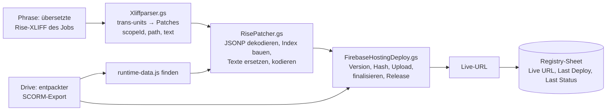

- Rise speichert alle Kurstexte in `scormcontent/runtime-data.js` als Base64-JSON in einem JSONP-Aufruf `__jsonp("runtime-data.js","…")`.
- Übersetzbare Felder: `title`, `description`, `paragraph`, `caption`, `heading`, `completeHint`, `name`. Unbekannte Felder landen in der Liste „unmatched“ – nichts geht kaputt.
- XLIFF-Inline-Tags (`<g ctype="x-html-P">` …) werden zurück in HTML (`<p>`, `<strong>`, `<br>`, `<ul>`, `<li>` …) übersetzt.
- Verifiziert am Kurs „Growth Mindset: unlock the power of openness (Deutsch)“: 127 von 127 Trans-Units gefunden.
- Firebase-Deploy nach REST-API: neue Version → SHA256 der gzip-Dateien melden → nur unbekannte Dateien hochladen → finalisieren → Release. Mehrere Kurse teilen sich eine Site über Pfad-Präfixe (z. B. `growth-mindset/de-DE`).
- Fortschritt im Script-Cache (`artprev_progress_<sessionId>`, 5 min), abrufbar über `apiGetPreviewProgress`.
- Grenzen: UrlFetch ≈ 50 MB pro Anfrage, 6 min Laufzeit; der Ordner-Weg (`patchAndDeployScormFolderToFirebase`) umgeht die Größenbeschränkung von `Utilities.unzip`.

### 3. Registry-Sheet `Projects`

ID · Course Name · Target Lang · Project UID · Job UID · Drive Folder ID · Firebase Site · Firebase Path · Live URL · Last Deploy · Last Status · Created By · (weitere Spalten per Kopfzeile)

### 4. Funktionen

| Funktion | Zweck |
|---|---|
| `apiListArticulateProjects`, `apiCreateArticulateProject`, `apiDeleteArticulateProject` | Registry pflegen |
| `apiGenerateArticulatePreviewById(id, sessionId)` | Vorschau für einen Registry-Eintrag |
| `apiGenerateArticulatePreview(params)` | Vorschau aus freien Parametern |
| `apiGetPreviewProgress(sessionId)` | Fortschritt |
| `patchAndDeployScormFolderToFirebase(folderId, patches, siteId, prefix)` | Kern: Ordner patchen und deployen |
| `patchAndDeployScormToFirebase(zipId, …)` | dasselbe aus einer ZIP |
| `generatePatchedScormZip(zipId, patches, options)` | gepatchte ZIP in Drive statt Deploy |
| `parseTranslatedXliffToPatches_` | XLIFF → Patches |
| `deployBlobsToFirebaseHosting(siteId, entries, prefix)` | Firebase-Deploy |
| `testPatchDemo`, `testFirebaseDeployDemo`, `testFirebaseDeployFromFolderDemo`, `testCreateArticulateProject`, `testListArticulateProjects`, `testGeneratePreviewById`, `testParseXliffFromPhrase` | Tests im Editor |

### 5. Dateien

`Articulatepreview.gs`, `Articulateregistry.gs`, `DriveFolderUtils.gs`, `FirebaseAuth.gs`, `FirebaseHostingDeploy.gs`, `Orchestration.gs`, `RisePatcher.gs`, `ScormPatcher.gs`, `Xliffparser.gs`, `Test.gs`, `Testregistry.gs`.

### 6. Verhältnis zum Portal

Identisch im Portal: `DriveFolderUtils.gs`, `FirebaseAuth.gs`, `Orchestration.gs`, `RisePatcher.gs`, `ScormPatcher.gs`. Weiterentwickelt im Portal: `Articulateregistry.gs`, `Articualtepreview.gs` (Schreibfehler im Dateinamen), `FirebaseHostingDeploy.gs`, `Xliffparser.gs`, Tests. Änderungen sollten im Portal gemacht werden; dieses Repo ist der Ursprung/Prototyp.

Hinweis: Im Portal prüfen die Kernfunktionen der Registry keine Rechte (nur die `…FromUi`-Varianten), siehe Auffälligkeit S3.

---

# Anhang Translation Services: docs/ARCHITEKTUR-UND-DATEN.md

## Architektur, Datenmodell und Betrieb

### Was die App ist

Ein internes Portal, über das Kärcher-Mitarbeitende Übersetzungsprojekte in **Phrase TMS**
(früher Memsource) anlegen, verfolgen, teilen und herunterladen – ohne selbst Phrase-Zugang zu
brauchen. Dazu kommen Spezialbereiche (Marketing, KeC, Dokumentation, WOMA, Competence Center,
Campus/Articulate), eine Startseite, ein Analytics-Dashboard, Google-Chat-Benachrichtigungen,
Kalender-Sync und eine Admin-Konsole.

```
Browser (Google Sites / Direkt-URL)
   │  HtmlService-Seite im Apps-Script-Sandbox-Iframe
   │  google.script.run.apiXyz(...)      ← kein REST, sondern RPC
   ▼
Google Apps Script (V8), Web-App "Execute as: USER_DEPLOYING", Zugriff: DOMAIN
   ├── Google Sheets  (Access-Sheet, Ops-Sheet, Doku-Sheets) = Datenbank
   ├── Script Properties / Cache / User Properties
   ├── Phrase TMS REST API  (api2/v1, v2, v3)     – Projekte, Jobs, Downloads
   ├── Phrase Strings API   (api.phrase.com/v2)   – UI-Texte übersetzen
   ├── Google Chat API      (Service Account)     – Benachrichtigungen, Slash-Commands
   ├── Google Drive         (DriveApp + 3-legged OAuth pro Nutzer)
   ├── Google Calendar API  (3-legged OAuth pro Nutzer)
   ├── Firebase Hosting API (Service Account)     – Articulate/Rise-Vorschauen
   └── Gemini (über Apigee-Proxy)                 – Chat-Bot mit Function Calling
```

#### Wichtige Eigenschaften der Laufzeit

- **Execute as: USER_DEPLOYING.** Jeder Server-Code läuft mit den Rechten des Kontos, das die
  Web-App bereitgestellt hat. `DriveApp`, `SpreadsheetApp`, `CalendarApp` greifen also auf die
  Ressourcen **dieses Kontos** zu, nicht auf die des Nutzers. Deshalb gibt es für „In mein Drive
  speichern“ und „Kalender-Sync“ eigene OAuth-Flows pro Nutzer (siehe `API.md`).
- **Identität:** `Session.getActiveUser().getEmail()` liefert die E-Mail des angemeldeten
  Nutzers (gleiche Workspace-Domain). Sie ist die einzige Grundlage aller Berechtigungen.
  In Chat-Events und Triggern ist sie **leer** – dort wird die E-Mail aus dem Event übergeben
  (`callerOverride`).
- **Kein Build-Schritt.** Alle `.gs`-Dateien teilen sich einen globalen Namensraum. Zwei
  Funktionen mit gleichem Namen überschreiben sich still (siehe `AUFFAELLIGKEITEN.md`).
- **Ausführungszeit:** max. 6 Minuten pro Aufruf. Upload hat eine eigene 5-Minuten-Grenze
  (`UPLOAD_DEADLINE_MS_`) und meldet danach `timedOut`.
- **Zeitzone:** `Europe/Berlin` (`appsscript.json`).

### Harte Grenzen (bei jeder Änderung beachten)

1. **Größe des Startdokuments ≈ 600 KB.** Apps Script schneidet größere HTML-Ausgaben mitten im
   `<script>` ab – danach startet die App nicht mehr. Deshalb werden Startseite, Einstellungen,
   Anleitung, Admin, Pivot-Admin, Translate UI, Dark Mode und das Campus-Skript **nachgeladen**.
   `include()` entfernt Einrückungen; `tests/ui.consistency.test.js` prüft die Größe. Neue große
   Bereiche immer nachladen, nie in `Index.html` einbetten.
2. **Nachgeladene Payloads ≈ 144 KB.** Auch einzelne `apiGet*Content()`-Antworten wurden bei
   dieser Größe abgeschnitten – große Bereiche weiter aufteilen.
3. **Jede Datei muss im Apps-Script-Projekt existieren.** Fehlt eine per `include()`
   eingebundene Datei, startet die Seite nicht. Admin → Tests prüft das.
4. **Nach CSS-Änderungen** `node tools/gen-dark-theme.js` ausführen (erzeugt `DarkTheme.html`).
5. **Jede Browser-aufrufbare Funktion ist öffentlich.** Jede globale Funktion ohne `_` am Ende
   kann jeder Domain-Nutzer per `google.script.run` aufrufen. Berechtigungen gehören in die
   Funktion selbst.
6. **Übersetzungen:** jeder sichtbare Text bekommt einen i18n-Schlüssel; Tests prüfen, dass jeder
   verwendete Schlüssel existiert.

### Dateien

#### Server (`.gs`)

| Bereich | Dateien |
|---|---|
| Einstieg, Konfiguration, Zugriff | `WebApp.gs` (doGet, include, viele APIs), `Code.gs` (Kontext, Whitelist, Wartung), `Config.gs` (Config, Rollen, Templates), `Apialiases.gs`, `KecWhitelistAliases.gs` |
| Rollen/Whitelists | `AdminAccess.gs` (Matrix), `AdminLight.gs`, `AdminMarketing.gs`, `AdminWoma.gs`, `AdminCc.gs`, `Articulateapi.gs` (Campus-Whitelist) |
| Projekte anlegen | `Upload.gs` (Upload, Notizen, Chat-Bot-Grundlagen), `ProjectsApi.gs` (Phrase-Client), `KeCProjects.gs`, `DocImport.gs`, `Xliffparser.gs` |
| Projekte verfolgen | `WebApp.gs` (Meine Projekte, Dashboard, Teilen, Abbrechen, Frist, Name, Fortschritt), `AutoSync.gs`, `Sync.gs`, `NotificationCenter.gs`, `Watchers.gs` |
| Download/Export | `DownloadZip.gs`, `DownloadTargetFile.gs`, `DriveSaveConfig.gs`, `DriveHelpers.gs`, `DriveFolderUtils.gs`, `DocExport.gs` |
| Dokumentation | `DocQueue.gs`, `DocBoard.gs`, `DocArchive.gs`, `DocDriveConfig.gs`, `DocDriveTree.gs` |
| Pivot-Workflow | `PivotProjects.gs`, `PivotAdmin.gs`, `PivotTemplateLinks.gs`, `PivotLanguageMap.gs` |
| Campus/Articulate | `Articulateapi.gs`, `Articulateregistry.gs`, `Articualtepreview.gs`, `ArticulateChat.gs`, `RisePatcher.gs`, `ScormPatcher.gs`, `CampusBatch.gs`, `FirebaseAuth.gs`, `FirebaseHostingDeploy.gs` |
| Google Chat | `Upload.gs` (Senden, doPost), `ChatToken.gs` (Nutzer-Mapping), `ChatCommands.gs` (Slash-Commands), `Chatbot.gs` (Gemini), `Messagetemplates.gs` |
| Persönlich | `UserPrefs.gs`, `Presets.gs`, `CalendarSync.gs`, `Announcements.gs`, `GermanHolidays.gs` |
| Übersetzung der UI | `I18nDicts.gs` (App: de/en/fr/es/pt/zh), `AdminI18n.gs`, `PhraseStrings.gs`, `PhraseStringsSync.gs` |
| Knowledge Base | `KnowledgebaseApi.gs` (`apiKbChunk`), `Knowledgebase.html`, `KbData*.html` (erzeugt), Quelle `kb-src/*.md`, Build `tools/build-kb.js` |
| Admin-Manager | `AdminManagers.gs` (Kennzahlen, Mehrfachbearbeitung, Details), `AdminManagersUi.html` (nachgeladen) |
| Betrieb | `Auditlog.gs` (inkl. gemeinsames Protokoll `apiGetUnifiedLog`), `Adminadvanced.gs` (Script Properties), `SelfTests.gs`, `Triggers.gs`, `SheetSetup.gs`, `HeaderRepair.gs`, `Debug.gs`, `Test.gs`, `Testregistry.gs`, `Kecdebugscan.gs` |

#### Oberfläche (`.html`)

Siehe `UI-UX.md` → „Aufbau der Oberflächen-Dateien“.

### Datenmodell (Google Sheets)

Es gibt keine Datenbank; Sheets sind die Datenhaltung. Spalten werden meist **über den
Kopfzeilen-Namen** gesucht (tolerant gegenüber Groß-/Kleinschreibung und Varianten), an einigen
Stellen aber **per festem Index** geschrieben – Spalten nie umsortieren.

#### Access-Sheet (`ACCESS_SHEET_ID`)

| Tabellenblatt | Zweck | Spalten (Auszug) |
|---|---|---|
| `Whitelist` | Zugang „General Projects“ | Email |
| `Whitelist_Marketing`, `Whitelist_KeC`, `Whitelist_Documentation`, `Whitelist_Woma`, `Whitelist_CC`, `Whitelist_Articulate` | Exklusive Spezialbereiche | Email |
| `Whitelist_AdminLight` | Teil-Admin-Rechte | Email \| Subtabs (`users,templates,pivot,tests,dashboard`) |
| `FetchTemplate-Prod` | Phrase-Projektvorlagen (per Sync aus Phrase) | Display Name, Template UID, Source, Targets, Active (yes/no), Client, Domain, Subdomain, Business Unit |
| `FetchTMS_USERS-Prod` | Nutzer-Zuordnung (per Sync aus Phrase) | Email, Client, Domain, Subdomain, Business Unit (mehrere Werte durch `,` `;` oder Zeilenumbruch) |
| `Maintenance` | Wartungsfenster (Alternative zu Script Properties) | ID, StartTime, EndTime, Message, Active |
| `Notifications` | Chat-Einstellung + Chat-User-ID | Email \| ON/OFF \| `users/…` |
| `UserPrefs` | Persönliche Einstellungen | Email \| Prefs JSON \| Updated At |
| `CalendarSync` | Kalender-Sync-Status | Email, Enabled, Calendar ID, Include Done, Lang, Last Sync, Last Result |
| `User_Presets` | Gespeicherte Formular-Vorlagen | (pro Nutzer: Template, Sprachen, Notiz) |
| `Announcements` | Banner/Chat-Ankündigungen | Zielgruppe, Zeitraum, Text, aktiv |
| `NotificationLog` | Einträge der Glocke | Zeit, Empfänger, Typ, Projekt … |
| `AuditLog` | Gemeinsames Protokoll: Admin-/Projektaktionen, Phrase-Owner, jede Chat-Nachricht (`CHAT_SENT`/`CHAT_FAILED`) | Zeit, Nutzer (bei Nachrichten: Empfänger), Aktion, Details |
| `Message_Templates` | Texte der Chat-Nachrichten (DE/EN) | Key, Text DE, Text EN |
| `Watchers` | Wer bei neuen Projekten einer Vorlage informiert wird | Konfiguration |
| `PivotTemplateLinks`, `PivotLanguageMap` | Pivot-Workflow | Parent/Child-Template, Sprache → Options-Wert |

#### Ops-Sheet (`OPS_SHEET_ID`) – Blatt `Queue`

Eine Zeile pro angelegtem Phrase-Projekt (bei mehreren Template-UIDs mehrere Zeilen).
**Zeilen nie löschen – Status auf `CANCELLED` setzen.**

| Spalte | Inhalt | Hinweis |
|---|---|---|
| A | Timestamp | |
| B | User Email (Eigentümer) | Grundlage der Eigentümer-Prüfung |
| C | Project UID (Phrase) | Schlüssel für fast alle Projekt-APIs |
| D | File ID (Source) | |
| E | File Name | |
| F | Mime Type | |
| G | Target Lang(s) | kommagetrennt |
| H | Status | Phrase-Status in Großbuchstaben (s. u.) |
| I | Job UIDs | JSON-Array oder kommagetrennt |
| J | Async ID | |
| K | Notification Email | |
| L | Project Name | |
| M | Due Date | |
| N | CC Email | |
| O | Analysis UID | |
| P | Total Words | |
| Q | Net Words | |
| R | Shared With | kommagetrennte E-Mails |
| S | Template Name | |
| T | Chat-Thread (Message-Name) | für Antworten im selben Chat-Thread |
| U | Chat-Threads der Geteilten (JSON `{email: thread}`) | wird beim Abschluss geleert |
| V | Downloaded At | letzter Download, für das Archiv |
| (Kopfzeile) | `JobMapping`, `Pivot Role`, `Pivot Link` | nur per Kopfzeilen-Name |

**Status-Werte:** `NEW`, `QUEUED_UPLOAD`, `UPLOADED`, `ASSIGNED`, `ACCEPTED`, `COMPLETED`,
`NOTIFIED`, `DELIVERED`, `CANCELLED`/`CANCELED`, `REJECTED`, Pivot: `WAITING_CHILD`.
Terminal: `COMPLETED`, `DELIVERED`, `CANCELLED`, `CANCELED`, `REJECTED`.
Als „erledigt“ gelten `COMPLETED`, `DELIVERED`, `NOTIFIED`.

#### Weitere Sheets

- Dokumentations-Queue, `Board`, `Archive` (eigene Sheet-IDs in `DocQueue.gs`, `DocBoard.gs`).
- Articulate-Registry `Projects` (`Articulateregistry.gs`).

### Script Properties (nur Namen – Werte nie in Prompts oder Doku)

| Property | Zweck |
|---|---|
| `ADMIN_EMAILS` | Kommagetrennte Admin-Liste |
| `ACCESS_SHEET_ID`, `OPS_SHEET_ID` | Sheet-IDs (Fallback-IDs stehen in `Config.gs`) |
| `PHRASE_API_TOKEN` (Aliase `PHRASE_TOKEN`, `GLOBAL_PHRASE_TOKEN`) | Phrase-TMS-API-Token |
| `PHRASE_API_BASE_URL` | Standard `https://cloud.memsource.com/web` |
| `PHRASE_STRINGS_TOKEN`, `PHRASE_STRINGS_PROJECT`, `PHRASE_STRINGS_REGION` | Phrase Strings (Translate UI) |
| `PHRASE_STRINGS_NIGHTLY`, `PHRASE_STRINGS_LAST_PULL` | nächtlicher Abgleich |
| `CHAT_CLIENT_EMAIL`, `CHAT_PRIVATE_KEY` | Service Account des Chat-Bots |
| `SERVICE_ACCOUNT_JSON` | Service Account für Firebase Hosting |
| `DRIVE_SAVE_OAUTH_CLIENT_ID`, `DRIVE_SAVE_OAUTH_CLIENT_SECRET` | OAuth-Client für Drive-Export und Kalender |
| `GEMINI_API_KEY` | Chat-Bot (Gemini) |
| `MAX_FILE_SIZE_MB` | Upload-Limit (Standard 100) |
| `PHRASE_SET_REAL_OWNER` | `false` = API-Funktionsuser bleibt Phrase-Owner (Standard: Einreicher wird Owner) |
| `MAINT_START`, `MAINT_END`, `MAINT_MSG` | Wartungsmodus |
| `KEC_CLIENT_ID`, `KEC_DOMAIN_ID`, `KEC_BUSINESS_UNIT_ID` | Welche Phrase-Projekte als KeC gelten |
| `AUTO_SYNC_ENABLED`, `AUTO_SYNC_LAST_RUN` … | Status-Autosync |
| `CAMPUS_BATCH_ENABLED`, `CAMPUS_BATCH_TEMPLATE_NAMES` | Campus-Batch-Nachbearbeitung |
| `TERMBASE_UID` | Termbase für `/termsearch` |
| dynamisch: `CHAT_USER_MAP__<email>`, `CHAT_NOTIFIED__<uid>`, `CHAT_PREF_ON__<email>`, `oauth2.*`, `Cal_*` | Laufzeitdaten |

Admin → Console → System zeigt Properties an; Werte mit `token`, `key`, `secret`, `password`,
`private` im Namen werden **nie** angezeigt, nur überschrieben (`Adminadvanced.gs`).

### Zeitgesteuerte Trigger

| Funktion | Takt | Zweck |
|---|---|---|
| `autoSyncProjectStatuses_` | alle 15 min | Status aus Phrase holen, Chat/Glocke benachrichtigen, Pivot-Kinder verfolgen |
| `calendarSyncAllTrigger` | stündlich | Fristen in die Kalender der Nutzer |
| `psNightlySync_` | täglich ~02:00 | UI-Texte aus Phrase Strings zurückholen |
| `cleanupChatDedupProperties_` | täglich ~03:00 | Aufräumen der Chat-Dedup-Properties |

Einrichtung: `Triggers.gs`, bzw. Schalter im Admin (Auto-Sync, Nightly) und beim ersten
Kalender-Sync. Trigger laufen als Deploy-Konto **ohne** angemeldeten Nutzer.

### Deploy und Tests

- **Lokal/CI:** `npm test` (Node ≥ 18, ohne Abhängigkeiten: Logik + UI-Konsistenz),
  `npm run test:ui` (Playwright/Chromium gegen gemocktes `google.script.run`, siehe
  `tools/build-preview.js`). Vorschau: `npm run preview` → `preview.html`.
- **CD:** `.github/workflows/ci.yml` – nach grünem CI auf `main` `clasp push` (Dateiauswahl
  `.claspignore`: nur `*.gs`, `*.html`, `appsscript.json`) und optional `clasp deploy`.
  Secrets: `CLASPRC_JSON`, `APPS_SCRIPT_ID`, optional `APPS_SCRIPT_DEPLOYMENT_ID`.
- **In der App:** Admin → Tests (`SelfTests.gs`), nur lesend.
- **Health:** Admin-Reiter „Health“ (`apiHealthCheck`).

### Externe Links im Portal

- Portal-URL für Chat-Nachrichten: `PORTAL_URL_` in `Upload.gs` (Google Site).
- Phrase-Projekt: `https://cloud.memsource.com/web/project/show/<projectUid>`
- Phrase-Job: `https://cloud.memsource.com/web/job/<jobUid>/translate`
- Knowledge Base: Web-App-URL + `?page=kb` (auch `knowledgebase`, `knowledge-base`, `wissen`).
- Support-Formulare: Taskbox (Jira Service Desk) – Links im Reiter „Help & Support“.

---

# Anhang Translation Services: docs/API.md

## API, Authentifizierung und Integrationen

Dieses Dokument beschreibt **alle Server-Endpunkte** des Portals, wie sie aufgerufen werden,
wer sie aufrufen darf und mit welchen externen Diensten sie sprechen.

> Es gibt **keine REST-API** für den Browser. Die Oberfläche ruft Server-Funktionen per
> `google.script.run` auf (RPC über Apps Script). Die einzigen HTTP-Einstiege sind `doGet`
> (Seite ausliefern) und `doPost` (Google-Chat-Events), siehe unten.

---

### 1. Aufrufmodell

```js
google.script.run
  .withSuccessHandler(res => { /* Rückgabewert der Server-Funktion */ })
  .withFailureHandler(err => { /* bei throw auf dem Server: err.message */ })
  .apiShareProject(projectUid, "kollegin@karcher.com");
```

- Jede **globale Funktion ohne abschließendes `_`** ist vom Browser aufrufbar. Konvention:
  Endpunkte heißen `api…`, interne Helfer enden auf `_`.
- Parameter und Rückgaben müssen serialisierbar sein (Strings, Zahlen, Booleans, Arrays,
  einfache Objekte). `Date` wird als Wert übertragen, aber das Portal nutzt fast überall
  ISO-Strings. Funktionen, Blobs, `undefined` in Arrays gehen nicht.
- Dateien werden als **Base64** übertragen (Upload: `{source:"pc", base64, fileName, mimeType}`,
  Download: `{fileName, mimeType, base64}`) oder als Drive-ID.
- Laufzeitgrenze 6 min. Lange Vorgänge melden Fortschritt über den Script-Cache, den der
  Browser parallel abfragt (z. B. `apiGetPreviewProgress(sessionId)`).

#### Antwortkonventionen (uneinheitlich – beim Aufrufen beachten)

| Muster | Beispiel | Fehlerfall |
|---|---|---|
| `{ success: true, … }` | die meisten neueren Endpunkte | `{ success: false, error: "…" }` |
| `{ ok: true, … }` | Drive-Browser, Articulate-Registry, `apiDownloadTargetFile` | `{ ok: false, error: "…" }` |
| Rohdaten | `apiGetWhitelist()` → `{ emails: [] }`, `apiGetConfig()` | – |
| `throw new Error("Not authorized…")` | viele Admin-Endpunkte | landet im `withFailureHandler` |
| `{ authorized: false }` | `apiHealthCheck`, `apiRunSelfTests` | – |

`apiCreateProjectAndUpload` mischt beides: Vorabfehler `{ ok:false, error }`, danach
`{ success:true|false, … }`. Clients sollten `res.success || res.ok` prüfen.
Neue Endpunkte: bitte `{ success, error }` verwenden.

---

### 2. Authentifizierung der Nutzer

#### Identität

- Die Web-App ist mit `access: DOMAIN` bereitgestellt: nur angemeldete Konten der
  Kärcher-Workspace-Domain erreichen sie (Google-SSO, kein eigenes Login).
- Server-seitig: `getUserEmail_()` = `Session.getActiveUser().getEmail()` in Kleinbuchstaben.
  Das ist die **einzige** Identität; es gibt keine Sessions, Cookies oder Tokens der App.
- In **Chat-Events und Triggern** ist diese E-Mail leer. Chat-Befehle geben die E-Mail aus dem
  Event als `callerOverride` weiter (`apiUpdateDueDate`, `apiCancelProject`,
  `apiUpdateProjectName`, `apiAddJobNote`).

#### Rollen

| Rolle | Quelle | Wirkung |
|---|---|---|
| **Admin** | Script Property `ADMIN_EMAILS` | alles; sieht alle Projekte; darf Nutzer simulieren |
| **Admin-Light** | Sheet `Whitelist_AdminLight`, Spalte Subtabs | nur die freigegebenen Bereiche: `users`, `templates`, `pivot`, `tests`, `dashboard` (Dashboard über alle Projekte) |
| **General** | Sheet `Whitelist` | Reiter „General Projects“ |
| **Exklusive Bereiche** | `Whitelist_Marketing`, `_KeC`, `_Documentation`, `_Woma`, `_CC`, `_Articulate` | nur der jeweilige Spezialreiter (`isExclusive`), kein „General Projects“ |
| **Kein Eintrag** | – | kann die Seite öffnen, sieht aber keine Projektbereiche; Upload wird abgelehnt |

`apiCheckAccess()` entscheidet über den Zugang zu Aktionen:
Admin → erlaubt; **Wartung aktiv** → gesperrt (`reason: "maintenance"`); dann der Reihe nach
General, Marketing, KeC, Doc, WOMA, CC, Articulate → erlaubt (`reason: "<x>_whitelisted"`);
sonst `not_whitelisted`.

#### Sichtbarkeit von Vorlagen (Templates)

`templateMatchesUser_` (Config.gs), **fail-closed**: Eine Vorlage ist nur sichtbar, wenn
**Client, Domain, Subdomain und Business Unit** der Vorlage jeweils in den Werten des Nutzers
(`FetchTMS_USERS-Prod`) vorkommen. Ein leeres Feld – an der Vorlage oder beim Nutzer – bedeutet
„nicht sichtbar“. Admins sehen alle. Der Admin-Debugger (`apiDebugUserTemplates`) erklärt pro
Vorlage den Grund und schlägt die Zuordnung vor, die die meisten Vorlagen freischalten würde.

#### Sichtbarkeit von Projekten

`apiGetMyProjects`: Admin sieht alle Zeilen der Queue; sonst eigene (Spalte B), mit dem Nutzer
geteilte (Spalte R) und – für WOMA-Nutzer – alle Projekte anderer WOMA-Nutzer.
Ändern (Frist, Name, Notiz, Abbrechen, Teilen) darf: Admin oder Eigentümer; Notizen und Frist
auch Geteilte (`noteCallerMayEdit_`).

#### Simulation (Impersonation)

`apiGetConfig(impersonateEmail, uiLang)`: Nur Admins; liefert die Config (Vorlagen, Reiter,
Rollen) **so, wie der andere Nutzer sie sähe**. Andere Endpunkte werden dadurch **nicht**
umgestellt – sie laufen weiter als der Admin. Einstellungen (`apiGetUserPrefs`) sind nie
simuliert.

#### Berechtigungsmuster für neue Endpunkte

```js
function apiDoSomethingAdmin(arg) {
  const caller = getUserEmail_();
  if (!isAdmin_(caller)) return { success: false, error: "Not authorized. Admin only." };
  // ...
}

function apiDoSomethingForLight(arg) {
  const caller = getUserEmail_();
  if (!isAdmin_(caller) && !isAdminLightWithAccess_(caller, "templates")) {
    return { success: false, error: "Not authorized." };
  }
}

function apiDoSomethingWithProject(projectUid) {
  const access = apiCheckAccess();              // Whitelist + Wartung
  if (!access.allowed) return { success: false, error: "Not authorized." };
  const row = noteFindQueueRow_(projectUid);    // Eigentümer/Geteilt prüfen
  if (!row || !noteCallerMayEdit_(row, getUserEmail_())) return { success: false, error: "Not authorized." };
}
```

Wichtige Aktionen zusätzlich mit `logAuditEvent_(caller, "AKTION", "Details")` protokollieren.

---

### 3. Endpunkt-Katalog

**Legende „Recht“:**
`offen` = jeder Domain-Nutzer · `angemeldet` = prüft nur, dass eine E-Mail vorhanden ist ·
`Zugang` = `apiCheckAccess()` (Whitelist, nicht in Wartung) · `Eigentümer` = Admin, Eigentümer
(ggf. Geteilte) des Projekts · `Admin` · `Light:x` = Admin oder Admin-Light mit Bereich x ·
`Campus` = Admin oder Articulate-Whitelist · `Pivot` = `canManagePivot_` (Admin/Light:pivot).
Einträge mit ⚠️ sind in `AUFFAELLIGKEITEN.md` erklärt.

#### 3.1 Start, Konfiguration, nachgeladene Oberfläche

| Funktion | Recht | Zweck / Rückgabe |
|---|---|---|
| `apiGetConfig(impersonateEmail?, uiLang?)` | offen (Simulation: Admin) | Start-Config: `templates` (gefiltert), `languages`, `sizeLimitMb`, `kbUrl`, `currentUser`, `effectiveUser`, `isImpersonating`, `isAdmin`, `effectiveIsAdmin`, `isMarketing`, `isKeC`, `isDoc`, `isArticulate`, `isWoma`, `isCc`, `isGeneral`, `isExclusive`, `maintenance`, `adminLightSubtabs`, `userPrefs`, `announcements`, `i18nLang`, `i18nDict`, `i18nEn` |
| `apiGetContext()` | offen | `{ email, isAdmin, maintenance }` |
| `apiCheckAccess()` | offen | `{ allowed, reason, maintenance? }` |
| `apiGetMaintenance()` / `apiGetMaintenanceConfig` (intern) | offen | Wartungsstatus |
| `apiGetI18nDict(lang)` | offen | App-Wörterbuch einer Sprache |
| `apiGetAdminI18n(lang)` | Admin oder irgendein Light-Recht | Admin-Wörterbuch |
| `apiGetHomeUi()` | offen | `{ css, js }` der Startseite (`HomeUi.html`) |
| `apiGetPrefsUi()` | offen | Markup des Einstellungsdialogs |
| `apiGetDarkThemeCss()` | offen | CSS des dunklen Modus |
| `apiGetGuideContent()` | offen | HTML von Anleitung/FAQ |
| `apiGetLazyScript(name)` | offen, Allowlist `["JsCampus"]` | Skripttext zum Nachladen |
| `apiGetAdminContent()` | offen ⚠️ | `{ html, js }` der Admin-Konsole |
| `apiGetPivotAdminContent()` | offen ⚠️ | `{ html, js }` Pivot-Admin |
| `apiGetTranslateUiContent()` | Admin | `{ html, js }` Translate UI |
| `apiGetGermanHolidays(years)` | offen | Feiertage (für Fristprüfung im Browser) |
| `apiKbChunk(n)` | offen, nur `1..KB_CHUNK_COUNT_` | Knowledge-Base-Paket als JSON-Text `{ artikelId: html }` |

#### 3.2 Projekt anlegen

| Funktion | Recht | Zweck |
|---|---|---|
| `apiCreateProjectAndUpload(payload)` | Zugang | Legt Phrase-Projekt(e) aus Vorlage an, lädt Dateien als Jobs und Referenzen hoch, schreibt Queue-Zeile(n), schickt Chat-Nachricht, informiert Watcher |
| `apiHandleUpload(payload)` | Zugang | Kompatibilitäts-Wrapper: normalisiert alte Feldnamen, ruft obige Funktion |
| `apiUploadToExistingProject(payload)` | Zugang | KeC: Dateien an bestehendes Phrase-Projekt |
| `apiGetEligibleKeCProjects()` | angemeldet | KeC-Projekte (Status NEW, passende Client/Domain/BU-IDs) |
| `apiDebugSingleKeCProject(projectUid)` | angemeldet | Diagnose, warum ein Projekt (nicht) als KeC gilt |
| `apiGetKecEligibilitySettings()` / `apiSaveKecEligibilitySettings(clientId, domainId, businessUnitId)` | Admin | KeC-Kriterien |
| `apiGetPivotChildLanguageOptions(parentTemplateUid)` | angemeldet | Zielsprachen für Pivot-Übersetzungsschritt |
| `apiSavePreset(presetData)` / `apiLoadPresets()` / `apiDeletePreset(presetId)` | angemeldet (eigene) | Formular-Vorlagen |
| `apiSavePresetSheet`, `apiGetUserPresets` | – | Aliase (Apialiases.gs) |
| `apiGetTemplates()` | offen ⚠️ | alle Vorlagen aus dem Sheet (ungefiltert) |
| `apiBrowseDrive(folderId)` | Zugang ⚠️ | Drive-Ordner blättern (`home`, `root`, `::shared-drives-root::`, Ordner-ID) |

**Payload `apiCreateProjectAndUpload`:**

```jsonc
{
  "portalType": "request|marketing|woma|cc|kec|articulate",  // woma/cc setzen den echten Eigentümer
  "templateUid": "…",            // oder targetUidMap
  "templateName": "…",
  "targetUidMap": { "de_de": "<templateUid>", "fr_fr": "<templateUid>" }, // Sprache → Vorlage; je Vorlage ein Projekt
  "projectName": "…",            // Pflicht
  "sourceLang": "en",            // Pflicht
  "targetLangs": ["de_de", "fr_fr"], // Pflicht (oder targetLang)
  "dueDate": "2026-10-15T00:00:00.000Z",
  "note": "…",
  "campusReviewType": "…",       // Pflicht bei portalType "articulate"
  "pivotTargetLangs": ["…"],     // nur Pivot-Vorlagen: Sprachen des Folgeprojekts
  "mainFiles": [                 // Pflicht, .pdf und .doc sind gesperrt
    { "source": "pc", "fileName": "a.docx", "mimeType": "…", "base64": "…" },
    { "source": "drive", "fileId": "…" },
    { "source": "drivelink", "fileId": "…" }
  ],
  "refFiles": [ /* wie mainFiles */ ],
  "refDriveIds": ["…"]
}
```

Antwort: `{ success, timedOut, projectUid, allProjectUids, jobUids, jobMapping, mainResults,
refResults, createdProjects, errors }`.
Ablauf pro Vorlagen-Gruppe: `POST v2/projects/applyTemplate/{templateUid}` → je Hauptdatei
`POST v1/projects/{uid}/jobs` → je Referenz `POST v2/projects/{uid}/references` → Custom Field
„Project Creator“ setzen → Einreicher als Owner (`PATCH v1/projects/{uid}` `{owner:{id}}`, abschaltbar
über `PHRASE_SET_REAL_OWNER=false`) → Queue-Zeile → Chat (jede Nachricht landet im Protokoll).

#### 3.3 Meine Projekte, Details, Aktionen

| Funktion | Recht | Zweck |
|---|---|---|
| `apiGetMyProjects()` | angemeldet (gefiltert) | `{ projects: [...], email }` – Felder s. u. |
| `apiListMyProjects()` | angemeldet (gefiltert) | ältere Variante |
| `apiGetProjectsProgress(uids)` | nur eigene UIDs, max. 20 | `{ uid: { done, total } }`, 10 min Cache |
| `apiGetDashboardData()` | angemeldet; alle Projekte nur Admin/Light:dashboard | `{ scope: "all"|"own", generatedAt, rows }` – Filter/Diagramme rechnet der Browser |
| `apiGetTeamProjects()` | angemeldet | Projekte der Team-Mitglieder (nur lesen) |
| `apiSyncProjectStatuses()` | angemeldet (nur eigene; Admin alle) | Status aus Phrase holen, benachrichtigen |
| `apiShareProject(projectUid, email)` | Eigentümer | teilen + Chat + Glocke + Kalender |
| `apiCancelProject(projectUid, callerOverride?)` | Eigentümer | Status `CANCELLED` + Benachrichtigungen |
| `apiUpdateDueDate(projectUid, newDateIso, callerOverride?)` | Eigentümer/Geteilt | Frist in Phrase + Queue + Benachrichtigung |
| `apiUpdateProjectName(projectUid, newName, callerOverride?)` | Eigentümer/Geteilt | Name in Phrase + Queue |
| `apiGetProjectNote(projectUid)` | Eigentümer/Geteilt/Team | `{ note, canEdit }` |
| `apiUpdateProjectNote(projectUid, newNote)` | Eigentümer/Geteilt | Projektnotiz in Phrase (Pivot-Marker bleibt) |
| `apiAddJobNote(projectUid, jobUid, text, callerOverride?)` | Eigentümer/Geteilt | Text an Projektnotiz anhängen |
| `apiGetJobNotes(projectUid, jobUid?)` | ⚠️ keine Prüfung | Phrase-„Conversations“ aller Jobs |
| `apiGetPhraseProjectMetaByName(name)` | – | Phrase-Metadaten per Namen |

Projekt-Objekt (`apiGetMyProjects`): `timestamp`, `uploadDate`, `userEmail`, `owner`,
`isShared`, `phraseUrl`, `projectUid`, `jobUid`, `jobUids[]`, `targetLangs[]`, `projectName`,
`templateName`, `fileName`, `mimeType`, `sourceLang`, `targetLang`, `status`, `dueDate`,
`sharedWith`, `jobMapping[]` (`{jobUid, fileName, targetLang}`), `pivotRole`, `pivotLink`,
`downloadedAt`, `totalWords`, `netWords`, `groupShared`.

#### 3.4 Download und Export

| Funktion | Recht | Zweck |
|---|---|---|
| `apiSmartDownload(projectUid, jobUids, projectName, targetLangs, fileName, targetLang, mimeType, jobMapping)` | ⚠️ selbst keine Prüfung (die aufgerufenen prüfen Zugang) | Ermittelt höchsten Workflow-Schritt; 1 Datei → Einzel-Download, sonst ZIP |
| `apiUserDownloadFromPhrase(projectUid, jobUid, fileName, targetLang, mimeType)` | Zugang ⚠️ | Einzeldatei als Base64 |
| `apiDownloadAllJobsAsZip(…)` / Alias `apiDownloadMultipleTargets(…)` | Zugang ⚠️ | ZIP als Base64 |
| `apiDownloadTargetFile(projectUid, jobUid)` | Zugang ⚠️ | doppelt definiert (s. Auffälligkeiten) |
| `apiGetFilesForDriveExport(…)` | Zugang ⚠️ | Dateien für Drive-Export |
| `apiGetDriveSaveConfig()` | offen | `{ clientId, configured }` |
| `apiSaveDriveSaveClientId(clientId, clientSecret)` | Admin | OAuth-Client setzen (setzt alle Nutzer-Tokens zurück) |
| `apiCheckDriveAuthStatus()` | angemeldet | `{ authorized }` für „Save to Drive“ |
| `apiGetDriveAuthUrl()` | angemeldet | URL für die Google-Freigabe |
| `apiSaveProjectToDrive(projectUid, jobUids, projectName, targetLangs, jobMapping, convertToGoogle, options)` | Nutzer-OAuth + Zugang | Upload in „Meine Ablage“ des Nutzers; `options.folderName`, `options.subFolderName`; ohne Token `{ needsAuth: true }` |

„Zugang ⚠️“: Diese Endpunkte prüfen nur die Whitelist, **nicht**, ob das Projekt dem Aufrufer
gehört.

#### 3.5 Dokumentation

| Funktion | Recht | Zweck |
|---|---|---|
| `apiGetDocImportTemplateLangs(templateUid)` | Zugang | Sprachen einer Doku-Vorlage |
| `apiGetDocImportFolderHistory(folderId)` | Zugang | Wurde der Ordner schon importiert? |
| `apiUploadDocXmlBatch(payload)` | Zugang | `{ templateUid, templateName, sourceLang, projectName, iaNumber, dueDate, note, files:[{targetLang, fileId, fileName}] }` |
| `apiGetDocQueueProjects()` / `apiGetDocProjectsForHistory()` | Zugang | Doku-Projekte (Format wie Meine Projekte) |
| `apiArchiveDocQueueProject(projectUid, projectName)` | Zugang ⚠️ | Zeilen ins Archiv verschieben |
| `apiGetDocBoardData()` | Zugang | Board |
| `apiGetDocDriveTree(projectName)` / `apiGetDocDriveTreeById(folderId)` / `apiSearchDocDriveFolders(query)` | Zugang | Ordner unter dem Doku-Root |
| `apiGetDocDriveRootSettings()` / `apiSaveDocDriveRootSettings(idOrUrl)` | Admin | Doku-Root |
| `apiGetDocExportStatus(projectName)` | Zugang | Live-Status |
| `apiExportDocProjectToDrive(uid, name, jobs)` / `apiExportSingleJobToDrive(uid, name, job)` | Zugang | Fertige Übersetzungen in den Drive-Ordner |
| `apiGetDocExportEligibilitySettings()` | Zugang | Kriterien |
| `apiSaveDocExportEligibilitySettings(clientId, domainId, subDomainId, businessUnitId)` | ⚠️ immer abgelehnt (Bug) | Kriterien speichern |
| `apiGetDocExportEligibleProjects()` | Zugang | passende Phrase-Projekte inkl. Jobs |

#### 3.6 Campus / Articulate (Rise-Kurse)

| Funktion | Recht | Zweck |
|---|---|---|
| `apiListArticulateProjectsForUi()` | angemeldet (Nicht-Admins: eigene) | Kursliste |
| `apiCreateArticulateProjectFromUi(payload)` / `apiBatchCreateArticulateProjectsFromUi(payloads)` | Campus | Kurs registrieren (mit Validierung) |
| `apiDeleteArticulateProjectFromUi(id)` | Campus | Kurs entfernen |
| `apiRunArticulatePreview(id, sessionId)` | Campus | Vorschau erzeugen (Phrase-XLIFF → Rise patchen → Firebase Hosting) |
| `apiGetPreviewProgress(sessionId)` | offen | `{ percent, message }` zum Pollen |
| `apiArtPickerListProjects()` / `apiArtPickerListJobs(projectUid)` | Campus | Auswahl-Listen |
| `apiValidateArticulateInputs(payload)` | offen | nur prüfen |
| `apiListArticulateProjects()`, `apiCreateArticulateProject(p)`, `apiDeleteArticulateProject(id)`, `apiGenerateArticulatePreview(params)`, `apiGenerateArticulatePreviewById(id, sessionId, jobUid?)` | ⚠️ offen | Registry-/Preview-Kern ohne Prüfung |
| `apiFindCourseMetadataIds()` | ⚠️ offen | Hilfsfunktion (Phrase-IDs für Campus) |
| `apiGetArticulateWhitelist()` / `apiAdd…` / `apiRemove…` | lesen offen / ändern Admin | Whitelist |

#### 3.7 Persönliches

| Funktion | Recht | Zweck |
|---|---|---|
| `apiGetUserPrefs()` / `apiSaveUserPrefs(patch)` | eigene | Einstellungen (Schlüssel s. `UI-UX.md`) |
| `apiGetTeamSettings()` | eigene | Team-Einstellung + Vorschau |
| `apiGetNotifications()` / `apiMarkNotificationsRead()` | eigene | Glocke |
| `apiGetChatPreference()` / `apiSetChatPreference(enabled)` | eigene | Chat-Benachrichtigungen an/aus |
| `apiGetCalendarSyncStatus()` | eigene | `{ configured, authorized, enabled, includeDone, calendarId, lastSync, lastResult }` |
| `apiGetCalendarAuthUrl(lang)` | eigene | Freigabe-URL |
| `apiSetCalendarSyncOptions({ enabled, includeDone, lang })` | eigene | ein-/ausschalten, synchronisiert sofort |
| `apiCalendarSyncNow()` | eigene | jetzt abgleichen |
| `apiDisconnectCalendar(deleteCalendar)` | eigene | Token widerrufen, optional App-Kalender löschen |

#### 3.8 Admin

| Bereich | Funktionen | Recht |
|---|---|---|
| Zugriffe | `apiGetAccessMatrix()`, `apiSetAccessBulk(emails, areaIds, grant)` | Admin |
| Whitelists | `apiGet/Add/RemoveWhitelist`, `…MarketingWhitelist`, `…KeCWhitelist` (+ Alias `…Kec…`), `…DocWhitelist`, `…WomaWhitelist`, `…CcWhitelist`, `…ArticulateWhitelist` | lesen offen ⚠️ / ändern Admin |
| Admins | `apiGetAdmins()`, `apiAddAdmin(email)`, `apiRemoveAdmin(email)` | Admin |
| Admin-Light | `apiGetAdminLightUsers()`, `apiAddAdminLightUser(email, subtabs)`, `apiRemoveAdminLightUser(email)` | Admin |
| Wartung | `apiSaveMaintenanceConfig(startIso, endIso, msg)`, `apiClearMaintenanceConfig()`, `apiSetMaintenance(…)` ⚠️, `apiClearMaintenance()` | Admin |
| System | `apiSaveAdminSettings(sizeLimitMb)` / `apiSetFileSizeLimit(mb)`, `apiGetAdminDashboardData()`, `apiGetAdminDashboardDataExtended()`, `apiGetRecentLogs()`, `apiGetDashboardStats()` | Admin |
| Script Properties | `apiGetAllScriptProperties()`, `apiSetScriptProperty(k, v)` / `apiUpdateScriptProperty`, `apiAddScriptProperty(k, v)`, `apiDeleteScriptProperty(k)`, `apiRevealScriptProperty(k)` (nie für sensible Keys) | Admin |
| Sync | `apiTriggerManualSync(type, mode)` mit `type` = `templates`/`users`/`notifications`/`chatmappings`, `mode` = `full`/`add_only`; `apiSyncNotifications()`, `apiResolveChatMappings()`, `apiToggleAutoSync(enable)`, `apiGetAutoSyncStatus()` (offen) | Admin |
| User Manager | `apiGetUsersForManager()`, `apiUpdateUserField(username, field, value, syncToPhrase)` | Light:users |
| User Manager (erweitert) | `apiGetUserManagerInsights()`, `apiGetUserDetail(email)`, `apiBulkUpdateUserField(usernames, field, value, "replace"\|"add"\|"remove")` (nur Sheet-Felder), `apiCopyUserSegmentation(fromUsername, toUsernames)` | Light:users (Bereiche ändern: `apiSetAccessBulk`, Admin) |
| Template Manager | `apiGetTemplatesForManager()`, `apiSetTemplateActive(templateUid, active)`, `apiBatchSetTemplateActive(uids, active)`, `apiGetTemplateManagerInsights()`, `apiGetTemplateDetail(uid)`, `apiSetTemplateDisplayName(uid, name)` | Light:templates |
| Debugger | `apiDebugListUsers()`, `apiDebugUserTemplates(email)`, `apiDebugPivotFindChild(name)` | Admin |
| Pivot | `apiGetPivotTemplateLinks()`, `apiAdd/RemovePivotTemplateLink(parent, child)`, `apiGetPivotLanguageMap()`, `apiGetPivotFieldOptionValues()`, `apiSet/RemovePivotLanguageMapping(…)` | Light:pivot |
| Pivot (Batch) | `apiPivotListTemplates(force)`, `apiAdd/RemovePivotTemplateLinksBatch(pairs)`, `apiRefreshPivotLinkDetails()`, `apiSetPivotLanguageMappingsBatch(entries)` | Pivot |
| Kommunikation | `apiAdminListAnnouncements()`, `apiAdminSaveAnnouncement(a)`, `apiAdminSetAnnouncementActive(id, active)`, `apiAdminDeleteAnnouncement(id)`, `apiAdminSendAnnouncementChat(id)`, `apiGetMessageTemplates()`, `apiSaveMessageTemplate(key, de, en)`, `apiResetMessageTemplate(key)`, `apiTestChatBot(email)`, `apiGetWatcherConfig()`, `apiSaveWatcherConfig(arr)` | Admin |
| Protokoll | `apiGetUnifiedLog({limit})` (AuditLog inkl. Chat-Nachrichten + letzte Queue-Zeilen, mit `category` und `level`), `apiGetAuditLog(limit)`, `apiPurgeOldAuditEntries(days)` | Admin |
| Diagnose | `apiHealthCheck()` / `apiRunHealthCheck()`, `apiRunSelfTests()` (Light:tests) | Admin |
| Translate UI | `apiPsGetConfig()`, `apiPsSaveConfig(project, region, token)`, `apiPsCheck()`, `apiPsPush({dicts, langs, overwrite})`, `apiPsPull({dicts, langs})`, `apiPsCoverage()`, `apiPsClearOverrides()`, `apiPsSetNightly(enabled)` | Admin |

---

### 4. HTTP-Einstiege

| Einstieg | Aufrufer | Verhalten |
|---|---|---|
| `GET <webapp-url>` | Browser (direkt oder eingebettet in Google Sites) | `Index.html` als Template, `XFrameOptionsMode.ALLOWALL` |
| `GET <webapp-url>?page=kb` (`knowledgebase`, `knowledge-base`, `wissen`) | Browser / Google Sites | eigenständige Knowledge-Base-Seite |
| `GET <webapp-url>?tab=history` | Links aus Chat | öffnet direkt „Meine Projekte“ |
| `POST <webapp-url>` (`doPost`) | Google Chat | Event-JSON; `type` = `ADDED_TO_SPACE` → Begrüßung, `MESSAGE` → Hinweistext, `APP_COMMAND` → Slash-Command. Antwort JSON. ⚠️ keine Prüfung, dass die Anfrage von Google Chat stammt |
| `https://script.google.com/macros/d/{SCRIPT_ID}/usercallback` | Google OAuth | Callback für Drive-Export (`driveSaveOAuthCallback_`) und Kalender (`calendarOAuthCallback_`) |

Zusätzlich registriert (Chat-API-Konfiguration, Verbindung „Apps Script“):
`onAddedToSpace`, `onMessage`, `onRemovedFromSpace`, `onAppCommand`.

#### Slash-Commands (`ChatCommands.gs`)

Routing über `appCommandId` (Fallback: getippter Name). Projekte werden über die Phrase-UID
angesprochen; mutierende Befehle prüfen Eigentümer/Geteilt/Admin wie das Portal.

| ID | Befehl | Zweck |
|---|---|---|
| 1 | `/changeprojectname` | Projekt umbenennen |
| 2 | `/changeduedate` | Frist ändern |
| 3 | `/changerevisor` | Revisor ändern |
| 4 | `/projectstatus` | Status abfragen |
| 5 | `/assignlinguist` | Linguist zuweisen |
| 6 | `/closeproject` | Projekt abschließen/abbrechen |
| 7 | `/termsearch` | Termbase durchsuchen (`TERMBASE_UID`) |
| 8 | `/quotestatus` | Angebotsstatus |
| 9 | `/notifyvendor` | Dienstleister benachrichtigen |
| 10 | `/jobstats` | Job-Statistik |

---

### 5. Externe Dienste und ihre Authentifizierung

| Dienst | Auth-Verfahren | Zugangsdaten | Scope / Rechte |
|---|---|---|---|
| **Phrase TMS** | statischer API-Token, `Authorization: Bearer <token>` | `PHRASE_API_TOKEN` | Rechte des technischen Phrase-Nutzers; er legt Projekte an, danach wird der Einreicher Owner (und steht im Custom Field „Project Creator“) |
| **Phrase Strings** | a) klassischer Token (64 Hex): `Authorization: token <t>`; b) Plattform-Token: OAuth 2.0 Token Exchange (RFC 8693) an `https://{eu|us}.phrase.com/idm/oauth/token` → JWT (~4 h, im Script-Cache) als `Bearer`; c) JWT direkt | `PHRASE_STRINGS_TOKEN`, `_PROJECT`, `_REGION` | read+write auf das Strings-Projekt |
| **Google Chat** | Service Account, JWT-Bearer über OAuth2-Bibliothek (`OAuth2.createService("TranslationChatBot_v3")`) | `CHAT_CLIENT_EMAIL`, `CHAT_PRIVATE_KEY` | `https://www.googleapis.com/auth/chat.bot` |
| **Drive „Save to Drive“** | 3-legged OAuth pro Nutzer (Authorization Code, offline), Token in **User Properties** | `DRIVE_SAVE_OAUTH_CLIENT_ID/SECRET` | `drive.file` (nur selbst angelegte Dateien) |
| **Google Calendar** | 3-legged OAuth pro Nutzer, gleicher Client; Token in **Script Properties** (Service `Cal_<hash>`), E-Mail signiert im State | wie Drive | `calendar.app.created` (nur eigener App-Kalender) |
| **Firebase Hosting** | Service Account: selbst signiertes JWT (RS256) → `oauth2.googleapis.com/token`, Access-Token 50 min gecacht | `SERVICE_ACCOUNT_JSON` | `firebase.hosting`, `cloud-platform` |
| **Gemini** | API-Key über einen Apigee-Proxy (Basis-URL in `Chatbot.gs`) | `GEMINI_API_KEY` | Modell `gemini-2.0-flash`, max. 5 Tool-Runden, Tools nur lesend |
| **Google Workspace intern** | Apps-Script-Scopes des Deploy-Kontos (`appsscript.json`) | – | Drive, Sheets, Admin Directory (Nutzer), People API (Verzeichnissuche), Cloud Identity Groups (lesen), Contacts (lesen), externe Requests, Trigger |

#### Phrase TMS – verwendete Endpunkte

Basis: `PHRASE_API_BASE_URL` + `/api2/v1|v2|v3`. Alle JSON-Aufrufe über
`phraseFetchJson_` mit **429-Retry** (max. 3, `Retry-After` oder 2 s · 2ⁿ); Fehler werfen
`Phrase API Error (<code>) @ <url>: <message>`.

| Methode + Pfad | Verwendung |
|---|---|
| `POST v2/projects/applyTemplate/{templateUid}` | Projekt aus Vorlage (`name`, `note`, `sourceLang`, `dateDue`, `targetLangs`) |
| `POST v1/projects/{uid}/jobs` | Hauptdatei als Job; Header `Memsource: {"targetLangs":[…],"useProjectFileImportSettings":true,"due":…}`, `Content-Disposition: filename*=UTF-8''…`, Body = Bytes |
| `POST v2/projects/{uid}/references` | Referenzdatei (multipart) |
| `GET v1/projects/{uid}` / `PATCH v1/projects/{uid}` | Status lesen; Name, Frist, Notiz ändern |
| `GET v2/projects/{uid}/quotes` | `/quotestatus` |
| `GET v1/projects?name=…`, `?statuses=NEW` | Suche, KeC |
| `GET v2/projects/{uid}/jobs` | Jobs, Fortschritt, Download-Auswahl (höchster Workflow-Schritt) |
| `GET v1/projects/{uid}/jobs/{jobUid}/targetFile` | Download (`phraseDownloadTargetFile_`) |
| `GET/PUT v1/projects/{uid}/customFields…` | „Project Creator“, „Pivot languages“ u. a. |
| `GET v1/projectTemplates…`, `GET v1/projectTemplates/{uid}` | Vorlagen-Sync, Sprachen |
| `GET v1/users?email=…`, `GET v1/users?pageNumber=…`, `GET v1/users/{uid}` | Nutzer-Sync |
| `GET v1/clients|domains|subDomains|businessUnits…` | Eligibility-IDs |
| `POST v1/termBases/{uid}/searchTerm` | `/termsearch` |
| `GET v1/jobs/{jobUid}/conversations/plains` | Job-Notizen (`apiGetJobNotes`) |

Web-Links (keine API): `…/web/project/show/{uid}`, `…/web/job/{jobUid}/translate`.

#### Google Chat – verwendete Endpunkte

- `GET https://chat.googleapis.com/v1/spaces:findDirectMessage?name=users/{id}` – 1:1-Space
  finden. 404 = Nutzer hat den Bot nie geöffnet → Fallback auf zuletzt bekannten Space mit
  @-Erwähnung.
- `POST …/v1/{space}/messages` – Nachricht; mit
  `?messageReplyOption=REPLY_MESSAGE_FALLBACK_TO_NEW_THREAD` + `thread.name` als Antwort.
- `PATCH …/v1/{message}?updateMask=text` – Nachricht ändern.
- Chat-User-ID (`users/…`): aus Chat-Events gemerkt (Sheet `Notifications`, Spalte C), sonst
  Admin Directory `Users.get(email).id`.
- Nachrichtentexte: `Message_Templates` mit Platzhaltern wie `{{PROJECT_NAME}}`,
  `{{PHRASE_URL}}` (Keys u. a. `MSG_PROJECT_SUBMITTED`, `MSG_PIVOT_PROJECT_SUBMITTED`,
  `MSG_WELCOME`, `MSG_COMPLETED`, `MSG_SHARED`, `MSG_SHARE_CONFIRM`, `MSG_CANCELLED`).

#### Einmalige Einrichtung OAuth (Drive + Kalender)

1. GCP-Projekt des Apps-Script-Projekts → OAuth-Client-ID Typ „Webanwendung“.
2. Redirect-URI: `https://script.google.com/macros/d/{SCRIPT_ID}/usercallback`
   (keine JavaScript-Origins – `*.googleusercontent.com` ist dort nicht erlaubt, deshalb kein
   Browser-Flow mit Google Identity Services).
3. Calendar API aktivieren, Scope `calendar.app.created` am Zustimmungsbildschirm.
4. Client-ID/-Secret in Admin → Console → „Google Drive Export“ eintragen.

---

# Anhang Translation Services: docs/UI-UX.md

## UI und UX

Wie das Portal aussieht, wie es sich bedient und nach welchen Regeln die Oberfläche gebaut und
erweitert wird. Technische Details der Server-Aufrufe stehen in `API.md`.

### 1. Zielgruppe und Grundsätze

- **Nutzer:** Kärcher-Mitarbeitende aus Fachbereichen (Marketing, Technische Dokumentation,
  Training/Campus, WOMA, Competence Center, KeC …), die Übersetzungen bestellen – keine
  Übersetzungsprofis, meist ohne Phrase-Kenntnisse. Dazu Admins des Übersetzungsteams.
- **Aufgaben in Häufigkeitsreihenfolge:** Status meiner Projekte sehen → fertige Übersetzung
  herunterladen → neues Projekt einreichen → Frist/Notiz ändern, teilen.
- **Grundsätze**
  1. *Nur zeigen, was die Person darf.* Reiter und Bereiche erscheinen je nach Rolle
     (siehe `API.md` → Rollen). Nutzer eines exklusiven Bereichs sehen nur diesen.
  2. *Phrase verstecken.* Fachbegriffe wie Workflow-Schritt, Job oder Template werden in
     einfache Sprache übersetzt; die Phrase-ID bleibt sichtbar, weil Support und Chat-Befehle
     sie nutzen.
  3. *Rückmeldung über mehrere Kanäle:* Toast im Portal, Glocke, Google-Chat-Nachricht,
     optional Kalendereintrag.
  4. *Fehler verständlich erklären* (z. B. „PDFs können nicht übersetzt werden, bitte das
     bearbeitbare Quellformat hochladen“) statt technischer Meldungen.
  5. *Schnell starten:* Das Startdokument ist klein; alles, was nicht sofort gebraucht wird,
     lädt nach (Startseite, Einstellungen, Anleitung, Admin, dunkler Modus, Campus).

### 2. Designsystem „Kaercher Glass“

Überträgt die Prinzipien von [plass-ui](https://github.com/MMario996/plass-ui) auf die
Kärcher-CI (Gelb/Schwarz). Definiert am Ende von `Styles.html`.

- **Gedrückt / Aktion = getönte Fläche:** Primärbuttons haben einen gelben Verlauf und einen
  gelblichen Schatten.
- **Inhalt = klares Glas:** Karten, Navigation und Panels sind halbtransparent weiß mit
  Weichzeichner und weißer Haarlinie.
- **Tiefe nur über Licht und Schatten.** Bedienelemente bewegen sich beim Hover nicht (kein
  Verschieben/Skalieren), sie werden heller bzw. bekommen mehr Schatten.

#### Tokens

| Token | Wert | Verwendung |
|---|---|---|
| `--primary-yellow` | `#FFED00` | Kärcher-Gelb: aktive Reiter, Akzentkanten, Fortschritt |
| `--primary-black` | `#000000` | Text auf Gelb, aktive Segmente |
| `--kg-fill` | Verlauf `#FFED00 → #FFD500` | Primärbuttons, Download-Button |
| `--kg-ink` | Verlauf `#1c1c1c → #3b3b3b` | schwarze Buttons, aktives Segment (Text gelb) |
| `--kg-tint` / `--kg-tint-hi` | gelber Schatten | Primärbutton normal / Hover |
| `--kg-glass` / `--kg-glass-hi` | Weiß 70 % / 86 % | Sekundärbuttons, Navigation, Glocke |
| `--kg-hair` | Weiß 75 % | Haarlinie um Glasflächen |
| `--kg-blur` | `blur(20px) saturate(160%)` | `backdrop-filter` für Glas |
| `--kg-elev` / `--kg-elev-hi` | weiche Doppelschatten | Karten / Hover |
| `--kg-ring` | `0 0 0 3px rgba(255,221,0,.6)` | Fokusring (Tastatur) |
| `--kg-r` / `--kg-r-lg` | 12 px / 18 px | Radius Buttons / Karten |
| `--kg-ease` | `cubic-bezier(.16,.9,.3,1)` | Übergänge |
| `--kg-wash` | `#f4f4f0` | Seitenhintergrund |
| `--k-surface`, `--k-surface-2` | `#fff`, `#f7f7f5` | Flächen |
| `--k-ink`, `--k-ink-2` | `#1a1a1a`, `#6b6b6b` | Text, Sekundärtext |
| `--k-line` | `#e8e8e4` | Linien, Rahmen |
| `--text-main`, `--text-sub`, `--border-light`, `--bg-gray` | `#333`, `#666`, `#e0e0e0`, `#F5F5F5` | ältere Tokens, noch verbreitet |

**Statusfarben:** offen = Gelb (`#e6c200` / `#fffbe0`), erledigt = Grün (`#8bc34a` / `#f1f8e9`),
abgebrochen = Rot hell (`#e57373` / `#ffebee`, Text grau), überfällig = Rot (`#c62828`, fett).
Toasts: Standard gelbe Kante, Erfolg grün, Fehler rot. Admin-Reiter aktiv = rote Unterkante
(`#d93025`) als Warnsignal. Warnbanner (Wartung): `#fff3cd` / `#856404`.

#### Typografie und Icons

- Schrift: `"Helvetica Neue", Helvetica, Arial, sans-serif`; Eingaben 16 px (verhindert Zoom auf
  iOS), Tabellen 13–14 px.
- Abschnittstitel (`.section-title`) und Buttons: **Großbuchstaben, fett (700–800)**, leichtes
  Letter-Spacing – typisch Kärcher.
- Icons: **Material Icons Outlined** (Google Fonts). Ist die Icon-Schrift blockiert, schaltet
  `initIconFallback_` (JsCore) auf Zeichen um (`.no-icon-font`), damit keine Wörter wie
  „refresh“ im Button stehen.

#### Komponenten

| Komponente | Klasse(n) | Regeln |
|---|---|---|
| Primärbutton | `.btn.btn-primary` | eine Hauptaktion pro Ansicht („Einreichen“, „Speichern & benachrichtigen“) |
| Sekundärbutton | `.btn.btn-secondary` | Glas; Toolbar-Aktionen (Aktualisieren, CSV, Kalender, Archiv) |
| Schwarzer Button | `.btn-black` | starke Nebenaktion |
| Download | `.btn-download` | gelb, in Tabellenzeilen |
| Karte | `.card` | Radius 18 px, weicher Schatten; Formulare bestehen aus Karten im `.card-grid` |
| Hauptreiter | `.tab-nav .tab-btn` | klebt oben; aktiv = gelbe 3-px-Unterkante |
| Bereichszeile | `.portal-nav` | segmentierte Glas-Leiste; aktiv = schwarz mit gelbem Text; nur sichtbar unter „Neues Projekt“ und nur bei > 1 Bereich |
| Unterreiter | `.docsub-nav`, `.admin-subtabs` | segmentiert |
| Modal | `.modal-backdrop` + `.modal-content`, bzw. feste Overlays | **6 px gelbe Oberkante**, Titel in Großbuchstaben mit Icon, Schließen-X oben rechts, Aktionen rechts unten (Abbrechen links vom Primärbutton), Hintergrund abgedunkelt + Blur |
| Dialoge | `showCustomAlert`, `showCustomConfirm`, `showCustomPrompt` (JsCore) | statt `alert/confirm/prompt` verwenden |
| Toast | `.toast-host` / `.toast`, `-ok`, `-err` | unten rechts, dunkel, optional mit Link („Öffnen“) |
| Status | `.status-badge` | Pille, Großbuchstaben, 10–11.5 px |
| Status-Chips | `#statusChips` | Filter nach Status über der Tabelle |
| Tabelle | `.history-table` | sortierbare Spalten mit Filterfeld im Kopf; horizontal scrollbar |
| Auswahl mit Suche | `.tmpl-dropdown-*`, `.multiselect-*` | Vorlagen- und Sprachwahl; Suchfeld oben im Panel |
| Dropzone | `.dropzone` | Ziehen oder Klicken; daneben „PC Upload“, „Drive“, „Drive Link“ |
| Seitenpanel | `.drawer`, `.pd-*` | Projektdetails mit Schritt-Anzeige |
| Banner | `#maintenanceBanner`, `#announceHost`, `#simulationBanner` | Wartung, Ankündigungen, Admin-Simulation |

#### Layout und Responsivität

- `.container` mit Innenabstand 25 px (≤ 900 px: 10 px, ≤ 700 px: 12 px); die Hauptnavigation
  klebt randlos oben und bekommt beim Scrollen einen Schatten (`.is-stuck`).
- Breakpoints im Code: 1350, 1300, 1200, 1100, 1000, 900, 820, 720, 700 px. Unter 700 px:
  Karten einspaltig, Toasts volle Breite, Dashboard einspaltig, Button-Beschriftungen teils nur
  Icon.
- `viewport-fit=cover` + `safe-area-inset` für iPhone.
- Die Seite läuft meist **eingebettet in Google Sites** (Iframe). Links öffnen mit
  `<base target="_top">` bzw. `target="_blank"`.

#### Darstellungsoptionen (pro Nutzer)

| Option | Umsetzung |
|---|---|
| Hell / Dunkel / Automatisch | `html[data-theme="dark"]`; CSS aus `DarkTheme.html` (generiert), zwischengespeichert in `localStorage.kts_dark_css`, wird vor dem ersten Rendern gesetzt (kein Aufblitzen) |
| Schriftgröße 100 / 110 / 120 % | `html[data-font]` |
| Dichte komfortabel / kompakt | `html[data-density="compact"]` |
| Bewegung reduzieren | `html[data-motion="reduce"]` + `prefers-reduced-motion` |

### 3. Informationsarchitektur

```
Kopf: Sprachwahl · Glocke · Einstellungen (Zahnrad/„tune“) · Hilfe-Link (Knowledge Base)
Hauptreiter (klebt oben):
  Start │ Neues Projekt │ Meine Projekte │ Dashboard* │ Anleitung │ Hilfe & Support │ Admin* │ Health*
    └─ Neues Projekt → Bereichszeile (nur erlaubte):
         General │ Marketing │ WOMA │ Competence Center │ KeC │ Dokumentation │ Campus
* nur mit Recht: Dashboard (Admin, Light:dashboard), Admin (Admin, beliebiges Light-Recht), Health (Admin)
```

- **Startbereich:** Startseite, wenn in den Einstellungen aktiv; sonst „Neues Projekt“ bzw.
  „Meine Projekte“ (`startTab`). Exklusive Nutzer landen in ihrem Bereich. `?tab=history` öffnet
  direkt „Meine Projekte“ (Links aus Chat-Nachrichten).
- **„Neues Projekt“** öffnet den zuletzt genutzten Bereich (`localStorage.lastPortalTab`).

### 4. Bildschirme

#### Start und Zugang

- **Start-Overlay** mit Ladeanimation, bis `apiGetConfig` antwortet. Beim Sprachwechsel ein
  kurzes Overlay mit freundlichen Texten in der Zielsprache.
- **Zugriff verweigert** (Vollbild): Icon, Erklärung, Button „Zugriff beantragen“ (Taskbox).
- **Wartung:** gelber Laufbanner; im Wartungsfenster sind Aktionen für Nicht-Admins gesperrt.
- **Ankündigungen:** Banner je Zielgruppe (Admin pflegt sie, optional auch als Chat-Nachricht).
- **Simulation (Admin):** Banner mit der simulierten E-Mail (`#simulationBanner`) und Beenden.
- **Chat-Willkommen** (einmalig, abschaltbar): erklärt die Chat-Benachrichtigungen in 3 Schritten.

#### Startseite (`HomeUi.html`, nachgeladen)

Begrüßung mit Namen, darunter Widgets (einzeln abschaltbar):
- **Suche/Befehle** (Combobox, `Strg/⌘+K` oder `/`): findet Projekte und Aktionen.
- **Schnellstart** (`quick`): Bereiche und gespeicherte Presets als Kacheln.
- **Kennzahlen** (`kpis`): offen, überfällig, diese Woche, erledigt – Kachel = Filter.
- **Meine Arbeit** (`focus`): Reiter überfällig / diese Woche / offen / erledigt / angeheftet,
  mit Fortschrittsbalken aus Phrase (erledigte/alle Jobs).
- **Nächste Frist** und **7 Tage** (`week`).
- **Aktivitäten** (`activity`): letzte Ereignisse.
- **Tipp** (`tips`).
Die Startseite zeigt nur eigene und geteilte Projekte – auch für Admins.

#### Neues Projekt (Formular je Bereich)

Aufbau als Karten:
1. **Projektinfo:** Vorlage (durchsuchbares Dropdown; nur Vorlagen, die zur Nutzerzuordnung
   passen), Quellsprache (aus der Vorlage), Zielsprachen (Mehrfachauswahl), Projektname.
   Campus zusätzlich: Review-Typ (Pflicht) und optional SCORM-Ordner für automatische Vorschau.
   Pivot-Vorlagen zusätzlich: Sprachen des Übersetzungsschritts.
2. **Einstellungen:** Frist (Datum; Wochenenden/Feiertage werden geprüft, Express-Vorlagen
   verlangen ≤ 72 h und Bestätigung des Aufschlags), Notiz für Übersetzer.
3. **Hauptdateien:** Dropzone + „PC Upload“ / „Drive“ (Drive-Browser) / „Drive Link“.
   `.pdf` und `.doc` werden mit Erklärung abgelehnt. Größenlimit aus `sizeLimitMb`.
4. **Referenzdateien** (optional).
- **Presets:** aktuelle Auswahl speichern/laden (ohne Name und Frist).
- **Absenden:** Button rechts unten, Fortschritts-Overlay; danach Erfolgsdialog mit Phrase-ID
  und Hinweis auf die Chat-Nachricht. Bei Zeitüberschreitung: „Projekt wurde evtl. schon
  angelegt, bitte in ‚Meine Projekte‘ prüfen“.
- **Dokumentation** hat ein eigenes Formular: Vorlage, Quellsprache, IA-Nummer (Pflicht, nur
  Ziffern), Frist, Notiz, **Drive-Ordner mit Sprach-Unterordnern** (Suche; Warnung bei schon
  importierten Ordnern; Validierung pro Sprache), Referenzdateien (PDF, XLSX, JPG).
- **KeC:** Dateien zu einem bestehenden Phrase-Projekt hinzufügen.
- **Marketing:** Seitenleiste mit eingebetteter Google-Slides-Anleitung (einklappbar).

#### Meine Projekte

- **Toolbar:** Aktualisieren · Status synchronisieren · CSV-Export · Kalender · Archiv zeigen
  (erledigte Projekte älter als 30 Tage) · Filter (alle / meine / mit mir geteilt / Team) ·
  Suche · Umschalter Tabelle ↔ Kalender.
- **Status-Chips** filtern nach Status.
- **Tabelle:** Projektname, Phrase-ID, Upload-Datum, Quelle, Zielsprachen, Status, Frist,
  Geteilt?, Download, Aktionen. Sortier- und Filterfelder im Spaltenkopf.
- **Aktionen je Zeile:** Details, Frist ändern, Umbenennen, Notizen, Teilen, Abbrechen,
  Anheften. Team-Projekte sind nur lesbar.
- **Detailansicht (Drawer):** Schritt-Anzeige NEW → UPLOADED → ASSIGNED → ACCEPTED → COMPLETED →
  DELIVERED, Metadaten, Aktionen, Link zu Phrase.
- **Download-Dialog:** Auswahl der Sprachen/Dateien, Einzeldatei oder ZIP; „In Google Drive
  speichern“ (einmalige Google-Freigabe in neuem Tab; Option „in Google-Format umwandeln“;
  bei Pivot: Unterordner „Source-Check“).
- **Kalenderansicht:** Monat/Woche, Heute, Legende (offen, erledigt, abgebrochen, überfällig).
- **Frist-Dialog:** Datum + Hinweis „Phrase wird aktualisiert, alle Beteiligten werden per Chat
  informiert“, Button „Speichern & benachrichtigen“.
- **Notizen-Dialog:** Projektnotiz (in Phrase für Übersetzer sichtbar), editierbar für
  Berechtigte.

#### Dashboard

Kopf mit Aktualisieren, CSV, „Anpassen“ (Widgets konfigurieren). Filter: Zeitraum
(7 T, 30 T, 90 T, 12 M, YTD, alle, benutzerdefiniert), Status, Vorlage, Sprache, Nutzer, Suche;
aktive Filter als Chips. Kennzahlen mit Sparklines, Diagramme, Tooltips. Berechnung komplett im
Browser auf den Rohzeilen von `apiGetDashboardData`.

#### Campus (Articulate/Rise)

Unterreiter **Projekt anlegen** (Formular wie oben) und **Preview-Generator** in 3 Schritten:
Phrase-Projekt & Job → SCORM-Ordner (entpackter Rise-Export) → Kursname & Zielsprache;
„Eingaben prüfen“ / „Preview erzeugen“, Fortschrittsmodal mit Prozent und ETA, Batch für alle
Jobs eines Projekts. Rechts „Gespeicherte Kurse“ mit Suche und Vollbild-Tabelle.

#### Anleitung, Hilfe & Support, Knowledge Base

- Anleitung und FAQ werden beim ersten Öffnen nachgeladen (`GuideContent.html`).
- Hilfe & Support: Kacheln zu Taskbox-Formularen (Problem melden, Berechtigung beantragen,
  Beratung zu Phrase) und E-Learnings.
- Knowledge Base: eigene Seite unter `?page=kb`, einbettbar in Google Sites, mit der kompletten
  Phrase-Dokumentation (TMS, Strings, Orchestrator, Portal, Studio, Global; 414 Artikel). Aufbau wie
  das Portal: Sprachleiste (6 Sprachen, `appLang`) und Hell/Dunkel oben rechts, Reiterleiste mit
  **Start + einem Reiter je Produkt**, Start wie die Portal-Startseite (Hero mit Suche, Produkt-
  Kacheln, Kennzahlen, „Zuletzt aktualisiert“, Suchtipps). Produkt-Reiter: Seitenleiste mit den
  Bereichen, Bereichs-Karten mit Artikelliste. Artikel: Brotkrumen, „Auf dieser Seite“,
  Hinweisboxen, Zurück/Weiter, Link zum Original. Volltextsuche (`/`, `Strg/⌘+K`, Pfeiltasten +
  Enter) mit Produktfilter und gelber Markierung im Artikel; mobil mit Menü-Schublade.

#### Einstellungen (Dialog, `PrefsUi.html`)

Linke Navigation, rechts Gruppen: Darstellung (Theme, Schriftgröße, Dichte, Bewegung),
Startseite (an/aus, Widgets, Standard-Reiter, Anrede), Startbereich, Team-Ansicht (Business
Unit oder eigene E-Mail-Liste), Benachrichtigungen (Chat an/aus, Arten in der Glocke, Toast),
Kalender-Sync (verbinden, erledigte einbeziehen, jetzt synchronisieren, trennen),
Tastenkürzel an/aus. Gespeichert pro Nutzer im Sheet `UserPrefs`.

Gespeicherte Schlüssel: `theme`, `fontScale`, `startPage`, `team {enabled, mode, emails}`,
`displayName`, `density`, `reduceMotion`, `startTab`, `home {widgets, tab}`, `pinned`,
`notifTypes`, `notifToast`, `shortcuts`.

#### Glocke (Benachrichtigungen)

Glas-Panel mit Ereignissen: `completed`, `shared`, `due_changed`, `due_soon`, `renamed`,
`cancelled`, `pivot_step`, `submitted`. „Alle gelesen“ setzt `notifSeenAt`. Neue Ereignisse
optional als Toast.

#### Admin

Unterreiter: **Console** (Gruppen: Zugriffe · System · Kommunikation · Protokolle & Diagnose),
**User Manager**, **Template Manager**, **Pivot Templates**, **Tests**, **Translate UI**.

- **Protokoll** (Console → Protokolle & Diagnose): eine Liste statt System- und Aktivitätsprotokoll;
  Filter-Chips Alle/Projekte/Nachrichten/Zugriffe & Rechte/System/Fehler, Suche, CSV, Vollbild;
  Fehler rot; versendete Chat-Nachrichten mit Empfänger und erster Textzeile.
- **User Manager:** Kennzahlen-Chips (aktiv, inaktiv, ohne Segmentierung, keine Templates sichtbar,
  ohne Portal-Zugriff, Chat nicht verbunden, offene Projekte), Spalte „Portal & Nutzung“,
  Mehrfachauswahl mit Feld ändern (hinzufügen/entfernen/ersetzen), „Zuordnung übernehmen von …“,
  Zugriff geben/entziehen, Detail-Schublade (Profil, Bereiche, sichtbare Templates mit
  Freischalt-Tipps, letzte Projekte, Aktivitäten, „Als Nutzer ansehen“), CSV.
- **Template Manager:** Kennzahlen-Chips (für niemanden sichtbar, Segmentierung unvollständig, nie
  genutzt, Pivot, mit Watchern), Spalte „Sichtbarkeit & Nutzung“, Detail-Schublade (Anzeigename
  ändern, aktiv, wer sieht es, letzte Projekte), Mehrfach-Aktivieren, CSV.
Admin-Light sieht nur freigegebene Unterreiter. Console-Kacheln u. a.: Zugriffs-Übersicht
(Matrix Nutzer × Bereich, Mehrfachänderung), User View Simulator, Wartungsmodus,
Systemkonfiguration, Google Drive Export, Whitelists, Administratoren, Admin-Light,
KeC-/Doku-Einstellungen, System-Logs, User Template Debugger, Ankündigungen, Chat-Bot-Tester,
Nachrichtenvorlagen, Watcher, Audit-Log. Kachelreihen müssen voll sein (UI-Test prüft das).

### 5. Zustände und Rückmeldungen

| Zustand | Muster |
|---|---|
| Laden | `.loader` + Text („Lade deine Projekte …“), Buttons während Aktionen deaktiviert |
| Leer | zentrierter grauer Text mit Icon („Keine Projekte gefunden“, „Noch keine Kurse gespeichert“) |
| Erfolg | Toast `-ok` oder kurzer grüner Text im Dialog („✓ Frist aktualisiert“) |
| Fehler | `showCustomAlert` mit verständlicher Meldung; Server-`error` wird angezeigt |
| Keine Berechtigung | Vollbild „Zugriff verweigert“ bzw. Element ausgeblendet |
| Lange Vorgänge | Fortschrittsbalken in Gelb mit Prozent/ETA, Polling |
| Zeitüberschreitung | Hinweis, dass die Aktion evtl. trotzdem erfolgreich war, mit Weg zur Kontrolle |

### 6. Sprachen (i18n)

- UI-Sprachen: **de, en, fr, es, pt, zh** (`SUPPORTED_LANGS_`). Fallback Englisch.
- Markup: `data-i18n="key"`, `data-i18n-placeholder`, `data-i18n-title`; im Skript
  `tr_('key', 'Fallback')`.
- Wörterbücher: `I18N_DICTS_` (`I18nDicts.gs`, App), `ADMIN_I18N_` (`AdminI18n.gs`, Admin);
  de/en liegen zusätzlich im Browser, die übrigen reisen mit `apiGetConfig` (kein Flackern,
  kein Extra-Aufruf).
- Texte können über Admin → Translate UI mit **Phrase Strings** übersetzt und zurückgeholt
  werden (Überschreibungen, nächtlicher Abgleich).
- Chat-Nachrichten und Kalendertexte haben eigene Textquellen (`Message_Templates`,
  `CAL_TEXT_`).
- Datumsformat im Chat `en-GB`; Frist als ISO an den Server.

### 7. Bedienung per Tastatur und Barrierefreiheit

| Taste | Aktion |
|---|---|
| `Strg/⌘ + K` oder `/` | Suche auf der Startseite |
| `N` | Neues Projekt |
| `H` | Startseite |
| `P` | Meine Projekte |
| `?` | Übersicht der Tastenkürzel |
| `Esc` | Dialog/Panel schließen |

Kürzel greifen nicht in Eingabefeldern oder bei offenen Dialogen und sind abschaltbar.
Vorhanden: sichtbarer Fokusring (`--kg-ring`), Combobox-ARIA bei der Suche, `aria-live` für
Ankündigungen, reduzierte Bewegung. **Lücken:** viele Inline-Styles und Icon-Buttons nur mit
`title`, Modals ohne Fokusfalle, Kontraste der grauen Hinweistexte teils knapp – bei
Überarbeitungen verbessern.

### 8. Aufbau der Oberflächen-Dateien

`Index.html` ist nur das Gerüst; Styles und Skripte werden per `include()` eingebunden.

| Datei | Inhalt |
|---|---|
| `Styles.html` | alle Styles (Kaercher Glass am Ende) |
| `JsCore.html` | globale Variablen, Dialoge, i18n, Start (`loadAppConfig`) |
| `JsForms.html` | Formulare, Bereichsnavigation, Vorlagen, Sprachen (`initForm`) |
| `JsNavigation.html` | `switchTab`, Nachladen (Anleitung, Admin, Skripte) |
| `JsDocumentation.html` | Doku-Import und Doku-Projekte |
| `JsUpload.html` | Dateiauswahl, Drive-Picker, Absenden |
| `JsProjects.html` | Meine Projekte, Kalender, Details, Dashboard |
| `JsDownload.html` | Download-Dialog, Drive-Speichern, Notizen, Frist |
| `JsMisc.html` | Presets, Admin-Hilfen, Tour, Selbsttest-Anzeige |
| `JsPersonal.html` | Einstellungen, Glocke, Tastenkürzel, Team, Startseiten-Lader |
| `JsCampus.html` | Campus/Articulate – **nachgeladen** (`apiGetLazyScript`) |
| `HomeUi.html`, `PrefsUi.html`, `GuideContent.html`, `AdminConsole.html` + `AdminScript.html`, `PivotAdminConsole.html` + `PivotAdminScript.html`, `TranslateUi.html`, `DarkTheme.html` | nachgeladen |
| `Knowledgebase.html` | eigenständige Seite `?page=kb` |

### 9. Regeln für Änderungen an der Oberfläche

1. **Größe:** Nichts Großes in `Index.html` oder die `Js*`-Startdateien. Neue Bereiche als
   eigene Datei + `apiGet…Content()` nachladen (Muster: `apiGetHomeUi`). Der Test prüft die
   Gesamtgröße.
2. **Tokens statt Farben:** `--kg-*` / `--k-*` verwenden, keine neuen Hex-Werte oder
   Inline-Styles. Danach `node tools/gen-dark-theme.js` für den dunklen Modus.
3. **Jeder Text übersetzt:** neuer Schlüssel in `I18nDicts.gs` (bzw. `AdminI18n.gs`) für alle
   sechs Sprachen, Markup mit `data-i18n`, Skript mit `tr_()`.
4. **Jeder Button ruft eine existierende Funktion** – `tests/ui.consistency.test.js` prüft
   `onclick`-Ziele.
5. **Dialoge** über `showCustomAlert/Confirm/Prompt` oder das Modal-Muster (gelbe Oberkante),
   nie Browser-`alert`.
6. **Rechte doppelt:** Elemente für Rollen im Browser ausblenden **und** im Server-Endpunkt
   prüfen – Ausblenden allein schützt nichts.
7. **HTML escapen:** Nutzerdaten nur über `escapeHtml()` in `innerHTML`.
8. **Mobile prüfen** (≤ 700 px) und den Playwright-Test laufen lassen
   (`npm run test:ui`); Vorschau mit `npm run preview`.
9. **Kein Framework, kein Build:** reines HTML/CSS/JS im Apps-Script-Template; externe Assets
   nur Google Fonts (Material Icons).

---

# Anhang Translation Services: docs/AUFFAELLIGKEITEN.md

## Auffälligkeiten aus der Code-Analyse

Beim Erstellen der Dokumentation aufgefallen. **Nicht behoben** – diese Liste ist eine
Arbeitsgrundlage. Einträge mit „prüfen“ sind aus dem Code abgeleitet, aber nicht in der
laufenden App nachgestellt.

Schweregrad: 🔴 hoch · 🟠 mittel · 🟡 niedrig

### Sicherheit / Berechtigungen

| # | | Fund | Wirkung | Vorschlag |
|---|---|---|---|---|
| S1 | 🔴 | **Downloads prüfen nur die Whitelist, nicht den Projektbesitz.** `apiUserDownloadFromPhrase`, `apiDownloadAllJobsAsZip`, `apiDownloadTargetFile`, `apiGetFilesForDriveExport` (und damit `apiSmartDownload`, `apiSaveProjectToDrive`) rufen nur `apiCheckAccess()` auf. | Jede freigeschaltete Person kann mit einer bekannten Phrase-Projekt-UID die Übersetzungen fremder Projekte laden. | Queue-Zeile suchen und `noteCallerMayView_` (Admin/Eigentümer/Geteilt/Team) prüfen; für Doku-Projekte die Doku-Queue. |
| S2 | 🔴 | **Drive-Zugriff läuft als Deploy-Konto.** `apiBrowseDrive` blättert „My Drive“ und geteilte Ablagen **des Deploy-Kontos**; Uploads mit `source: "drive"/"drivelink"` lesen per `DriveApp.getFileById` ebenfalls als Deploy-Konto. | Freigeschaltete Nutzer sehen Ordner-/Dateinamen des Deploy-Kontos und können jede Datei, die dieses Konto lesen darf, nach Phrase übertragen und die Übersetzung herunterladen. (prüfen) | Drive-Auswahl über den Nutzer-OAuth-Token (wie „Save to Drive“) bzw. Google Picker mit Nutzer-Token; serverseitig prüfen, dass der Nutzer die Datei selbst lesen darf. |
| S3 | 🟠 | **Articulate-Registry und Preview ohne Prüfung:** `apiListArticulateProjects`, `apiCreateArticulateProject`, `apiDeleteArticulateProject`, `apiGenerateArticulatePreview`, `apiGenerateArticulatePreviewById`, `apiValidateArticulateInputs`, `apiFindCourseMetadataIds`. Die `…FromUi`-Varianten prüfen korrekt. | Jeder Domain-Nutzer kann per `google.script.run` Registry-Einträge löschen/anlegen und Firebase-Deploys auslösen. | Kernfunktionen mit `_` am Ende privat machen oder Campus-Prüfung einbauen. |
| S4 | 🟠 | **`doPost` prüft die Herkunft nicht.** Das Event-JSON (inkl. `user.email`) wird ungeprüft übernommen; `APP_COMMAND` ruft mutierende Befehle mit dieser E-Mail als `callerOverride` auf. | Wer die Web-App-URL per POST erreicht (bei `access: DOMAIN` jeder Domain-Nutzer), kann Befehle im Namen anderer ausführen. (prüfen) | Chat-App über die Apps-Script-Verbindung (`onAppCommand`) statt HTTP betreiben oder das Bearer-Token von Google Chat verifizieren. |
| S5 | 🟠 | **`apiGetJobNotes` ohne Prüfung.** | Notizen/Konversationen beliebiger Phrase-Jobs lesbar. | `noteCallerMayView_` wie bei `apiGetProjectNote`. |
| S6 | 🟡 | **`apiGetTemplates` liefert alle Vorlagen ungefiltert** (umgeht die fail-closed-Regel). | Informationsabfluss (Vorlagennamen, Zuordnungen). | Wie `getConfig_` filtern oder nur für Admins. |
| S7 | 🟡 | **Whitelists offen lesbar:** `apiGetWhitelist`, `apiGetMarketingWhitelist`, `…KeC…`, `…Doc…`, `…Woma…`, `…Cc…`, `…Articulate…`. | Jeder Domain-Nutzer sieht alle freigeschalteten E-Mails. | Lesen nur für Admins; intern die `is…User_`-Helfer nutzen. |
| S8 | 🟡 | **`apiGetAdminContent` / `apiGetPivotAdminContent` ohne Prüfung.** | Admin-HTML/JS für alle abrufbar (Endpunkte dahinter sind geschützt). | Admin/Light prüfen. |
| S9 | 🟡 | **Feste Standard-Sheet-IDs** in `Config.gs` und ein Gemini-Proxy mit IP-basiertem Hostnamen in `Chatbot.gs`. | Umgebungswechsel fehleranfällig; Proxy-Vertrauen unklar. | IDs nur aus Script Properties; Proxy-URL als Property. |

### Namenskonflikte (gleicher globaler Funktionsname)

Apps Script hat einen gemeinsamen globalen Namensraum. Bei doppelten Namen gewinnt die zuletzt
geladene Datei – das hängt von der Dateireihenfolge im Projekt ab und ist nicht offensichtlich.

| # | | Funktion | Fundstellen | Problem |
|---|---|---|---|---|
| N1 | 🟠 | `apiSetMaintenance` | `Code.gs` `(payload)` (schreibt Sheet) · `Apialiases.gs` `(start, end, msg)` (schreibt Properties) | verschiedene Signaturen und Speicherorte |
| N2 | 🟠 | `apiDownloadTargetFile` | `DownloadTargetFile.gs` (`{ok, fileName, mimeType, base64}`) · `DownloadZip.gs` (mit Campus-Nachbearbeitung) | unterschiedliche Rückgaben |
| N3 | 🟡 | `onMessage` | `Chatbot.gs` (Gemini) · `Upload.gs` (fester Hinweistext) | welcher Bot antwortet, ist zufällig |
| N4 | 🟡 | `apiGetMarketingWhitelist`, `apiAddMarketingWhitelist`, `apiRemoveMarketingWhitelist`, `isMarketingUser_` | `AdminMarketing.gs` · `WebApp.gs` / `Config.gs` | doppelte Pflege |
| N5 | 🟡 | `apiGetKecWhitelist`, `apiAddKecWhitelist`, `apiRemoveKecWhitelist` | `Apialiases.gs` · `KecWhitelistAliases.gs` | doppelte Aliase |
| N6 | 🟡 | `phraseApiUrlV3_` | `ProjectsApi.gs` · `Upload.gs` | identisch, aber redundant |

### Fehler / Inkonsistenzen

Behoben: `apiBatchSetTemplateActive` fehlte (Mehrfach-Aktivieren im Template Manager schlug fehl) –
jetzt in `AdminManagers.gs`.

| # | | Fund | Wirkung | Vorschlag |
|---|---|---|---|---|
| F1 | 🟠 | `apiSaveDocExportEligibilitySettings` prüft `access.isAdmin`, aber `apiCheckAccess()` liefert kein `isAdmin`. | Speichern schlägt **immer** mit „Not authorized“ fehl. | `isAdmin_(getUserEmail_())` verwenden. |
| F2 | 🟠 | **Zwei Quellen für den Wartungsmodus:** `apiCheckAccess` liest das Sheet `Maintenance`; Banner/Config (`getMaintenanceConfig_`) lesen zuerst die Properties `MAINT_*`. Die Konsole ruft `apiSetMaintenance(start, end, msg)` auf (N1): gewinnt die `Apialiases.gs`-Version, landen die Werte nur in den Properties; gewinnt die `Code.gs`-Version, wird `start` als `payload` gelesen und die Wartung **abgeschaltet** statt eingeschaltet. | Wartung über die Konsole zeigt den Banner, sperrt Aktionen aber nicht – oder wird gar nicht gesetzt. (prüfen) | Eine Quelle festlegen, `apiSetMaintenance` in `Code.gs` umbenennen. |
| F3 | 🟠 | `apiGetConfig` prüft keinen Zugang; `JsCore` zeigt „Zugriff verweigert“ nur bei `config.authorized === false`, das nie gesetzt wird. | Nicht freigeschaltete Nutzer sehen eine leere App statt der Zugangsseite; der Fehler kommt erst beim Einreichen. | In `getConfig_` `apiCheckAccess()` auswerten und `authorized:false` liefern (Admins ausgenommen). |
| F4 | 🟡 | `apiCreateProjectAndUpload` antwortet mal `{ ok:false }`, mal `{ success }`. | Aufrufer müssen beides prüfen. | Einheitlich `{ success, error }`. |
| F5 | 🟡 | `readQueueRows_` liest `jobMapping` per Kopfzeile „JobMapping“, sonst **Spalte U** – dort stehen die Chat-Threads der Geteilten (JSON-Objekt). | Ohne Kopfzeile wird ein Objekt als Mapping geparst. | Eigene Spalte, Fallback-Index entfernen. |
| F6 | 🟡 | Dateiname `Articualtepreview.gs` (Tippfehler), gemischte Sprachen (DE/EN) in Meldungen, Fragezeichen statt Sonderzeichen in einigen Kommentaren/Logs (Kodierung). | Lesbarkeit. | Bei Gelegenheit bereinigen. |

---
