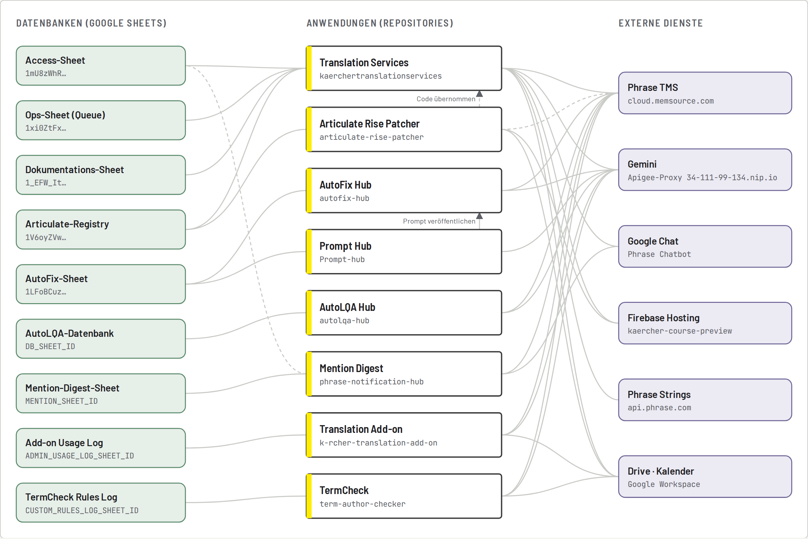

# Wissensbasis: Kärcher Translation Tools

Dieser Ordner enthält eine vollständige Dokumentation aller acht Repositories, aufbereitet zum Hochladen in einen **Gemini Gem** oder in **NotebookLM**. Damit können Kolleginnen und Kollegen Fragen stellen wie „Welche Datenbank nutzt der Mention Digest?“ oder „Wie lege ich einen neuen Prompt Space an?“.



## Inhalt

| Datei | Inhalt |
|---|---|
| [`00-GESAMTUEBERSICHT.md`](00-GESAMTUEBERSICHT.md) | Systemlandkarte, alle Datenbanken mit IDs, Phrase-Objekte, Gemini, Chat, Trigger, Abläufe, Rollen, Deployment, Glossar, FAQ |
| [`01-translation-services.md`](01-translation-services.md) | Portal Kärcher Translation Services |
| [`02-autofix-hub.md`](02-autofix-hub.md) | AutoFix Hub |
| [`03-prompt-hub.md`](03-prompt-hub.md) | Prompt Hub |
| [`04-autolqa-hub.md`](04-autolqa-hub.md) | AutoLQA Hub |
| [`05-mention-digest.md`](05-mention-digest.md) | Mention Digest (phrase-notification-hub) |
| [`06-translation-add-on.md`](06-translation-add-on.md) | Kärcher Translation Add-on |
| [`07-termcheck.md`](07-termcheck.md) | Kärcher TermCheck (term-author-checker) |
| [`08-articulate-rise-patcher.md`](08-articulate-rise-patcher.md) | Articulate Rise Patcher |
| [`KOMPLETT.md`](KOMPLETT.md) | alles in einer Datei, inkl. der Fachdokumente des Portals (`docs/*.md`) – erzeugt mit `node tools/build-wissensbasis.js` |
| [`GEM-ANWEISUNGEN.md`](GEM-ANWEISUNGEN.md) | Text für das Feld „Anweisungen“ des Gems |
| [`systemlandkarte.html`](systemlandkarte.html) / [`systemlandkarte.png`](systemlandkarte.png) | Grafik aller Systeme, Datenbanken und Verbindungen |

Die Kapitel 01–08 liegen zusätzlich in jedem Repository als `docs/DOKUMENTATION.md`.

## Als Gemini Gem einrichten (ca. 5 Minuten)

1. <https://gemini.google.com> → **Gem-Manager** → **Neues Gem**.
2. **Name:** `Kärcher Translation Tools – Wissensbasis`
3. **Beschreibung:** `Beantwortet Fragen zu Translation Services, AutoFix, Prompt Hub, AutoLQA, Mention Digest, Translation Add-on, TermCheck und Rise Patcher.`
4. **Anweisungen:** Inhalt von [`GEM-ANWEISUNGEN.md`](GEM-ANWEISUNGEN.md) einfügen.
5. **Wissen:** hochladen
   - `KOMPLETT.md` (enthält alles), **oder** die Dateien `00` bis `08` einzeln (Gems erlauben bis zu 10 Dateien),
   - optional `systemlandkarte.png`.
6. Speichern und über **Teilen** mit dem Kollegen teilen.

## In NotebookLM nutzen

1. <https://notebooklm.google.com> → **Neues Notebook**.
2. Quellen hinzufügen: die Dateien `00` bis `08` einzeln hochladen (bessere Quellenangaben als eine große Datei), dazu `systemlandkarte.png`.
3. Optional als Quelle zusätzlich die Fachdokumente des Portals: `docs/ARCHITEKTUR-UND-DATEN.md`, `docs/API.md`, `docs/UI-UX.md`, `docs/AUFFAELLIGKEITEN.md`.
4. Notebook mit dem Kollegen teilen.

## Aktuell halten

Die Wissensbasis ist aus dem Code abgeleitet. Nach größeren Änderungen das betroffene Kapitel anpassen, dann

```bash
node tools/build-wissensbasis.js   # KOMPLETT.md neu erzeugen
```

und die Dateien im Gem bzw. Notebook ersetzen.

## Hinweis zu vertraulichen Daten

Die Dokumente enthalten **Sheet-IDs, Phrase-UIDs und interne Links**, aber **keine Passwörter, Tokens oder API-Keys** (die liegen nur in den Script Properties). Den Gem bzw. das Notebook deshalb nur intern teilen.
